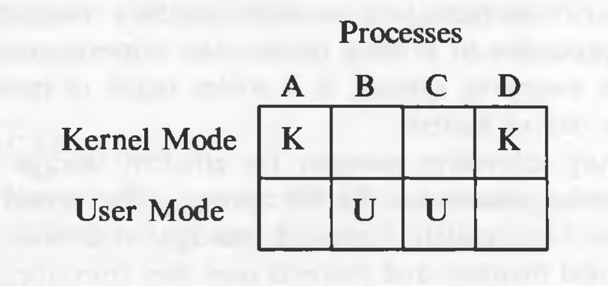
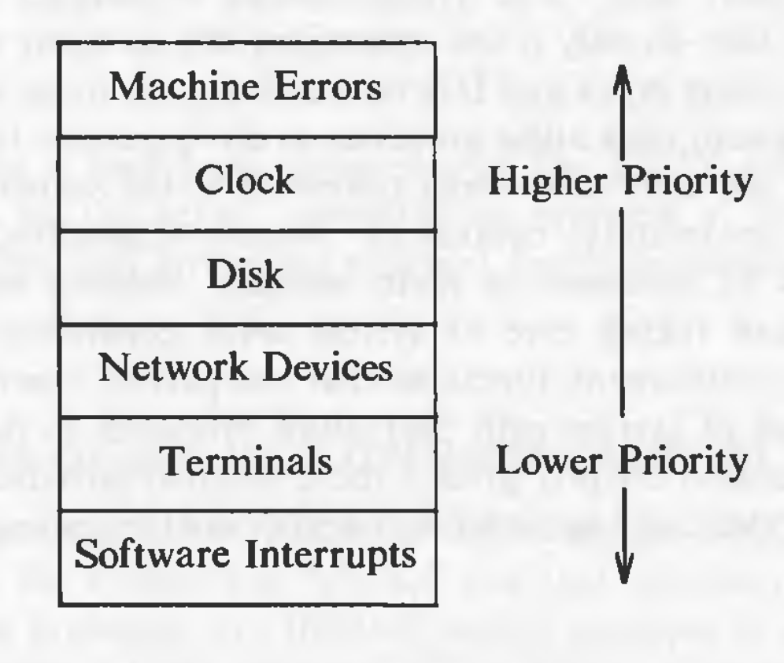

# General Overview of the System

## Why UNIX became so popular

* The system is written in a high-level language, making it easy to read, understand, change, and move to other machines.
* It has a simple user interface that has the power to provide the services that users want.
* It provides primitives that permit complex programs to be built from simpler programs.
* It uses a hierarchical file system that allows easy maintenance and efficient implementation.
* It uses a consistent format for files, the byte stream, making application programs easier to write.
* It provides a simple, consistent interface to peripheral devices.
* It is a multi-user, multiprocess system; each user can execute several processes simultaneously.
* It hides the machine architecture from the user, making it easier to write programs that run on different hardware implementations.

## Architecture of UNIX Systems

The operating systems interacts directly with the hardware, providing common services to programs and insulating them from hardware idiosyncrasies.
Programs such as the shell and editors shown in the outer layers interact with the kernel by invoking a well defined set of *system calls*.

## User Perspective

### The File System

* A hierarchical structure
* consistent treatment of file data
* the ability to create and delete files
* dynamic growth of files
* the protection of file data
* the treatment of peripheral devices as files

The file system is organized as a tree with a single root node called *root* (written '/'). Every non-leaf node of the file system structure is a *directory* of files, and files at the leaf nodes of the tree are either *directories*, *regular files*, or *special device files*.

## Operating System Services

These are the services provided by the kernel:

* Controlling the execution of processes by allowing their creation, termination or suspension, and communication.
* Scheduling processes fairly for execution of the CPU. Processes share the CPU in a *time-shared* manner: the CPU executes a process, the kernel suspends it when its time quantum elapses, and the kernel schedules another process to execute. The kernel later reschedules the suspended process.
* Allocating main memory for an executing process. The kernel allows processes to share portions of their address space under certain conditions, but protects the private address space of a process from outside tampering. If the system runs low on free memory, the kernel frees memory by writing a process temporarily to secondary memory, called a *swap* device. If the kernel writes entire processes to a swap device, the implementation of the UNIX system is called a *swapping* system; if it writes pages of memory to a swap device, it is called a *paging* system.
* Allocating secondary memory for efficient storage and retrieval of user data. This service constitutes the file system. The kernel allocates secondary storage for user files, reclaims unused storage, structures the file system in a well understood manner, and protects user files from illegal access.
* Allowing processes controlled access to peripheral devices such as terminals, tape drives, disk drives, and network devices.

## Assumptions about Hardware

The execution of user processes in a UNIX system is divided in two levels: user and kernel. When a process executes a system call, its execution mode changes from *user mode* to *kernel mode*. Even if the user process doesn't make a system call, the operating system still does bookkeeping work that relates to the user process, handling interrupts, scheduling processes, managing memory, and so on.

* Processes in user mode can access their own instructions and data. Processes in kernel mode however, can access kernel and user addresses.
* Some machine instructions are privileged and result in an error when executed in user mode.

### Multiple processes and modes of execution

In the diagram above, the operating system views from the top (or bottom), it sees which processes are running. However, the hardware view if from the left (or right), it sees which mode is currently active.

### Interrupts and Exceptions

The UNIX system allows devices such as I/O peripherals or the system clock to interrupt the CPU asynchronously. On receipt of an interrupt, the kernel saves its current *context* (a frozen image of what the processor was doing), determines the cause of the interrupt, and services the interrupt. After servicing the interrupt, it restores its interrupted context and begins execution as if nothing had happened. The hardware usually prioritizes devices according to the order that interrupts should be handled: When the kernel services an interrupt, it *blocks* out lower priority interrupts but services higher priority interrupts.

An exception condition refers to unexpected events caused by a process, such as addressing illegal memory, executing privileged instructions, dividing by zero, and so on. They are distinct from interrupts, which are caused by events that are external to a process.

Exceptions happen "in the middle" of the execution of an instruction, and the system attempts to restart the instruction after handling the exception; interrupts are considered to happen between the execution of two instruction, and the system continues with the next instruction after servicing the interrupt. The UNIX system uses one mechanism to handle interrupts and exception conditions.

### Processor Execution Levels

The kernel sometimes wants to prevent occurrence of interrupts when it is doing some important work (such as modifying kernel data structures). In such situations, if the interrupts are not prevented, the kernel itself might get corrupt. Computers typically have a set of privileged instructions that set the processor execution level in the processor status word. Setting the processor execution level to certain values masks off interrupts from the level and lower levels, allowing only higher-level interrupts.

### Memory Management

The kernel permanently resides in the main memory. When compiling a program, the compiler generates a set of addresses in the program that represent addresses of variables and data structures of the addresses of instructions such as functions. The compiler generates the addresses for a *virtual machine* as if no other program will execute simultaneously on the physical machine. When the program is run on the machine, the kernel allocates space in main memory for it, but the virtual addresses generated by the compiler need not be identical to the physical addresses that they occupy in the machine. The kernel coordinates with the machine hardware to set up a virtual to physical address translation that maps the compiler-generated addresses to the physical machine addresses.
