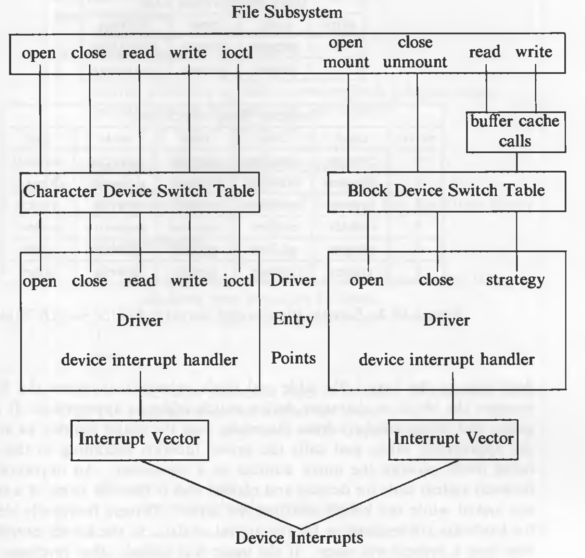
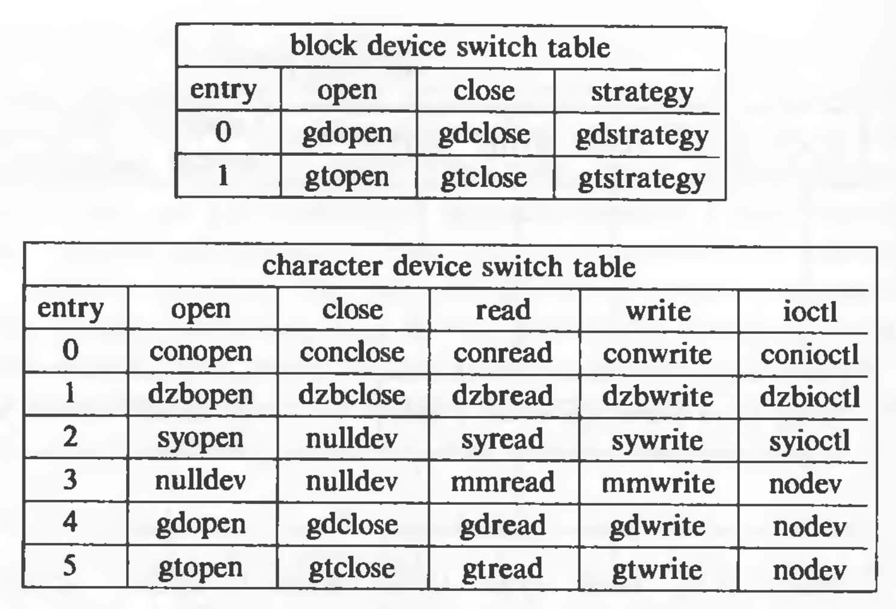
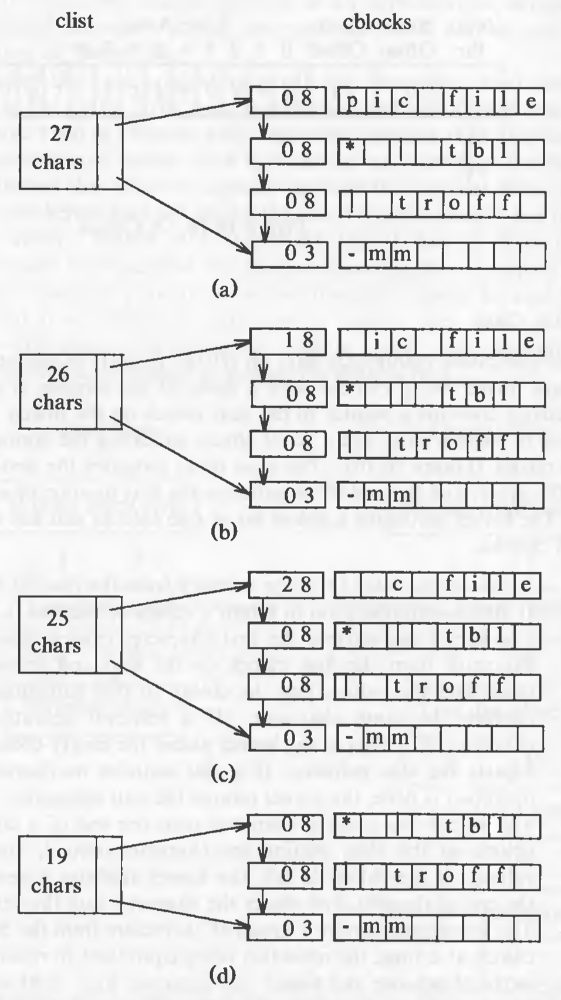
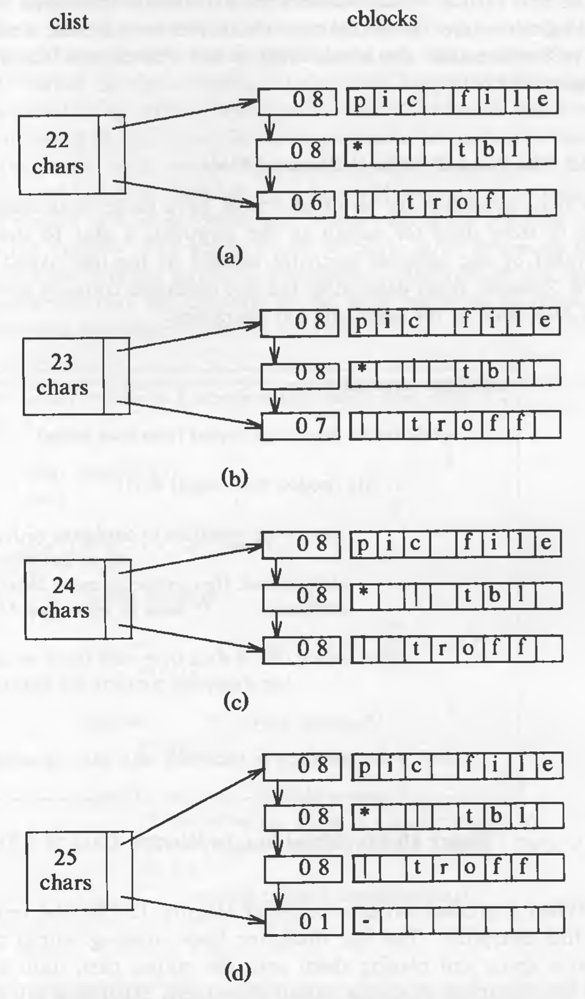
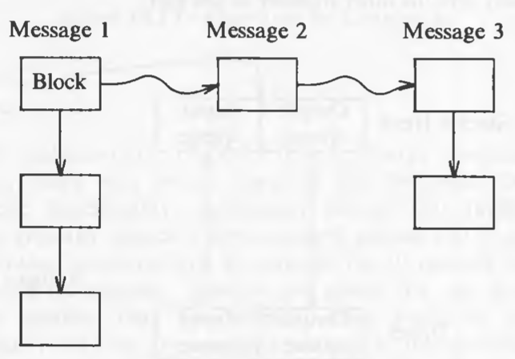
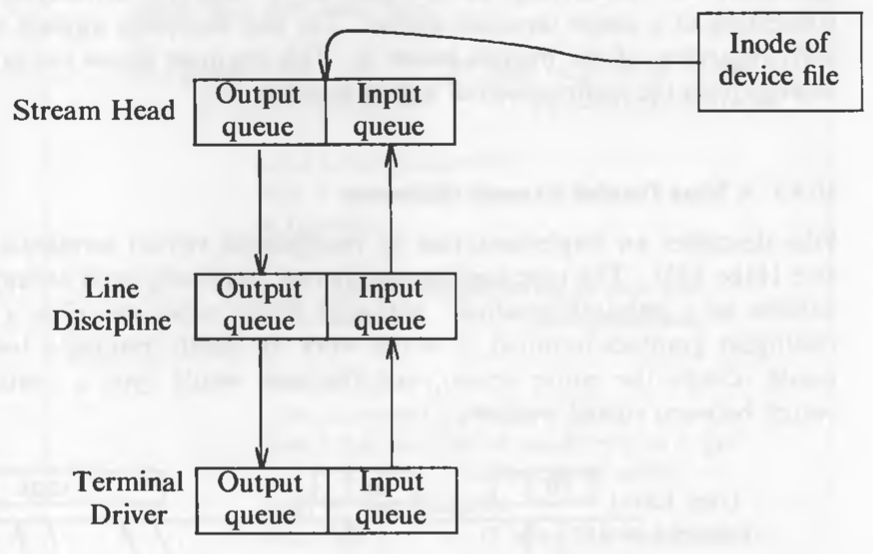

# The I/O Subsystem

The I/O subsystem allows a process to communicate with peripheral devices such as disks, tape drives, terminals, printers, and networks, and the kernel modules that control devices are known as *device drivers*. Usually, there is a one-to-one correspondence between device drivers and device types: Systems may contain one disk driver to control all disk drives, one terminal driver to control all terminals, and so on. Same type of devices from different manufacturers may have different device drivers. The system supports "software devices", which have no associated physical device. For example, it treats physical memory as a device to allow a process access to physical memory outside its address space, even though memory is not a peripheral device. The kernel profiler described previously is implemented as a driver.

## Driver Interfaces

There are two types of devices, *block* and *raw* or *character* devices. The *block* devices such as disks, appear as random access storage devices to the rest of the system. Character devices include devices such as terminals and network media. Block devices may have a character device interface too.

The devices are represented by device special files that reside in the file system. A device special file has its type (block or character) specified in its inode. If a device has both interfaces, there are two separate files for each interface. System calls such as *open*, *close*, *read*, and *write* have appropriate meanings for these device files. The *ioctl* system call provides an interface that allows processes to control character devices, but it is not applicable to regular files. However, each device driver need not support every system call interface.

### System Configuration

System configurations are the parameters provided by administrators that alter the behavior of the system. Some parameters specify the sizes of kernel tables. Other parameters specify device configuration, telling the kernel which devices are included in the installation and their "address".

There are three stages at which device configuration can be specified:

* It can be hardcoded into files that are compiled and linked when building the kernel code.
* Administrators can supply configuration information when the system is already running; the kernel updates the internal configuration tables dynamically.
* Self-identifying devices permit the kernel to recognize which devices are installed.

The kernel to driver interface is describes by the *block device switch table* and the *character device switch table*, as shown in the figure:



Each device has its entry in one or both the switch tables. The system calls refer to the switch tables and then invoke the required driver routine, as shown in the diagram above.

The hardware to driver interface consists of machine-dependent control registers or I/O instructions for manipulating devices and interrupt vectors: When a device interrupt occurs, the system identifies the interrupting device and calls the appropriate interrupt handler. Obviously, software devices such as the kernel profile driver do not have a hardware interface, but other interrupt handlers may call a "software interrupt handler" directly. For example, the clock interrupt handler calls the kernel profiler interrupt handler.

Administrators set up device special files with the *mknod* command, supplying file type (block or character) and major and minor numbers. The *mknod* command invokes the *mknod* system call to create the device file. For example:

`mknod /dev/tty13 c 2 13`

`/dev/tty13` is the file name of the device, `c` specifies that its a character special file (*b* specifies a block special file), 2 is the major number, and 13 is the minor number. The major number indicates a device type that corresponds to the appropriate entry in the block or character device switch tables, and minor number indicates a unit of the device. Example of the tables is given below:



The entries in the tables describe the routines to be called for respective system calls. The routine *nulldev* is an "empty" routine, used when there is no need for a particular driver function. Many peripheral devices can be associated with a major number; the minor number distinguishes them from each other. Device special files do not have to be created on every boot.

### System Calls and the Driver Interface

For system calls that use file descriptors, the kernel follows pointers from user file descriptor to file table entry and the inode, where it examines the file type and accesses the block or character device switch table, as appropriate. It extracts the major and minor number from the inode, uses the major number as an index into the appropriate table, and calls the driver function according to the system call being made, passing the minor number as a parameter. An important difference between system calls for devices and regular files is that the inode of a special file is *not* locked while the kernel executes the driver. Drivers frequently sleep, waiting for hardware connections or for the arrival of data.

The device driver interprets the parameters of the system call as appropriate for the device. A driver maintains data structures that describe the state of each unit that it controls; driver functions and interrupt handlers execute according to the state of the driver and the action being done.

**Open**

Opening a device file is similar to *open*ing a regular file, in the sense that in-core inode table, file table entries are made and a user file descriptor is returned. However, device-specific *open* procedure is invoked. The algorithm is given below:

```
/*  Algorithm: open
 *  Input: pathname
 *         openmode
 *  Output: file descriptor
 */

{
	convert pathname to inode, increment inode reference count,
		allocate entry in file table, user file descriptor, as in
		open of regular file;
	
	get major, minor number from inode;
	
	save context (algorithm: setjmp) in case of long jump from driver;
	
	if (block device)
	{
		use major number as index to block device switch table;
		call driver open procedure for index:
				pass minor number, open modes;
	}
	else
	{
		use major number as index to character device switch table;
		call driver open procedure for index:
				pass minor number, open modes;
	}
	
	if (open fails in driver)
		decrement file table, inode counts;
}
```

For software devices such as system memory, the *open* procedure may have to initialization to do. For the cases where the *open* call might fail, (for example, if it sleeps on an event which never occurs) the kernel does a *setjmp* before invoking the driver specific routine. And when the call fails, it will restore the previous state by doing a *longjmp* and clearing all the structures (user file descriptor, file table entry, inode) it had allocated.

**Close**

The driver specific closed is not called for every *close* operation. It is only called for the last *close* call after which no processes are accessing that device. If the driver is not coded carefully, it can easily loose the count of processes using it. If it sleeps in a *close* call and another process *open*s it, it could easily go out of state. The algorithm is given below:

```
/*  Algorithm: close
 *  Input: file descriptor
 *  Output: none
 */

{
	do regular close algorithm;
	if (file table reference count not 0)
		goto finish;
	if (there is another open file and its major, minor numbers are same as device being closed)
		goto finish;			// not last close after all
	if (character device)
	{
		use major number to index into character device switch table;
		call driver close routine: parameter number;
	}
	if (block device)
	{
		if (device mounted)
			goto finish;
		write device blocks in buffer cache to device;
		user major number to index into block device switch table;
		call driver close routine: parameters minor number;
		invalidate device blocks still in buffer cache;
	}
 finish:
 	release inode;
}
```

Considering only inode reference count is not enough to check if any other process is accessing the device. It is possible to have two different device files for the same file.

**Read and Write**

If a process is reading or writing a character device, the kernel invokes the device driver read or write procedure. Although there are important cases where the kernel transmits data directly between the user address space and the device, device drivers may buffer data internally. For example, terminal drivers use *clists* to buffer data (seen later). In such cases, the device driver copies dat from user space to a buffer during the write, and outputs the data from the buffer to the device. The driver write procedure throttles the amount of data being output. If processes generate data faster than the device can output it, the write procedure puts processes to sleep until the device can accept more data.

The method in which the driver communicates with a device depends on the hardware. Some machines provide *memory mapped I/O*, meaning that certain addresses in the kernel address space are not locations in physical memory but are special registers that control particular devices.

Other machines have *programmed I/O*, meaning that the machine contains instructions to control devices.

The interface between the device drivers and the underlying hardware is machine dependent, no standard interfaces exist at this level. For both memory mapped I/O and programmed I/O, a driver can issue control sequences to a device to set up *direct memory access (DMA)* between the device and memory. The system allows bulk DMA transfer of data between the device and memory in parallel to CPU operations, and the device interrupts the system when such a transfer has completed. The driver sets up the virtual memory mapping so that the correct locations in memory are used for DMA.

High-speed devices can sometimes transfer data directly between the device and the user's address space, without intervention of a kernel buffer. This results in higher transfer speed because there is one less copy operation in the kernel, and the amount of data transmitted per transfer operation is not bounded by the size of kernel buffers.

**Strategy Interface**

The kernel uses the *strategy* interface to transmit data between the buffer cache and a device. The read and write procedures of the character devices sometimes use their (block counterpart) *strategy* procedures to transfer data directly between the device and the user address space. The kernel passes a buffer header address to the driver strategy procedure; the header contains a list of (page) addresses and sizes for transmission of data to or from the device. For the buffer cache, the kernel transmits data from one data address; when swapping, the kernel transmits data from many data addresses (pages). If data is being copied to or from the user's address space, the driver must lock the process (or at least, the relevant pages) in memory until the I/O transfer is complete.

**Ioctl**

In earlier versions of UNIX system, *setty* (set terminal settings) and *getty* (get terminal settings) were the terminal-specific system calls. *ioctl* is the generalization of both. It has a general, catch-all entry point for device specific commands, with which hardware options for the device and software options for the process can be set. The specific actions specified by the *ioctl* call vary per device and are defined by the device driver. This is an exception to the general rule that the system does not differentiate between different file types.

`ioctl (fd, command, arg);`

where `fd` is the file descriptor returned by a prior *open* system call, `command` is a request of the driver to do a particular action, and `arg` is a parameter (possibly pointer to a structure) for the `command`.

**Other File System Related Calls**

Calls such as *stat* and *chmod* work for devices as they do for regular files; they manipulate the inode without accessing the driver. *lseek* also works for devices, for example, on a tape, the kernel updates the file table offset but does on driver-specific operation.

**Interrupt Handlers**

The kernel invokes the device specific interrupt handler, passing it the device number or other parameters to identify the specific unit that caused the interrupt. Figure shows the structure of device interrupts:


## Disk Drivers

The disk driver translates a file system address, consisting of a logical device number and block number, to a particular sector on the disk. The driver gets the address in one of two ways: Either the strategy procedure uses a buffer from the buffer pool and the buffer header contains the device and block number, or the *read* and *write* procedures are passed the logical (minor) device number as a parameter; they convert the byte offset saved in the u-area to the appropriate block address. Finally, it adds the block number of the file system to the start sector number to identify the sector used for the I/O transmission.

Because of high disk traffic, the disk driver must maximize the data throughput to get the best system performance. Most modern disk controllers take care of disk job scheduling, positioning the disk arm, and transferring data between the disk and the CPU; otherwise, the disk driver must do these tasks.

Two important programs that deal directly with the disk (bypassing the file system) are *mkfs* and *fsck*.

## Terminal Drivers

Terminals are special, because they are the user's interface to the system. Terminal drivers contain an internal interface to *line discipline* modules, which interpret input and output. In *canonical* mode, the line discipline converts the raw data sequences typed at the keyboard to a canonical form (what the user really meant) before sending the data to the receiving process; the line discipline also converts the raw output sequences written by a process to a format that the user expects. In *raw* mode, the line discipline passes data between processes and the terminal without such conversions.

For example, if something is typed at the terminal and then a few characters are erased and then a few more are typed, the terminal sends the entire sequence to the machine, including the erase characters. In canonical mode, the line discipline buffers the data into lines (the sequence of characters until a carriage-return character) and processes erase characters internally before sending the revised sequence to the reading process.

The functions of a line discipline are:

* to parse input strings into lines
* to process erase characters
* to process a "kill" character that invalidates all characters typed so far on the current line
* to echo (write) received characters to the terminal
* to expand output such as tab characters to a sequence of blank spaces
* to generate signals to processes for terminal hangups, line breaks, or in response to a user hitting the delete key
* to allow a raw mode that does not interpret special characters such as erase, kill or carriage return

Although, only terminal uses the line discipline, it could be required by other processes as well, therefore, the correct place to put it, is in the kernel. The following figure shows the logical flow of data through the terminal driver and line discipline and the corresponding flow of control through the terminal driver.


### Clists

*Clist* is a short form for *character list*. Line disciplines manipulate data on *clists*. It is a variable length linked list of *cblocks* with a count of number of characters on the list. A *cblock* contains a pointer to the next *cblock*, a small character array and a set of offsets indicating the position of the valid data in the *cblock*. It is shown in the figure:


The *start* offset indicates the first location of valid data in the array and *end* offset indicates the first location of invalid data.

The kernel maintains a linked list of free cblocks and has six operations on clists and cblocks:

1. Assign a cblock from free list to a driver.
2. Return a cblock to the free list.
3. Retrieve the first character from a clist. After retrieval, the character count is decremented, and if the character is the last character in a cblock, it is returned to the free list.
4. Place a character onto the end of a clist by finding last free cblock on the clist. If the last cblock is full, kernel allocates a new cblock.
5. Remove a group of characters from the beginning of a clist one cblock at a time.
6. Place a cblock of characters onto the end of a clist.

Example of removing a character from clist:




Example placing a character on a clist:



**The Terminal Driver in Canonical Mode**

The data structures for terminal drivers have three clists associated with them: a clist to store data for output to the terminal, a clist to store "raw" input data provided by the terminal interrupt handler as the user typed it in, and a clist to store "cooked" input data, after the line discipline converts special characters in the raw clist, such as the erase and kill characters.

The algorithm *terminal_write* is given below:

```
terminal_write
{
	while (more data to be copied from user space)
	{
		if (tty flooded with output data)
		{
			start write operation to hardware with data on output clist;
			sleep (event: tty can accept more data);
			continue;		// back to while loop
		}
		copy cblock size of data from user space to output clist:
				line discipline converts tab characters, etc;
	}
	
	start write operation to hardware with data on output clist;
}
```

If multiple processes are writing to the terminal, the data could be interleaved on the terminal.

The algorithm *terminal_read* is given below:

```
terminal_read
{
	if (no data on canonical clist)
	{
		while (no data on raw clist)
		{
			if (tty opened with no delay option)
				return;
			if (tty in raw mode based on timer and timer not active)
				arrange for timer wakeup (callout table);
			sleep (event: data arrives from terminal);
		}
		
		// there is data on raw clist
		if (tty in raw mode)
			copy all data from raw clist to canonical clist;
		else		// tty is in canonical mode
		{
			while (characters on raw clist)
			{
				copy one character at a time from raw clist to canonical clist:
					do erase, kill processing;
				if (char is carriage return or end-of-file)
					break;
			}
		}
	}
	
	while (characters on canonical list and read count not satisfied)
		copy from cblocks on canonical list to user address space;
}
```

The case for `tty in raw mode based on timer and timer not active` is studied below. Rest of the algorithm is self explanatory.

**The Terminal Driver in Raw Mode**

When a process sets terminal parameters, it does so for all processes using the terminal. The terminal settings are not automatically reset when the process that changed the setting *exit*s.

When processes put the terminal into *raw* mode, where the line discipline transmits characters exactly as the user typed them. Still the kernel must know when to satisfy user *read* calls, since the carriage return is treated as an ordinary input character. It satisfies *read* system calls after a minimum number of characters are input at the terminal. In the latter case, the kernel  times the entry of characters from the terminal by placing entries into callout table. When the particular criterion is met, the line discipline interrupt handler awakens all sleeping processes. The driver moves all characters from the raw clist to the canonical clist and satisfies the process *read* request, following the same algorithm as for the canonical case.

**Terminal Polling**

It is sometimes convenient to poll a device, that is, to *read* it if there is data present but to continue regular processing otherwise. It is achieved by *open*ing the terminal with the "no delay" option, subsequent *read*s will not sleep if there is no data present but will return immediately.

The BSD system has a *select* system call that allows device polling:

`select (nfds, rfds, wfds, efds, timeout);`

where `nfds` gives the number of file descriptors being selected, and `rfds`, `wfds` and `efds` point to bit masks that "select" open file descriptors. That is, the bit 1 << fd is set if a user wants to select file descriptor. `timeout` indicates how long *select* should sleep, waiting for data to arrive.

**Establishment of a Control Terminal**

The control terminal is the terminal on which a user logs into the system, and it controls processes that the user initiates from the terminal. When a process *open*s a terminal, the terminal driver opens the line discipline. If the process is a process group leader as the result of a prior *setpgrp* system call and if the process does not have an associated control terminal, the line discipline makes the opened terminal the control terminal. it stores the major and minor device number of the terminal device file in the u-area, and it stores the process group number of the opening process in the terminal driver data structure. The opening process is the control process, typically the login shell.

**Indirect Terminal Driver**

Processes frequently need to read or write data directly to the control terminal, even though the standard input and output may have been redirected to other files. UNIX systems provide "indirect" terminal access via the device file "/dev/tty", which designates the control terminal for every process that has one. Users logged onto separate terminals can access "/dev/tty", but they access different terminals.

There are two common implementations for the kernel to find the control terminal from the file name "/dev/tty". First, the kernel can define a special device number for the indirect terminal file with a special entry in the character device switch table. When invoking the indirect terminal, the *driver* for the indirect terminal gets the major and minor number of the control terminal from the u-area and invokes the real terminal driver through the character device switch table. The second implementation commonly used to find the control terminal from the name "/dev/tty" tests if the major number is that of the indirect terminal before calling the driver *open* routine. If so, it releases the inode for "/dev/tty", allocates the inode for the control terminal, resets the file table entry to point to the control terminal inode, and calls the *open* routine of the terminal driver. The file descriptor returned when opening "/dev/tty" refers directly to the control terminal and its regular driver.

**Logging In**

In multi-user state, a primary responsibility of init is to allow users to log into terminals. The algorithm *login* is given below:

```
login
{
	getty process executes;
	set process group (setpgrp system call);
	open tty line;			// sleeps until opened
	if (open successful)
	{
		exec login program;
		prompt for user name;
		turn off echo, prompt for password;
		if (successful)
		{
			put tty in canonical mode (ioctl);
			exec shell;
		}
		else
			count login attempts, try again up to a point;
	}
}
```

It spawns processes called *getty* and keeps track of which *getty* process opens which terminal; each *getty* process resets its process group using the *setpgrp* system call. The invocation of shell (`exec shell`) in the above algorithm, is called the *login shell*.

## Streams

The scheme for implementation of device drivers, though adequate, suffers from some drawbacks. Different drivers tend to duplicate functionality, particular drivers that implement network protocols, which typically include a device-control portion and a protocol portion. Although the protocol portion should be common for all network devices, this has not been the case, because the kernel did not provide adequate mechanisms for common use.

To overcome this, Ritchie developed a scheme called *streams* to provide greater modularity and flexibility for the I/O subsystem.

A *stream* is a full-duplex connection between a process and a device driver. It consists of a set of linearly linked queue pairs, one member of each pair for input and the other for output. When a process *write*s data to a stream, the kernel sends the data down the output queues; when a device driver receives input data, it sends the data up the input queues to a reading process. The queues pass messages to neighboring queues according to a well-defined interface. Each queue pair is associated with an instance of a kernel module, such as a driver, line discipline, or protocol, and the modules manipulate data passed through its queues.

Each queue is a data structure that contains the following elements:

* An open procedure, called during an *open* system call.
* A close procedure, called during a *close* system call.
* A "put" procedure, called to pass a message into the queue.
* A "service" procedure, called when a queue is scheduled to execute.
* A pointer to the next queue in the stream.
* A pointer to a list of messages awaiting service.
* A pointer to a private data structure that maintains the state of the queue.
* Flags and high- and low-water marks, used for flow control, scheduling, and maintaining the queue state.

The kernel allocates queue pairs, which are adjacent in memory.

A device with a streams driver is a character device; it has a special field in the character device switch table that points to a streams initialization structure. When the kernel executes the *open* system call and discovers that the device file is character special, it examines the new field in the character device switch table. If there is no entry there, the driver is not a streams driver. For the first open of a streams driver, the kernel allocates two pairs of queues, one for the *strem-head* and other for the device. The stream-head module is identical for all instances of open streams: It has generic put and service procedures and is the interface to higher-level kernel modules that implement the *read*, *write*, and *ioctl* system calls. The kernel initializes the driver queue structure, assigning queue pointers and copying addresses of driver routines from a per-driver initialization structure, and invokes the driver open procedure. The driver open procedure does the usual initialization but also saves information to recall the queue with which it is associated. Finally, the kernel assigns a special pointer in the in-core inode to indicate the stream-head. When another process *open*s the device, the kernel finds the previously allocated stream via the inode pointer and invokes the open procedure of all modules on the stream. A diagram of the structure is given below:


Modules communicate by passing messages to neighboring models on a stream. A message consists of a linked list of message block headers; each block header points to the start and end location of the block's data. There are two types of messages - control and data - identified by a type indicator in the message header. Control message may result from *ioctl* system calls or from special conditions, such as a terminal hang-up, and data messages may result from *write* system calls or the arrival of data from a device.

When a process *write*s a stream, the kernel copies the data from user space into message blocks allocated by the stream-head. The stream-head module invokes the put procedure of the next queue module, which may process the message, pass it immediately to the next queue, or enqueue it for later processing. In the latter case, the module links the message block headers on a linked list, forming a two-way linked list. The structure is shown in the figure:



Then it sets a flag in its queue data structure to indicate that it has data to process, and schedules itself for servicing. The module places the queue on a linked list of queues requesting service and invokes a scheduling mechanism; that scheduler calls the service procedures of each queue on the list.

The process can "push" modules onto an opened stream by issuing *ioctl* system calls. The kernel inserts the pushed module immediately below the stream head and connects the queue pointers to keep the structure of the doubly linked list. Lower modules on the stream do not care whether they are communicating with the stream head or with a pushed module. Example of such structure:



An example of opening a terminal and pushing a line discipline:

```
fd = open("/dev/ttyxy", O_RDWR);
ioctl(fd, PUSH, TTYLD);
```

where `PUSH` is the command name and `TTYLD` is a number that identifies the line discipline module. A process can "pop" the modules off a stream in last-in-first-out order using another *ioctl* system call.

`ioctl(fd, POP, 0);`

### A More Detailed Example of Streams

Streams are used in the implementation of *virtual terminals*. Each virtual terminal occupies the entire screen, and the user would type a control sequence to switch between virtual windows. The figure shows the structure of kernel modules:


The user invokes a process, *mpx*, to control the physical terminal. *mpx* *read*s the physical terminal line and waits for notification of control events, such as creation of a new window, switching control to another window, deletion of a window, and so on. When it receives notification that a user wants to create a new window, *mpx* creates a process to control the new window and communicates with it over a *pseudo-terminal* (*pty*). A *pty* is a software device that operates in pairs: Output directed to one member of the pair is sent to the input of the other member; input is sent to the upstream module. To set up a window *mpx* allocates a *pty* pair and *open*s one member, establishing a stream to it (the driver *open* insures that the *pty* was not previously allocated). *mpx* *fork*s, and the new process *open*s the other member of the *pty* pair. *mpx* pushes a message module onto its *pty* stream to convert control messages to data messages, and the child process pushes a line discipline module its *pty* stream before *exec*ing the shell. That shell is now running on a virtual terminal; to the user, it is indistinguishable from a physical terminal.

The *px* process is a multiplexer, forwarding output from the virtual terminals to the physical terminal and demultiplexing input from the physical terminal to the correct virtual terminal. *mpx* waits for the arrival of data on any line, using the *select* system call. When data arrives from the physical terminal, *mpx* devices whether is is a control message, informing it to create a new window or delete an old one, or whether it is a data message to be sent to processes reading a virtual terminal; *mpx* strips the header from the message and *write*s the data to the appropriate *pty* stream. The *pty* driver routes the data through the terminal line discipline to reading processes. The reverse procedure happens when a process *write*s the virtual terminal: *mpx* prepends a header onto the data, informing the physical terminal which window the data should be printed to.

If a process issues an *ioctl* on a virtual terminal, the terminal line discipline sets the necessary terminal settings for its virtual line; settings may differ for each virtual terminal. However, some information may have to be sent to the physical terminal, depending on the device. The message module converts the control messages that are generated by the *ioctl* into data messages suitable for reading and writing the *mpx*, and these messages are transmitted to the physical device.

The pseudo code is given below:
##
```
// assume file descriptors 0 and 1 already refer to physical tty
for (;;)
{
	select(input);						// wait for some line with input
	read input line;
	switch(line with input data)
	{
	 case physical tty:					// input on physical tty line
		if (control command)			// for eg: create new window
		{
			open a free pseudo-tty;
			fork a new process;
			if (parent)
			{
				push a msg discipline on mpx side;
				continue;
			}
			// child here
			close unnecessary file descriptors;
			open other member of pseduo-tty pair, get stdin, stdout, stderr;
			push tty line discipline;
			exec shell;					// looks like virtual tty
		}
		// "regular" data from tty coming up for virtual tty
		demultiplex data read from physical tty, strip off headers and write to appropriate pty;
		continue;
		
	 case logical tty:					// a virtual tty is writing a window
	 	encode header indicating what window data is for;
	 	write header and data to physical tty;
	 	continue;
	}
}
```
