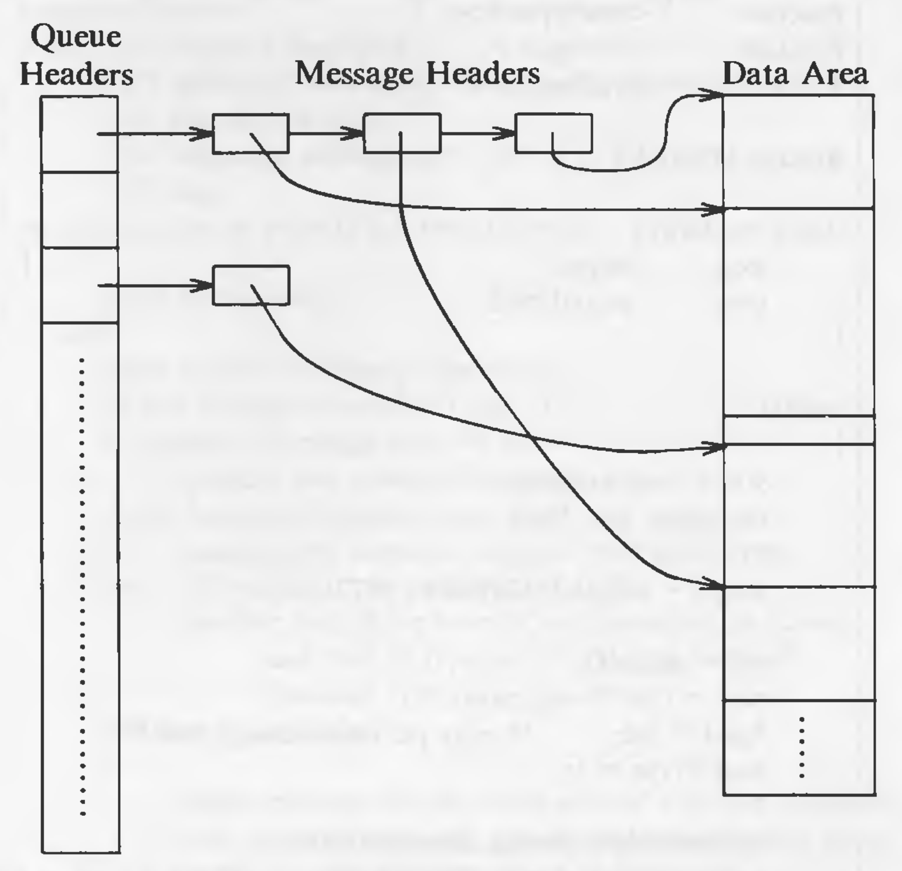
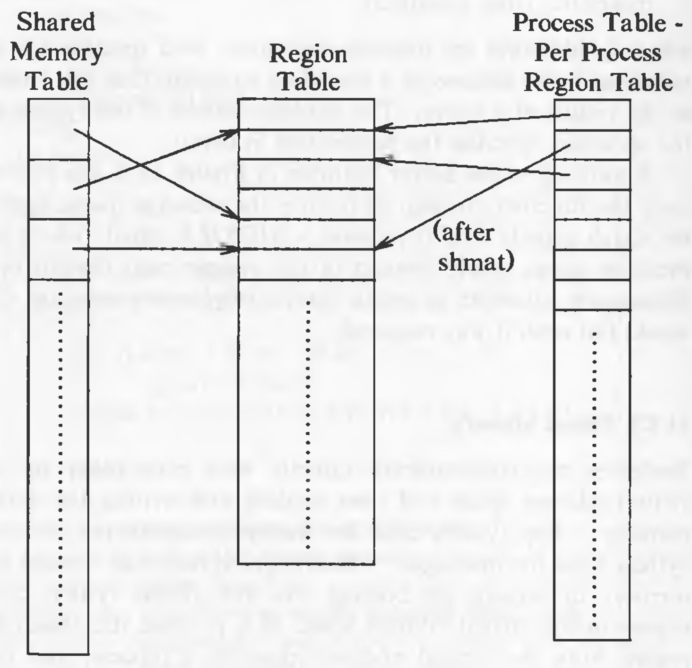
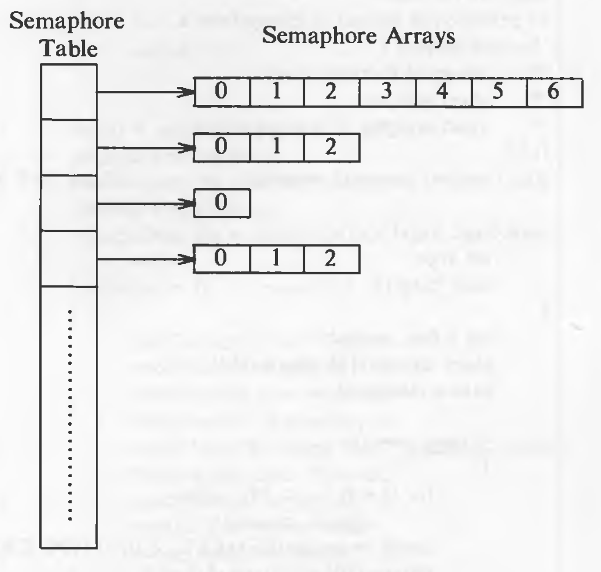
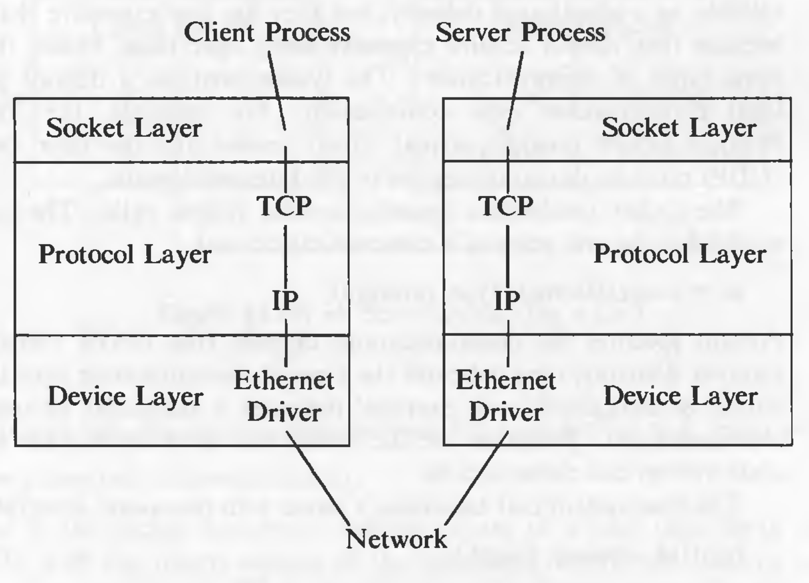

# Interprocess Communication

Processes have to communicate to exchange data and to synchronize operations. Several forms of interprocess communication are: pipes, named pipes and signals. But each one has some limitations.

## Process Tracing

The UNIX system provides a primitive form of interprocess communication for tracing processes, useful for debugging. A debugger process, such as *sdb*, spawns a process to be traced and controls its execution with the *ptrace* system call, setting and clearing break points, and reading and writing data in its virtual address space. Process tracing consists of synchronization of the debugger process and the traced process and controlling the execution of the traced process. The pseudo-code shows the typical structure of a debugger program:

```
if ((pid = fork()) == 0)
{
	// child - traced process
	ptrace(0, 0, 0, 0);
	exec("name of traced process here");
}
// debugger process continues here
for (;;)
{
	wait((int *) 0);
	read(input for tracing instructions);
	ptrace(cmd, pid, ...);
	if (quitting trace)
		break;
}
```

When *ptrace* is invoked, the kernel sets a trace bit in the child process table entry.

`ptrace (cmd, pid, addr, data);`

where `cmd` specifies various commands such as reading/writing data, resuming execution and so on, `pid` is the process ID of the traced process, `addr` is the virtual address to be read or written in the child process, and `data` is an integer value to be written. When executing the *ptrace* system call, the kernel verifies that the debugger has a child whose *D is *pid* and that the child is in the traced state and then uses a global trace data structure to transfer data between the two processes. It locks the trace data structure to prevent other tracing processes from overwriting it, copies *cmd*, *addr*, and *data* into the data structure, wakes up the child process and puts it into the "ready-to-run" state, then sleeps until the child responds. When the child resumes execution (in kernel mode), it does the appropriate trace command, writes its reply into the trace data structure, then awakens the debugger.

Consider the following two programs:

```
int data[32];
main()
{
	int i;
	for (i = 0; i < 32; i++)
		printf("data[%d] = %d\n", i, data[i]);
	printf("ptrace data addr 0x%x\n", data);
}
```

```
#define TR_SETUP		0
#define TR_WRITE		5
#define TR_RESUME		7
int addr;

main(argc, argv)
	int argc;
	char *argv[];
{
	int i, pid;
	sscanf(argv[1], "%x", &addr);
	
	if ((pid = fork()) == 0)
	{
		ptrace(TR_SETUP, 0, 0, 0);
		execl("trace", "trace", 0);
		exit();
	}
	for (i = 0; i < 32; i++)
	{
		wait((int*) 0);
		// write value of i into address addr in proc pid
		if (ptrace(TR_WRITE, pid, addr, i) == -1)
			exit();
		addr += sizeof(int);
	}
	// traced process should resume execution
	ptrace(TR_RESUME, pid, 1, 0);
}
```

The first program is called *trace* and the second is called *debug*. Running *trace* at a terminal, the array values for *data* will be 0. Running *debug* with a parameter equal to the value printed out by *trace*, *debug* saves the parameter in *addr*, creates a child process that invokes *ptrace* to make itself eligible for tracing, and *exec*s *trace*. The kernel sends the child process a *SIGTRAP* signal at the end of *exec*, and *trace* enters the trace state, waiting for command from *debug*. If *debug* had been sleeping in *wait*, it wakes up, finds the traced child process, and returns from *wait*. *debug* then calls *ptrace*, writes the value of loop variable *i* into the data space of *trace* at address *addr*, and increments *addr*. In *trace*, *addr* is an address of an entry in the array *data*.

Drawbacks of *ptrace*:

* Four context switches are required to transfer a word of data between a debugger and a traced process. The kernel switches context in the debugger in the *ptrace* call until the traced process replies to a query, switches context to and from the traced process, and switches context back to the debugger process with the answer to the *ptrace* call.
* The debugger can trace only its children, not grandchildren (and subsequent children).
* A debugger cannot trace a process that is already executing if the debugged process had not called *ptrace*. It must be killed and restarted in *debug* mode.
* It is impossible to trace *setuid* programs, because users could violate security by writing their address space via *ptrace* and doing illegal operations. *exec* ignores the *setuid* bit if the process is traced to prevent a user from overwriting the address space of a *setuid* program.

## System V IPC

The UNIX System V IPC package consists of three mechanisms:

1. Messages allow process to send formatted data streams to arbitrary processes.
2. Shared memory allows processes to share parts of their virtual address space.
3. Semaphores allow processes to synchronize execution.

The share common properties:

* Each mechanism contains a table whose entries describe all instances of the mechanism.
* Each entry contains a numeric *key*, which is its user-chosen name.
* Each mechanism contains a "get" system call to create a new entry or to retrieve an existing one, and parameters to the calls include a key and flags.
* The kernel uses the following formula to find the index into the table of data structures from the descriptor:
`index = descriptor modulo (number of entries in table);`
* Each entry has a permissions structure that includes the user ID and group ID of the process that created the entry, a user and group ID set by the "control" system call (studied below), and a set of read-write-execute permissions for user, group, and others, similar to the file permission modes.
* Each entry contains other information such as the process ID of the last process to update the entry, and time of last access or update.
* Each mechanism contains a "control" system call to query status of an entry, to set status information, or to remove the entry from the system.

### Messages

There are  four system calls for messages:

1. *msgget* returns (and possibly creates) a message descriptor.
2. *msgctl* has options to set and return parameters associated with a message descriptor and an option to remove descriptors.
3. *msgsnd* sends a message.
4. *msgrcv* receives a message.

Syntax of *msgget*:

`msgqid = msgget(key, flag);`

where `msgqid` is the descriptor returned by the call, and *key* and *flag* have the semantics described above for the general "get" calls. The kernel stores messages on a linked list (queue) per descriptor, and it uses *msgqid* as an index into an array of message queue headers. The queue structure contains the following fields, in addition to the common fields:

* Pointers to the first and last messages on a linked list.
* The number of messages and total number of data bytes on the linked list.
* The maximum number of bytes of data that can be on the linked list.
* The process IDs of the last processes to send and receive messages.
* Time stamps of the last *msgsnd*, *msgrcv*, and *msgctl* operations.

Syntax of *msgsnd*:

`msgsnd(msgqid, msg, count, flag);`

`flag` describes the action the kernel should take if it runs out of internal buffer space. The algorithm is given below:

```
/*  Algorithm: msgsnd
 *  Input: message queue descriptor
 *         address of message structure
 *         size of message
 *         flags
 *  Output: number of bytes send
 */

{
	check legality of descriptor, permissions;
	while (not enough space to store message)
	{
		if (flags specify not to wait)
			return;
		sleep(event: enough space is available);
	}
	get message header;
	read message text from user space to kernel;
	adjust data structures: enqueue message header,
		message header points to data, counts,
		time stamps, process ID;
	wakeup all processes waiting to read message from queue;
}
```

The diagram shows the structure of message queues:



Syntax for *msgrcv*:

`count = msgrcv(id, msg, maxcount, type, flag);`

The algorithm is given below:

```
/*  Algorithm: msgrcv
 *  Input: message descriptor
 *         address of data array for incoming message
 *         size of data array
 *         requested message type
 *         flags
 *  Output: number of bytes in returned message
 */

{
	check permissions;
 loop:
 	check legality of message descriptor;
 	// find message to return to user
 	if (requested message type == 0)
 		consider first message on queue;
 	else if (requested message type > 0)
 		consider first message on queue with given type;
 	else			// requested message type < 0
 		consider first of the lowest typed messages on queue,
 			such that its type is <= absolute value of requested type;
 	if (there is a message)
 	{
 		adjust message size or return error if user size too small;
 		copy message type, text from kernel space to user space;
 		unlink message from queue;
 		return;
 	}
 	// no message
 	if (flags specify not to sleep)
 		return with error;
 	sleep(event: message arrives on queue);
 	goto loop;
}
```

If processes were waiting to send messages because there was no room on the list, the kernel awakens them after it removes a message from the message queue. If a message is bigger than *maxcount*, the kernel returns an error for the system call leaves the message on the queue. If a process ignores the size constraints (*MSG_NOERROR* bit is set in *flag*), the kernel truncates the message, returns the requested number of bytes, and removes the entire message from the list.

If the *type* is a positive integer, the kernel returns the first message of the given type. If it is a negative, the kernel finds the lowest type of all message on the queue, provided it is less than or equal to the absolute value of the *type*, and returns the first message of that type. For example, if a queue contains three messages whose types are 3, 1, and 2, respectively, and a user requests a message with type -2, the kernel returns the message of type 1.

The syntax of *msgctl*:

`msgctl(id, cmd, mstatbuf);`

where `cmd` specifies the type of command, and `mstatbuf` is the address of a user data structure that will contain control parameters or the results of a query.

### Shared Memory

Sharing the part of virtual memory and reading to and writing from it, is another way for the processes to communicate. The system calls are:

* *shmget* creates a new region of shared memory or returns an existing one.
* *shmat* logically attaches a region to the virtual address space of a process.
* *shmdt* logically detaches a region.
* *shmctl* manipulates the parameters associated with the region.

`shmid = shmget(key, size, flag);`

where `size` is the number of bytes in the region. If the region is to be created, *allocreg* is used. It sets a flag in the shared memory table to indicate that the memory is not allocated to the region. The memory is allocated only when the region gets attached. A flag is set in the region table which indicates that the region should not be freed when the last process referencing it, *exit*s. The data structure are shown below:



Syntax for *shmat*:

`virtaddr = shmat(id, addr, flags);`

where `addr` is the virtual address where the user wants to attach the shared memory. And the `flags` specify whether the region is read-only and whether the kernel should round off the user-specified address. The return value *virtaddr* is the virtual address where the kernel attached the region, not necessarily the value requested by the process.

The algorithm is given below:

```
/*  Algorithm: shmat
 *  Input: shared memory descriptor
 *         virtual addresses to attach memory
 *         flags
 *  Output: virtual address where memory was attached
 */

{
	check validity of descriptor, permissions;
	if (user specified virtual address)
	{
		round off virtual address, as specified by flags;
		check legality of virtual address, size of region;
	}
	else			// user wants kernel to find good address
		kernel picks virtual address: error if none available;
	attach region to process address space (algorithm: attachreg);
	if (region being attached for first time)
		allocate page tables, memory for region (algorithm: growreg);
	return (virtual address where attached);
}
```

If the address where the region is to be attached is given as 0, the kernel chooses a convenient virtual address. If the calling process is the first process to attach that region, it means that page tables and memory are not allocated for that region, therefore, the kernel allocated both using *growreg*.

The syntax for *shmdt*:

`shmdt(addr);`

where `addr` is the virtual address returned by a prior *shmat* call. The kernel searches for the process region attached at the indicated virtual address and detaches it using *detachreg*. Because the region tables have no back pointers to the shared memory table, the kernel searches the shared memory table for the entry that points to the region and adjusts the field for the time the region was last detached.

Syntax of *shmctl*
##
`shmctl(id, cmd, shmstatbuf);`

which is similar to *msgctl*

### Semaphores

A semaphore is UNIX System V consists of the following elements:

* The value of the semaphore.
* The process ID of the last process to manipulate the semaphore.
* The number of processes waiting for semaphore value to increase.
* The number of processes waiting for the semaphore value to equal 0.

The system calls are:

* *semget* to create and gain access to a set of semaphores.
* *semctl* to do various control operations on the set.
* *semop* to manipulate the values of semaphores.

*semget* creates an array of semaphores:

`id = semget(key, count, flag);`

The kernel allocates an entry that points to an array of semaphore structure with *count* elements. It is shown in the figure:



The entry also specifies the number of semaphores in the array, the time of the last *semop* call, and the time of the last *semctl* call.

Processes manipulate semaphores with the *semop* system call:

`oldval = semop(id, oplist, count);`

where `oplist` is a pointer to an array of semaphore operations, and *count* is the size of the array. The return value, *oldval*, is the value of the last semaphore operated on in the set before the operation was done. The format of each element of *oplist* is,

* The semaphore number identifying the semaphore array entry being operated on
* The operation
* Flags

The algorithm is given below:

```
/*  Algorithm: semop
 *  Input: semaphore descriptor
 *         array of semaphore operations
 *         number of elements in array
 *  Output: start value of last semaphore operated on
 */

{
	check legality of semaphore descriptor;
 start: read array of semaphore operations from user to kernel space;
 	check permissions for all semaphore operations;
 	
 	for (each semaphore operation in array)
 	{
 		if (semaphore operation is positive)
 		{
 			add "operation" to semaphore value;
 			if (UNDO flag set on semaphore operation)
 				update process undo structure;
 			wakeup all processes sleeping (event: semaphore value increases);
 		}
 		else if (semaphore operation is negative)
 		{
 			if ("operation" + semaphore value >= 0)
 			{
 				add "operation" to semaphore value;
 				if (UNDO flag set)
 					update process undo structure;
 				if (semaphore value 0)
 					wakeup all processes sleeping (event: semaphore value becomes 0);
 				continue;
 			}
 			reverse all semaphore operations already done
 				this system call (previous iterations);
 			if (flags specify not to sleep)
 				return with error;
 			sleep (event: semaphore value increases);
 			goto start;
 		}
 		else		// semaphore operation is zero
 		{
 			if (semaphore value non 0)
 			{
	 			reverse all semaphore operations done this system call;
 				if (flags specify not to sleep)
 					return with error;
 				sleep (event: semaphore value == 0);
	 			goto start;
	 		}
 		}
 	}
 	// semaphore operations all succeeded
 	update time stamps, process ID's;
 	return value of last semaphore operated on before call succeeded;
}
```

If the kernel must sleep, it restores all the operations previously done and then sleeps until the event it is sleeping for, happens, and then it restarts the system call. The kernel stores the operations in a global array, it reads the array from user space again if it must restart the system call. That is how the operations are done atomically -- **either all at once or not at all**.

Whenever a process sleeps in the middle of a semaphore operation, it sleeps at an interruptible priority. If a process *exit*s without resetting the semaphore value, a dangerous situation could occur. To avoid this, a process can set the SEM_UNDO flag in the *semop* call. If this flag is set, the kernel reverses the effect of every semaphore operation the process had done. The kernel maintains a table with one entry for every process in the system. Each entry points to a set of *undo* structures, one for each semaphore used by the process. Each undo structure is an array of triples consisting of a semaphore ID, a semaphore number in the set identified by ID, and an adjustment value. The kernel allocates undo structure dynamically when a process executes its first *semop* system call with the SEM_UNDO flag set.

Syntax of *semctl*:

`semctl(id, number, cmd, arg);`

where `arg` is declared as a union:

```
union semunion {
	int val;
	struct semid_ds *semstat;
	unsigned short *array;
} arg;
```

where kernel interprets *arg* based on the value of *cmd*, similar to the way it interprets the *ioctl* command.

## Sockets

To provide common methods for interprocess communication and to allow use of sophisticated network protocols, the BSD system provides a mechanism known as *sockets*. The kernel structure consists of three parts: the socket layer, the protocol layer, and the device layer, as shown in the figure:



The socket layer contains the protocol modules used for communication, and the device layer contains the device drivers that control the network devices. Sockets that share common communications properties, such as naming conventions and protocol address formats, are grouped into *domains*. For example, the "UNIX system domain" or "Internet domain". Each socket has a type -- a *virtual circuit* or *datagram*. A virtual circuit allows sequenced, reliable delivery of data. Datagrams do not guarantee sequenced, reliable, or unduplicated delivery, but they are less expensive than virtual circuits, because they do not require expensive setup operations.

The *socket* system call establishes the end point of a communications link:

`sd = socket(format, type, protocol);`

where `format` specifies the communications domain, `type` indicates the type of communication over the socket, and `protocol` indicates a particular protocol to control the communication.

The *close* system call closes sockets.

The *bind* system call associates a name with the socket descriptor:

`bind(sd, address, length);`

where `address` points to a structure that specifies an identifier specific to the communications domain and protocol specified in the *socket* system call. `length` is the length of the `address` structure.

The *connect* system call requests that the kernel make a connection to an existing socket:

`connect(sd, address, length);`

where `address` is the address of the target socket. Both sockets must use the same communications domain and protocol.

If the type of the socket is a datagram, the *connect* call informs the kernel of the address to be used on subsequent *send* calls over the socket; no connections are made at the time of the call.

When a server process arranges to accept connections over a virtual circuit, the kernel must queue incoming requests until it can service them. The *listen* system call specifies the maximum queue length:

`listen(sd, qlength);`

The *accept* call receives incoming requests for a connection to a server process:

`nsd = accept(sd, address, addrlen);`

where `address` points to a user data array that the kernel fills with the return address of the connecting client, and `addrlen` indicates the size of the user array. When *accept* returns, the kernel overwrites the contents of `addrlen` with a number that indicates the amount of space taken up by the address. *accept* returns a new socket descriptor `nsd` different from the socket descriptor `sd`.

The *send* and *recv* system calls transmit data over a connected socket:

```
count = send(sd, msg, length, flags);
count = recv(sd, buf, length, flags);
```

The datagram versions of these system calls, *sendto* and *recvfrom* have additional parameters for addresses. Processes can also use *read* and *write* system calls on stream (virtual circuit) sockets after the connection is set up.

The *shutdown* system call closes a socket connection:

`shutdown(sd, mode);`

where `mode` indicates whether the sending side, the receiving side, or both sides no longer allow data transmission. After this call, the socket descriptors are still intact. The *close* system call frees the socket descriptor.

The *getsocketname* system call gets the name of a socket bound by a previous *bind* call:

`getsocketname(sd, name, length);`

The *getsockopt* and *setsockopt* calls retrieve and set various options associated with the socket, according to the communications domain and protocol of the socket.
