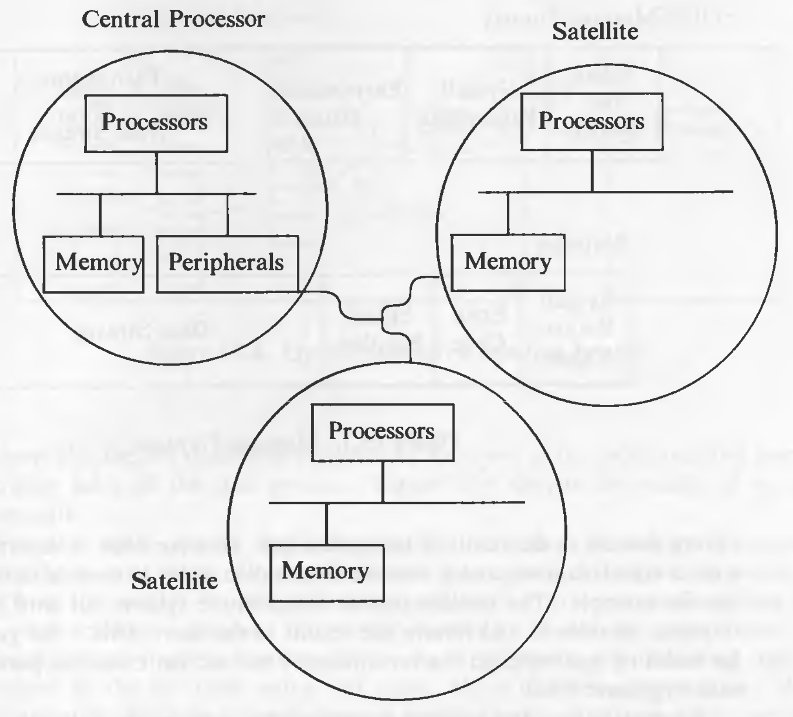
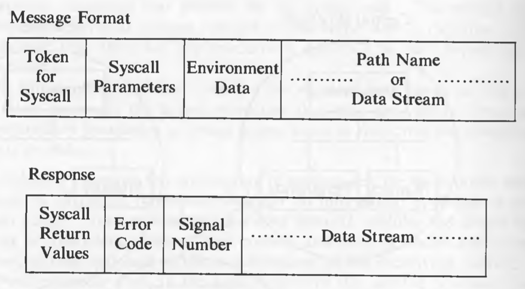
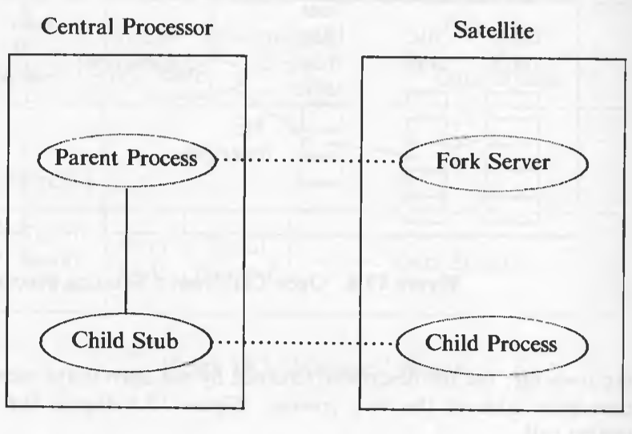
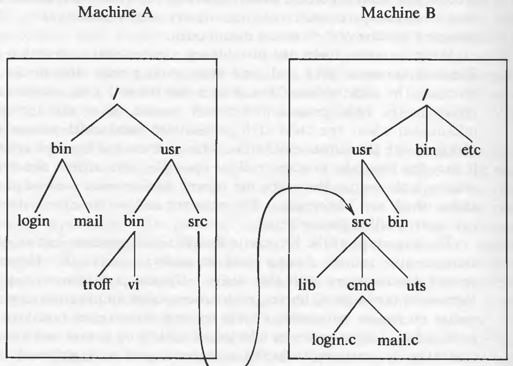

# Distributed UNIX Systems

Even though accessing files from the network is possible, the user is aware of that the files are coming from a network. Users would like to do the normal set of UNIX system calls and not be aware that they cross a machine boundary, except for a possible degradation in performance.

In a distributed system, each computer is an autonomous unit and has a CPU, memory and peripherals. The kernels on each machine can also be independent, but they must satisfy the constraints to be a part of the distributed system. The architecture is shown below:


Distributed systems have been implemented and they roughly fall into the following categories:
	
* *Satellite* systems are tightly clustered groups of machines that center on one (usually larger) machine. The satellite processors share the process load with the central processor and refer all system calls to it. Unlike other models of distributed systems, satellites do not have real autonomy.
* "Newcastle" distributed systems allow access to remote systems by recognizing names of remote files in the C library. The remote files are designated by special characters embedded in the path name or by special path component sequences that precede the file system root. It is easier to implement, but less flexible.
* Fully transparent distributed systems allow standard path names to refer to files on other machines; the kernel recognizes that they are remote. Path names cross machine boundaries at mount points, much as they cross file system mount points on disks.

## Satellite Processors

The architecture of the satellite configuration is given below:



Such configuration improves system throughput by offloading processes from the central processor and executing them on the satellite processors. Satellite processors have no peripherals except for the ones needed to communicate with the central processor. The file system and all devices are on the central processor. Processes do not migrate between satellite processor. The satellite processor contains a simplified operating system to handle local system calls, interrupts, and so on.

When the system is initialized, the kernel on the central processor downloads a local operating system into each satellite processor, which continues to run there until the system is taken down. Each process on a satellite processor has an associated *stub* process on the central processor. When a process on a satellite processor makes a system call that requires services provided only by the central processor, the satellite process communicates with its stub on the central processor to satisfy the request. The stub executes the system call and sends the results back to the satellite processor.

When a process on the satellite processor wants to execute a system call like *open* which needs the central processor, the process sends a message in a particular format to the stub process, which executes the system call and returns the response in a particular format, as shown in the figure:



The satellite process sleeps until it receives a response.

Consider what happens when a satellite process makes a *getppid* call. The satellite process sends a request (*write*s a message) to the central processor, the stub *read*s the message from the satellite, executes the *getppid* call and *write*s the result back to the satellite process, which had been waiting, *read*ing the communication link, and then the *getppid* call made by the satellite, returns.

When the central processor executes the *fork* system call, the kernel selects a satellite to execute the process and sends a message to a special server process on the satellite, informing it that it is about download a process. If the server accepts the request, it does a *fork* to create a new satellite process. The central processor downloads a copy of the *fork*ing process to the satellite processor, overwriting the address space of the process just created there, *fork*s a local stub process to communicate with the new satellite process, and sends a message to the satellite processor to initialize the program counter of the new process. The stub process is the child of the *fork*ing process; the satellite process is technically a child of the server process, but it is logically a child of the process that *fork*ed. The server process has no logical connection to the child process. The satellite and stub processes have the same process ID. The scenario is depicted in the diagram below:



When a satellite process *fork*s, a request is sent to the central processor. It does similar operations and creates a process on another satellite, as shown in the figure:


When a satellite process *exit*s, it sends an *exit* message to the stub, and the stub *exit*s. The stub cannot initiate an *exit* sequence.

A stub process handles system calls for a satellite, so it must react to signals in concert with the satellite process. If a signal causes a process on a uniprocessor to finish a system call abnormally, the stub process should behave the same way. When a satellite process executes the *signal* system call, it stores the usual information in local tables and sends a message to the stub process, informing it whether it should ignore the particular signal or not. A process reacts to a signal depending on three factors: whether the signal occurs when the process is in the middle of a system call, whether the process had called the *signal* system call to ignore the signal, or whether the signal originates on the satellite processor or on another processor. The algorithm for handling signals is given below:

```
/*  Algorithm: sighandle
 *  Input: none
 *  Output: none
 */

{
	if (clone process)
	{
		if (ignoring signal)
			return;
		if (in middle of system call)
			set signal against clone process;
		else
			send signal message to satellite process;
	}
	else					// satellite process
	{
		// whether in middle of system call or not
		send signal to clone process;
	}
}

/*  Algorithm: satellite_end_of_syscall
 *  Input: none
 *  Output: none
 */

{
	if (system call interrupted)
		send message to satellite telling about interrupt, signal;
	else		// system call not interrupted
		send system call reply: include flag indicating arrival of signal;
}
```

Example of a satellite process making a *read* system call (and receiving a signal):


If a process on the satellite receives a signal while its stub process is executing a system call, the satellite process (it wakes up due to the signal) sends a special message to the stub, informing the occurrence of the signal. The kernel on the central processor reads the message and sends the signal to the stub, which reacts as usual to the signal. The satellite process cannot send the message to the stub directly, because the stub is in the middle of a system call and is not *read*ing the communications line.

## The Newcastle Connection

The Newcastle Connection is more loosely coupled than the *satellite* systems. All the system calls are processed on the same machine but might access files on other machines. These systems use one of the two ways to identify remote files. Some systems insert a special character in the path name. For example,

`sftig!/fs1/mjb/rje`

where `sftig`, the component preceding the special character, identifies the machine. The remainder is the path name of the file on that machine.

Other way is to prepend a special prefix such as,

`/../sftig/fs1/mjb/rje`

where `/..` informs the parser that the file reference is remote, and the second component name gives the remote machine name. The latter is the path of the file on that machine.

The kernel does not determine if file is remote; instead, the C library functions that provide the kernel interface detect that a file access is remote and take appropriate action. Some implementations make it a responsibility of the kernel to detect if the file is on a remote machine. When dealing with a file (say, *open*ing it) on the remote machine, the stub process on the remote machine should access the remote file according to the same permissions that govern access to local files. But the client user ID for a particular user may be that of a different user on the remote machine. Either the system administrators of the machines must assign unique identifiers to all users across the network, or they must assign a transformation of user IDs at the time of request for network service. Failing the above, the stub process should execute with "other" permissions on the remote machine.

Allowing superuser access on remote files could circumvent security measures on the remote machine. On the other hand, various programs would not work without remote superuser capabilities. Perhaps this problem could best be solved by providing files with a separate set of access permissions for remote superuser access;  unfortunately, this would require changes to the structure of the disk inode to save the new permission fields and would thus cause too much turmoil in existing systems.

## Transparent Distributed File Systems

The users on this type of distribution can access files on another machine without realizing that they cross a machine boundary. The path names for remote files contain no distinguishing symbol and look exactly like local pathnames. The example below shows the structure where "/usr/src" on system B is mounted on "/usr/src" on system A. The *mount* system call is adapted for remote file systems. The kernel contains an expanded mount table.



Communication with a remote machine takes on one of two forms: remote procedure call or remote system call.

In a remote procedure call design, each kernel procedure that deals with inodes recognizes whether a particular inode refers to a remote file and, if it does, sends a message to the remote machine to perform a specific inode operation. The kernel data structures and their relationship is shown below:


This scheme suffers from frequency of network use, which is potentially several times per system call. Several operations can be combined into one message to reduce network traffic.

In a remote system call design, the local kernel recognizes that a system call refers to a remote file, and sends the parameters of the system call to the remote system, which executes the system call and returns the results to the client. The client machine receives the results of the remote system call and *longjmp*s out of the system call, because subsequent local processing, designed for uniprocessor system, may be irrelevant. Therefore, the semantics of the kernel algorithms may change to support a remote system call model. But, most system calls can be executed with only one network message, resulting in reasonably good system response.

## A Transparent Distributed Model without Stub Processes

Because of the stub processes, the process table becomes cluttered with stubs that are idle most of the time. Other schemes use special server processes on the remote machine to handle remote requests. The remote machine has a pool of server processes and assigns them temporarily to handle each remote request as it arrives. Consequently, each message from a client process must include data about its environment, such as UIDs, current directory, disposition of signals and so on. The relationship of the client and server exists only for the duration of the system call.

Handling flow control, signals, and remote devices is more difficult using server processes instead of stubs. If a remote machine is flooded with requests from many machines, it must queue the requests if it does not have enough server processes. This cannot happen with the stub model as the requests are synchronous: a client can have at most one outstanding request.

Handling signals is difficult because the remote machine must find the server process that is executing the system call.
