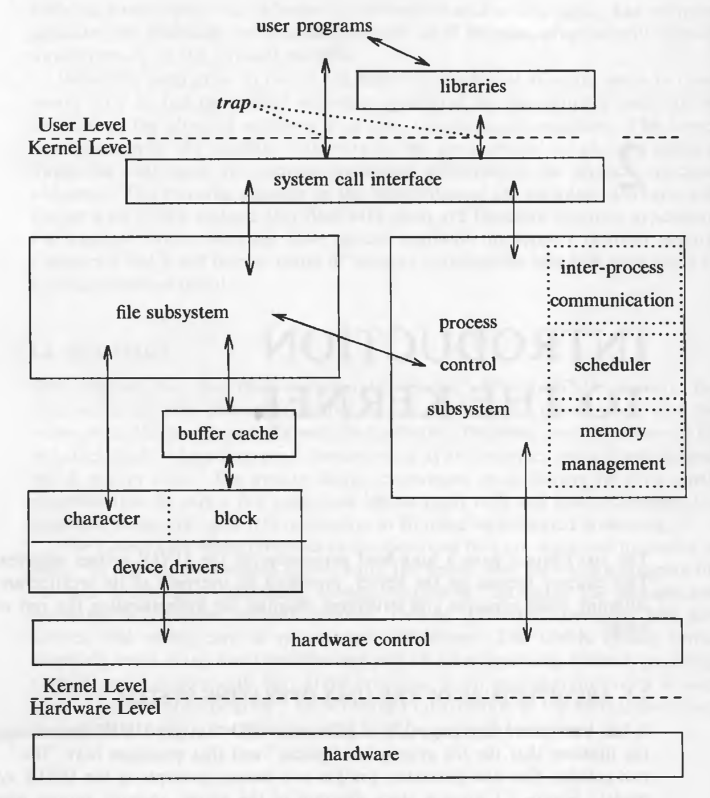
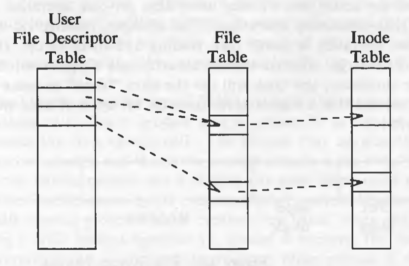
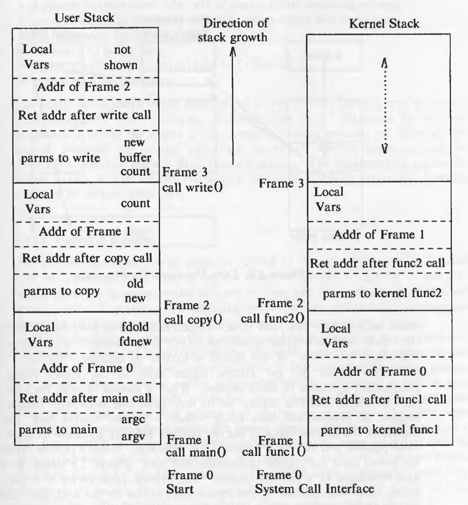

# Introduction to the Kernel

## Architecture of the UNIX Operating System

The UNIX system supports the illusions that the file system has "places" and that processes have "life".

The two entities, files and processes, are the two central concepts in the UNIX system model.



* The *file subsystem* is on the left and the *process control subsystem* is on the right.
* The diagram shows 3 levels : user, kernel, and hardware.
* The system call and library interface represent the border between user programs and the kernel.

## Introduction to System Concepts

### An Overview of the File Subsystem

Internal representation of a file is given by an *inode*, which contains a description of the disk layout of the file data and other information such as the file owner, access permissions, and access times. The term inode is a contraction of the term *index node*. Every file has one inode, but it may have several names, all of which map into the inode. Each name is called a *link*. When a process creates a new file, the kernel assigns it an unused inode.

Inodes are stored in the file system, but the kernel reads them into an in-core (in-memory) inode table when manipulating files. The kernel contains two other data structures, the *file table* and the *user file descriptor table*. The file table is a global kernel structure, but the user file descriptor table is allocated per process. When a process *open*s or *creat*s a file, the kernel allocates an entry from each table, corresponding to the file's inode. Entries in the three structures -- user file descriptor table, file table, and inode table -- maintain the state of the file and the user's access to it.  The file table keeps track of the byte offset in the file where the user's next *read8 or *write* will start, and the access rights allowed to the *open*ing process. The user file descriptor table identifier all open files for a process.



The kernel returns a *file descriptor* for the *open* and *creat* system calls, which is an index into the user file descriptor table. These three tables also enable sharing of files.

On a logical level, the kernel deals with file systems rather than with disks. It treats each file system as a *logical device* identified by a logical *device number*.

A file system consists of a sequence of logical blocks, each containing 512, 1024, 2048, or any convenient multiple of 512 bytes. The size of a local block is homogeneous within a file system but may vary between different file systems in a system configuration.

In this text, the size of a "block" is assumed to be 1K, unless stated otherwise.


A file system has the following structure:

* The *boot block* occupies the beginning of a file system, typically the first sector, and may contain the *bootstrap* code that is read into the machine to *boot* , or initialize, the operating system. Although only one boot block is needed to boot the system, every file system has a (possibly empty) boot block.
* The *super block* describes the state of a file system -- how large it is, how many files it can store, where to find free space on the file system, and other information.
* The *inode list* is a list of inodes that follows the super block in the file system. Administrators specify the size of the inode list when configuring a file system. The kernel references inodes by index into the inode list. One inode is the *root inode* of the file system: it is the inode by which the directory structure of the file system is accessible after execution of the *mount* system call.
* The data blocks start at the end of the inode list and contain file data and administrative data. An allocated data block can belong to t one and only one file in the file system.

## Processes

A process is the execution of a program and consists of a pattern of bytes that the CPU interprets as machine instructions (called *text*), *data*, and *stack*. Processes communicate with other processes and with the rest of the world via system calls.

A process on a UNIX system is the entity that is created by the *fork* system call. Every process except *process 0* is created when another process executes the *fork* system call. The process which invoked fork system call is called the parent process and the newly created process is called the child process. A process can have only one parent process but it can have many child processes. The kernel identifies each process by its process number, called the *process ID* (PID). Process 0 is a special process that is created "by hand" when the system boots; after *fork*ing a child  process (process 1), process 0 becomes the *swapper* process. Process 1, known as *init* is the ancestor of every other process.

An executable file consists of the following parts:

* a set of "headers" that describe the attributes of the file
* the program text
* a machine language representation of the data that has initial values when the program starts execution, and an indication of how much space the kernel should allocate for uninitialized data, called *bss* (block started by symbol).
* other sections, such as symbol table information.

```
#include <stdio.h>

char buffer[2048];
int version = 1;

main() {
	printf("Hello, world!");
}
```

In the code given above, the initialized data is the variable `version` and the uninitialized data (i.e *bss*) is the array `buffer`.

The kernel loads an executable file into memory during an *exec* system call, and the loaded process consists of at least three parts, called *regions*: text, data, and stack. The text and data regions correspond to the text and data-bss sections of the executable file, but the stack region is automatically created and its size is dynamically adjusted by the kernel at runtime. The stack consists of logical *stack frames* that are *push*ed when calling a function and *pop*ped when returning; a special register called the *stack pointer* indicates the current stack depth. A stack frame consists of parameters to a function, its local variables and the data necessary to recover the previous stack frame, including the value of the program counter and stack pointer at the time of the function call.

Because a process in the UNIX system can execute in two modes, kernel or user, it uses a separate stack for each mode. When a system call is made, a *trap* instruction is executed which causes an *interrupt* which makes the hardware switch to kernel mode. The kernel stack of a process is null when the process executes in user mode.




Every process has an entry in the kernel *process table*, and each process is allocated a *u area* ("u" stands for "user") that contains private data manipulated only by the kernel. The process table contains (or points to) a *per process region table*, whose entries point to entries in a *region table*. A region is a contiguous area of a process's address space, such as text, data, and stack. Region table entries describe the attributes of the region, such as whether it contains text or data, whether it is shared or private, and where the "data" of the region is located in memory. The extra level of indirection (from the per process region table to the region table) allows independent processes to share regions.


Important fields in the process table are:

* a state field
* identifiers indicating the user who owns the process (user IDs, or UIDs)
* an event descriptor set when a process is suspended (in the *sleep* state)

The u area contains information that needs to be accessible only when the process is executing. Important fields in the u area are:

* a pointer to the process table slot of the currently executing process
* parameters of the current system call, return values and error codes
* file descriptors for all open files
* internal I/O parameters
* current directory and current root
* process and file size limits

The kernel internally uses a structure variable *u* which points to the u area of the currently executing process. When another process executes, the kernel rearranges its virtual address space that *u* refers to the u area of the new process.

## Context of a process

Context of a process consists of the following:

* text region
* values of global variables and data structures
* values of machine registers
* values stored in its process table slot
* u area
* contents of user and kernel stacks

The text of the operating system and its global data structures are shared by all processes but do not constitute part of the context of a process.

When the kernel decides that it should execute another process, it does a *context switch*, so that the system executes in the context of the other process.

The kernel services the interrupts in the context of the interrupted process even though it may not have caused the interrupt. Interrupts are served in kernel mode.

## Process states

1. Process is currently executing in user mode.
2. Process is currently executing in kernel mode.
3. Process is not executing, but it is ready to run as soon as the scheduler chooses it.
4. Process is sleeping.

Because a processor can execute only one process at a time, at most one process may be in states 1 and 2.

## State transitions

Processes move continuously between the states according to well-defined rules. A *state transition* diagram is a directed graph.


By prohibiting arbitrary context switches and controlling the occurrence of interrupts, the kernel protects its consistency.

The kernel allows a context switch only when a process moves from the state "kernel running" to the state "asleep in memory". Processes running in kernel mode cannot be preempted by other processes; therefore the kernel is sometimes said to be *non-preemptive*.

Consider the following code snippet:

```
struct queue {

} *bp, bp1;

bp1->forp = bp->forp;
bp1->backp = bp
bp->forp = bp1;
// consider possible context switch here
bp1->forp->backp = bp1;
```

In the above code, we are trying to put a new node into a doubly linked list. Kernel uses many such doubly linked lists as its data structures. While inserting the node in the list, if a context switch occurs at the specified line, it will have incorrect links. If other process modifies the list, it will get corrupt.


Therefore, when entering *critical* regions of the code, kernel raises its processor execution level to prevent interrupts.

The process scheduler periodically preempts processes executing in user mode so that processes cannot monopolize use of the CPU.

## Sleep and wakeup

A process changes its state on its own will. Other processes can communicate with it and suggest various alternatives. But the final decision is made by the process on its own initiative. Consequently, an interrupt handler cannot go to sleep, because if it could, the interrupted process would be put to sleep by default.

Process always *sleep on an event*, meaning that they are in the sleep state until the event occurs, at which time they wake up and enter the state "ready to run". Many processes can simultaneously sleep on an event. When that event occurs, *all* the processes wake up because the event condition is no longer true. They transition from "sleep" state to "ready to run" state. Sleeping processes do not consume CPU resources. The kernel does not constantly check to see that a process is still sleeping but waits for the event to occur and awakens the process then.

The kernel, while modifying a critical data structure, always checks if some other process has locked the data structure. If yes, it *sleep*s on the event of the data structure being unlocked. After it is unlocked, the process will *wakeup* and lock the data structure so that it can modify it. The kernel implements such locks in the following manner:

```
while (condition is true)
	sleep (event: the condition becomes false);
set condition true;
```

It unlocks the lock and awakens all processes asleep on the lock in the following manner:

```
set condition false;
wakeup (event: the condition is false);
```

Example of 3 processes waiting for a the same buffer.


## Kernel Data Structures

Most kernel data structure have fixed size rather than dynamically allocated space.

This decision was taken to make the kernel code simple. But the disadvantage is that kernel cannot be configured dynamically. If, at runtime, kernel hits the limit of some data structure, it has to throw errors. But such situations occur **very** rarely.

## System Administration

Conceptually, there is no difference between system administrative processes and user processes. It's just that the system administrative processes have more rights and privileges. Internally, the kernel distinguishes a special user called the *superuser*. A user may become a superuser by going through a login-password sequence or by executing special programs.
