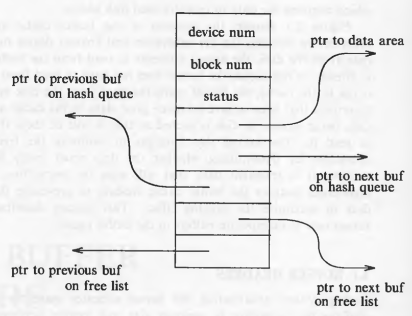
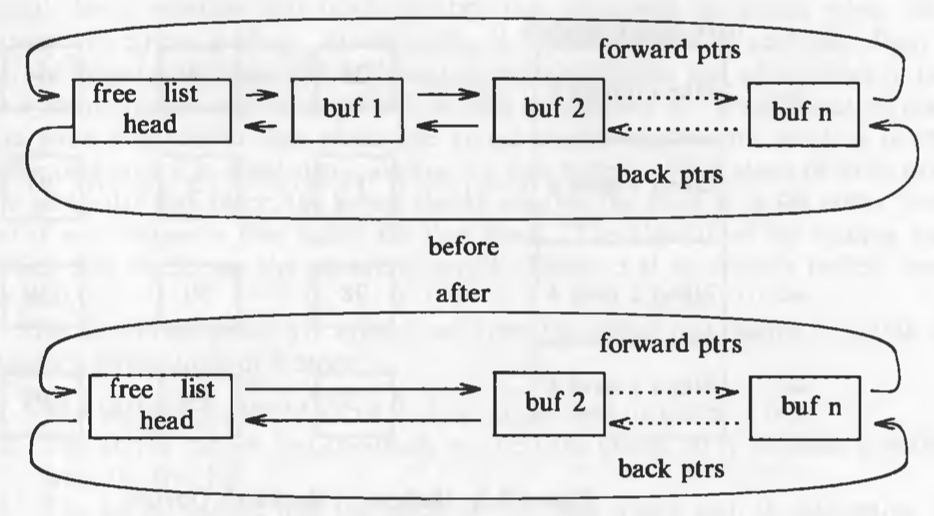
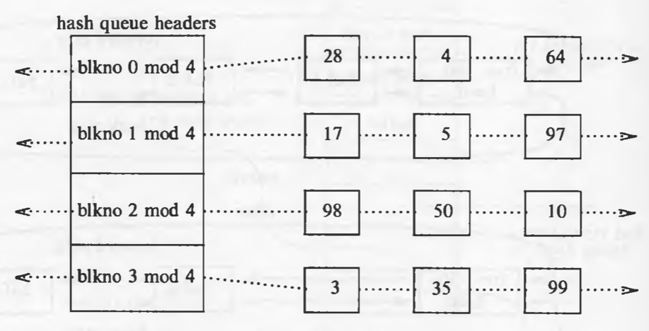
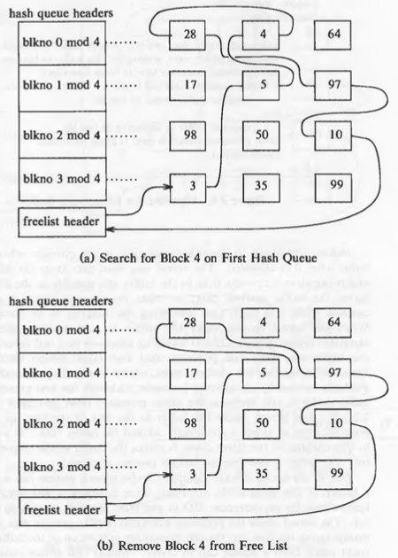
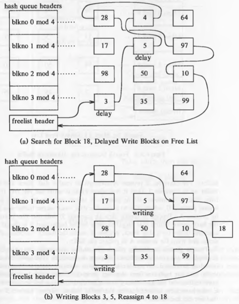
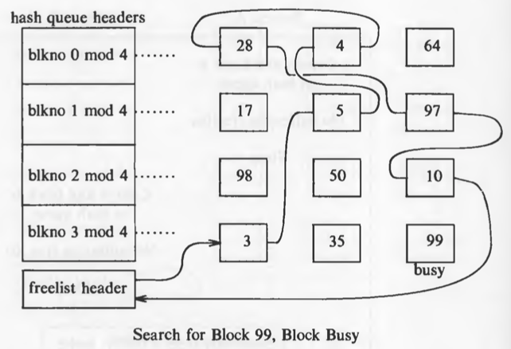
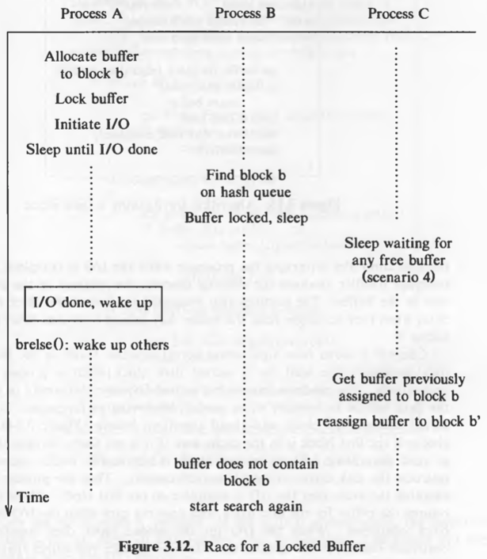

# The Buffer Cache

The kernel could read and write directly to and from the disk for all the file system accesses, but system response time and throughput will be poor because of the slow disk transfer rate. The kernel therefore attempts to minimize the frequency of disk access by keeping a pool of data buffers, called the *buffer cache*, which contains data in recently used disk blocks.

Architecturally, it is positioned between file subsystem and device drivers.

## Buffer Headers

During system initialization, the kernel allocates space for a number of buffers, configurable according to memory size and performance constraints.

Two parts of the buffer:

1. a memory array that contains data from the disk.
2. *buffer header* that identifies the buffer.

Data in a buffer corresponds to data in a logical disk block on a file system. A disk block can **never** map into more than one buffer at a time.



The *device number* fields specifies the logical file system (not physical device) and *block number* block number of the data on disk. These two numbers *uniquely* identify the buffer. The *status* field summarizes the current status of the buffer. The *ptr to data area* is a pointer to the data area, whose size must be at least as big as the size of a disk block.

The status of a buffer is a combination of the following conditions:

* Buffer is locked / busy
* Buffer contains valid data
* Kernel must write the buffer contents to disk before reassigning the buffer; called as "delayed-write"
* Kernel is currently reading or writing the contexts of the buffer to disk
* A process is currently waiting for the buffer to become free.

The two set of pointers in the header are used for traversal of the buffer queues (doubly linked circular lists).

## Structure of the Buffer Pool

The kernel follows the *least recently unused (LRU)* algorithm for the buffer pool. The kernel maintains a *free list* of buffers that preserves the least recently used order. Dummy buffer header marks the beginning and end of the list. All the buffers are put on the free list when the system is booted. When the kernel wants *any* buffer, it takes it from the head of the free list. But it can also take a specific buffer from the list. The used buffers, when become free, are attached to the end of the list, hence the buffers closer and closer to the head of the list are the least recently used ones.



When the kernel accesses a disk block, it searches for the buffer with the appropriate device-block number combination. Rather than search the entire buffer pool, it organizes the buffers into separate queues, *hashed* as a function of the device and block number. The hash queues are also doubly linked circular lists. A hashing function which uniformly distributes the buffers across the lists is used. But it also has to be simple so that the performance does not suffer.



The hash function shown in the figure only depends on the block number; real hash functions depend on device number as well.

Every disk block in the buffer pool exists on one and only one hash queue and only once on that queue. However, presence of a buffer on a hash queue does not mean that it is busy, it could well be on the free list as well if its status is free.

Therefore, if the kernel wants a particular buffer, it will search it on the queue. But if it wants *any* buffer, it removes a buffer from the free list. **A buffer is always on a hash queue, but it may or may not be on the free list**

## Scenarios for Retrieval of a Buffer

The algorithms for reading and writing disk blocks use the algorithm *getblk* to allocate buffers from the pool. There are 5 typical scenarios the kernel may follow in *getblk* to allocate a buffer for a disk block.

1. Block is found on its hash queue and its buffer is free.
2. Block could not be found on the hash queue, so a buffer from the free list is allocated.
3. Block could not be found on the hash queue, and when allocating a buffer from free list, a buffer marked "delayed write" is allocated. Then the kernel must write the "delayed write" buffer to disk and allocate another buffer.
4. Block could not be found on the hash queue and the free list of buffers is empty.
5. Block was found on the hash queue, but its buffer is currently busy.

The algorithm *getblk* is given below (scenarios stated above are marked in the comments) :

```
/*
 *  Algorithm: getblk
 *  Input: file system number
 *          block number
 *  Output: locked buffer that can now be used for block
 */

{
	while (buffer not found)
	{
		if (block in hash queue)
		{
			if (buffer busy)   // scenario 5
			{
				sleep (event: buffer becomes free);
				continue;      // back to while loop
			}
			mark buffer busy;  // scenario 1
			remove buffer from free list;
			return buffer;
		}
		else
		{
			if (there are no buffers on the free list)
			{
				sleep (event: any buffer becomes free);   // scenario 4
				continue;      // back to while loop
			}
			remove buffer from free list;
			if (buffer marked for delayed write)         // scenario 3
			{
				asynchronous write buffer to disk;
				continue:      // back to while loop;
			}
			// scenario 2
			remove buffer from old hash queue;
			put buffer onto new hash queue;
			return buffer;
		}
	}
}

```

When using the buffer, the kernel always marks the buffer as busy so that no other process can access it. When the kernel finishes using the buffer, it releases the buffer according to the algorithm *brelse*.

The algorithm *brelse* is given below :

```
/*  Algorithm: brelse
 *  Input: locked buffer
 *  Output: none
 */
 
{
	wakeup all processes (event: waiting for any buffer to become free;
	wakeup all processes (event: waiting for this buffer to become free;
	raise processor execution level to block interrupts;
	if (buffer contents valid and buffer not old)
		enqueue buffer at end of free list;
	else
		enqueue buffer at beginning of free list;
	lower processor execution level to allow interrupts;
	unlock (buffer);
} 
```

Buffer contents are old only if it is marked as "delayed write", in that case and in the case where the data is not valid (for example, due to I/O corruption), the buffer is put in the beginning of the free list as its data is not valid or old. Otherwise the data is valid as the buffer is put at the end to follow the LRU strategy.

The states of hash queues for different scenarios are shown in following figures :

Scenario 1



Scenario 2

Here the buffer is not on the hash queue, so a buffer from free list is removed and then its device and block numbers are changed.


Scenario 3



Scenario 4


Race for free buffer


Scenario 5



Race for a locked buffer **(this is an important race condition)**



**The kernel guarantees that all processes waiting for buffers will wake up, because it allocates buffers during execution of system calls and frees them before returning.**


## Reading and Writing Disk Blocks

This is the algorithm (*bread*) for reading data from the disk:

```
/*  Algorithm: bread
 *  Input: file system number
 *         block number
 *  Output: buffer containing data
 */
 
{
	get buffer for block (algorithm: getblk);
	if (buffer data valid)
		return buffer;
	initiate disk read;
	sleep (event: disk read complete);
	return buffer;
}
```

If the data is not found in the buffer pool, the kernel initiates disk read. The driver "schedules" a read request to the disk controller, which copies the data from the disk to the buffer and then the disk interrupt handler awakens the sleeping process.

The higher level algorithms anticipate the need for the next disk block if a sequential file access is being done. The second read is asynchronous. The kernel expects the data to be there for the second block when it wants.

The algorithm *breada* (bread-ahead) is given below:

```
/*  Algorithm: breada
 *  Input: file system number and block number for immediate read
 *         file system number and block number for asynchronous read
 *  Output: buffer containing data for immediate read
 */
 
{
	if (first block not in cache)
	{
		get buffer for first block (algorithm: bread);
		if (buffer data not valid)
			initiate disk read;
	}
	if (second block not in cache)
	{
		get buffer for second block (algorithm: getblk);
		if (buffer data valid)
			release buffer (algorithm: brelse);
		else
			initiate disk read;
	}
	if (first block was originally in the cache)
	{
		read first block (algorithm: bread);
		return buffer;
	}
	sleep (event: first buffer contains valid data);
	return buffer;
}
```

Note: in the algorithm above, the line: `get buffer for first block (algorithm: bread)` is not correct in my opinion. The algorithm here should be `getblk` and not `bread` as we are checking for validity and initiating a disk read both of which are done internally in `bread`. So the algorithm here should be `getblk`. It might just be a printing mistake in the book.

If we get the data for the second block in the buffer cache, we release it immediately as we do not need it right away. It will be acquired when the data is actually needed.

The algorithm (*bwrite*) for writing contents of a buffer to a disk block is given below:

```
/*  Algorithm: bwrite
 *  Input: buffer
 *  Output: none
 */

{
	initiate disk write;
	if (I/O synchronous)
	{
		sleep (event: I/O complete);
		release buffer (algorithm: brelse);
	}
	else if (buffer marked for delayed write)
			mark buffer to put at head of free list;
}
```

Because of the two asynchronous I/O operations -- block read ahead and delayed write -- the kernel can invoke *brelse* from an interrupt handler. Hence, it must prevent interrupts in any procedure that manipulates the buffer free list.
