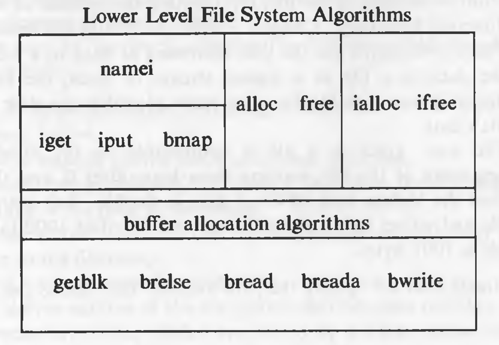
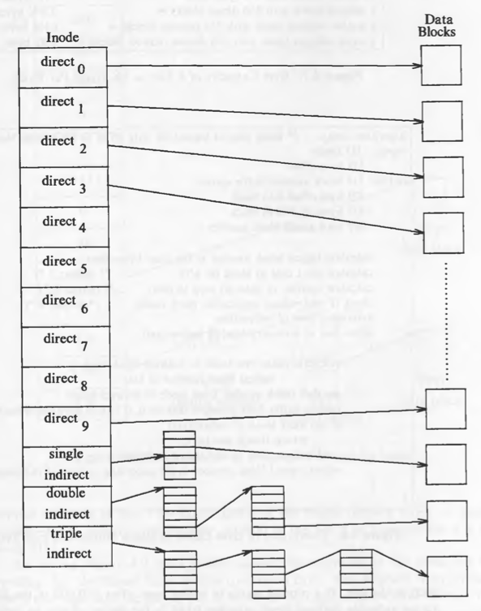
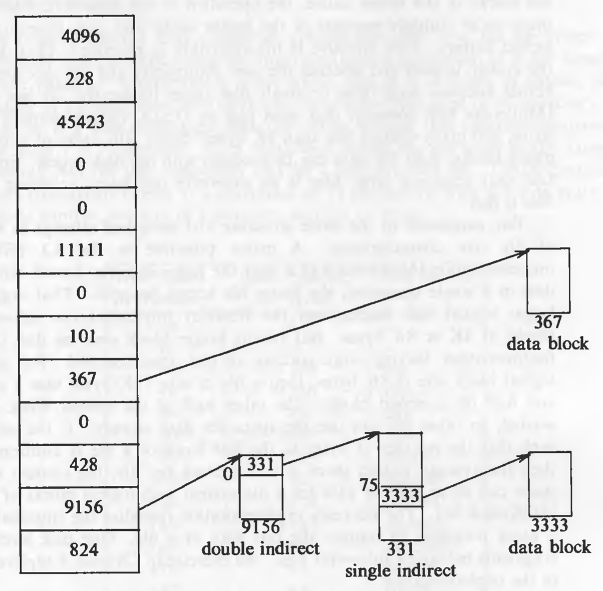
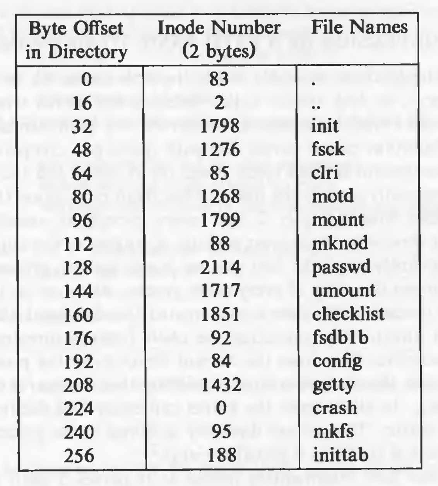
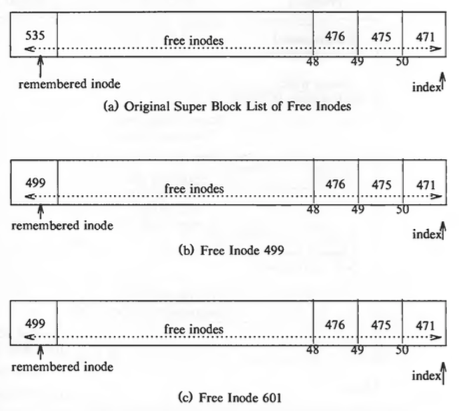
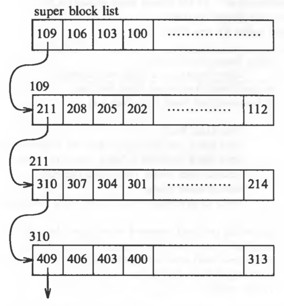

# Internal Representation of Files

Every file a UNIX system has a unique inode. Processes interact with files using well defined system calls. The users specify a file with a character string which is the file's path and then the system get the inode which is mapped to the file which corresponds to the path.

The algorithms described below are above the layer of buffer cache. Diagrammatically, it can be shown like this:



## Inodes

Inodes exist in a static form on the disk. The kernel reads them into in-core inodes and modifies them.

Disk inodes consists of the following fields:

* Owner information: ownership is divided into a user and a group of users. Root user has access to all the files.
* File type: it states whether a file is a normal file, a directory, a block or character special file, or a device file.
* File access permissions: there are 3 types of access permissions: owner, group and others. There are separate permissions for reading, writing and executing. Since execute permission is not applicable to a directory, execute permission for a directory gives the right to search inside the directory.
* Access times: the times at which the file was last accessed and last modified, and the time at which the inodes was last modified
* Number of links: number of places from which the file is being referred.
* Array of disk blocks: even if the users get a logically sequential representation of data in files, the actual data is scattered across the disk. This array keeps the addresses of the disk blocks on which the data is scattered.
* File size: the addressing of the file begins from location 0 from relative to the starting location and the size of the file is the maximum offset of the file + 1. For example, if a user creates a file and writes a byte at offset 999, the size of the file is 1000.

The inode does not specify the pathname/pathnames that access the file.


The in-core inodes contain the following fields in additional to the fields of the disk inode:

* Status of the inode
	1. Locked.
	2. A process is (or many processes are) waiting for it to be unlocked.
	3. The data in the inode differs from the disk inode due to change in the inode data.
	4. The data in the inode differs from the disk inode due to change in the file data.
	5. The file is a mount point (discussed later).
* The device number of the logical device of the file system on which the file resides.
* Inode number: the disk inodes are placed in an array. So the number of the inode is nothing but the index of the inode in the array. That is why the disk copy does not need to store the inode number.
* Points to inodes: just like the buffer cache, the in-core inodes are nothing but a cache for disk inodes (but with some extra information which is deterministic). In-core inodes also have hash queues and a free list and the lists behave in a very similar way to the buffer lists. The inode has next and previous pointers to the inodes in the hash queue and free lists. The hash queues have a hash function based on the device number and inode number.
* Reference count: it gives the number of instances of files that are active currently.

The most striking difference between an in-core inode and a buffer header is the *reference count*. The reference count increases when a process allocates that inode, for example, by *open*ing a file. An inode is on the free list if and only if the reference count of the inode is 0. If it is greater, some process is still accessing the inode. This means, that an inode can be on a hash queue and not on the free list even if its not locked. That is not the case with a buffer, a buffer will always be on the free list if it is not locked.

### Accessing Inodes

The algorithm *iget* allocates an in-core copy of an inode. If the inode is not found on a hash queue, it allocates an inode from the free list and reads the disk copy into the in-core inode. It already knows the inode number and device number. It calculates the logical block number on which the disk inode resides according to how many inodes fit into one disk block. The formula for calculating the logical block number is:

`block number = ((inode number - 1) / number of inodes per block) + start block of inode list`

where the division operation returns the integer part of the quotient.

To find the byte offset of the inode in that block, this following formula is used:

`byte offset = ((inode number - 1) % number of inodes per block) * size of disk inode`

The algorithm *iget* is given below:

```
/*  Algorithm: iget
 *  Input: file system inode number
 *  Output: locked inode
 */
 
{
	while (not done)
	{
		if (inode in inode cache)
		{
			if (inode locked)
			{
				sleep (event: inode becomes unlocked);
				continue;
			}
			// special processing for mount points, covered later
			if (inode on free list)
				remove inode from free list;
			increment reference count of the inode;
			return inode;
		}
		// inode not in the cache
		if (free list is empty)
			return error;
		remove inode from free list;
		reset inode number and file system;
		remove inode from old hash queue and place it on the new hash queue;
		read inode from disk (algorithm: bread);
		initialize inode;
		return inode;
	}
}
```

**The kernel manipulates inode lock and reference count independently.** It locks an inode when it is being accessed or modified. An inode is never locked across system calls. But the reference count remains set across system calls. The kernel can lock and unlock an inode independent of the value of the reference count.

The algorithm *iget* is very similar to *getblk* but there's one big difference. In *getblk*, a process sleeps if the free list is empty. But in *iget*, an error returned. The reason behind this difference is that the process have control over inodes at user level with *open* and *close* system calls. If a process *open*s a file and never closes it, the inode will have reference count of at least 1 and it will never be on the free list unless the process *close*s the file. This is not the case with buffers. Processes don't have user level control over buffers. Therefore, buffers are guaranteed to get free but inodes are not.

### Releasing Inodes

The algorithm *iput* is used to release an inode:

```
/*  Algorithm: iput
 *  Input: in-core inode
 *  Output: none
 */
 
{
	lock inode if not already locked;
	decrement inode reference count;
	if (reference count == 0)
	{
		if (inode link count == 0)
		{
			free disk blocks for file (algorithm: free); // free is described later
			set file type to 0;
			free inode (algorithm: ifree); // ifree is described later
		}
		if (file accessed or inode changed or file changed)
			update disk inode;
		put inode on free list;
	}
	release inode lock;
}
```

## Structure of a Regular File

In UNIX, the data in files is not stored sequentially on disk. If it was to be stored sequentially, the file size would not be flexible without large fragmentation. In case of sequential storage, the inode would only need to store the starting address and size. Instead, the inode stores the disk block numbers on which the data is present. But for such strategy, if a file had data across 1000 blocks, the inode would need to store the numbers of 1000 blocks and the size of the inode would differ according to the size of the file.

To be able to have constant size and yet allow large files, indirect addressing is used. The inodes have array of size 13 which for storing the block numbers, although, the number of elements in array is independent of the storage strategy. The first 10 members of the array are "direct addresses", meaning that they store the block numbers of actual data. The 11th member is "single indirect", it stores the block number of the block which has "direct addresses". The 12th member is "double indirect", it stores block number of a "single indirect" block. And the 13th member is "triple indirect", it stores block number of a "double indirect" block. This strategy can be extended to "quadruple" or "quintuple" indirect addressing.



If a logical block on the file system holds 1K bytes and that a block number is addressable by a 32 bit integer, then a block can hold up to 256 block numbers. The maximum file size with 13 member data array is:

```
10 direct blocks with 1K bytes each =                     10K bytes
1 indirect block with 256 direct blocks =                 256K bytes
1 double indirect block with 256 indirect blocks =        64M bytes
1 triple indirect block with 256 double indirect blocks = 16G bytes
```

But the file size field in the inode is 32 bits, the size of a file is effectively limited to 4 gigabytes.

The algorithm *bmap* is used to convert logical byte offset of a file to a physical disk block:

```
/*  Algorithm: bmap
 *  Input: inode
 *         byte offset
 *  Output: block number in file system
 *          byte offset into block
 *          bytes of I/O in block
 *          read ahead block number
 */
 
{
	calculate logical block number in file from byte offset;
	calculate start byte in block for I/O;       // output 2
	calculate number of bytes to copy to user;   // output 3
	check if read-ahead applicable, mark inode;  // output 4
	determine level of indirection;
	while (not at necessary level of indirection)
	{
		calculate index into inode or indirect block from logical block number in file;
		get disk block number from inode or indirect block;
		release buffer from previous disk read, if any (algorithm: brelse);
		if (no more levels of indirection)
			return (block number);
		read indirect disk block (algorithm: bread);
		adjust logical block number in file according to level of indirection;
	}
}
```

Some examples of conversions (refer to the figure):



1. To access byte offset 9000: 
The first 10 blocks contain 10K bytes. So 9000 should be in the first 10 block.
`9000 / 1024 = 8` so it is in the 8th block (starting from 0). And `9000 % 1024 = 808` so the byte offset into the 8th block is 808 bytes (starting from 0). (Block 367 in the figure.)
2. To access byte offset 350000:
The first 10 blocks contain 10K bytes `(350000 - 10240 = 339760)`. A single indirect block contains 256K bytes. `(339760 - (256 * 1024) = 77616)`. So a double indirect block (block 9156 in the figure) must be used. Every single indirect block in the double indirect block contains 256K, so data must be in the 0th single indirect block (block 331 in the figure). Every direct block in the single indirect block addresses 10K bytes `(77616 / 10240 = 7)`. So the data must be in 7th (starting from 0) direct block (block number 3333 in the figure). And the byte offset will be `77616 % 1024 = 816`.

## Directories

Directory files have entries of sub directories and files that reside inside them. Directory files have the mapping of a file name and its inode number. One directory entry takes 16 bytes. 14 bytes are given for the name of the file and 2 bytes for inode number. For example:



The entry `.` has the inode number of the the directory file itself. And `..` has the inode number of the parent directory. `.` and `..` for the root directory are nothing but inode numbers of the root directory itself. Entries that have the inode number 0 are empty (i.e. deleted files).

The kernel has exclusive writes to write to a directory. The access permission for directories mean different things. Read permission is for reading the contents of the directory, write permission given the permission to create files and directories in that directory, and the execute permission gives the right to search in that directory.

## Conversion of Path Name to an Inode

Algorithm *namei* (*name* to *i*node) is used for converting a path to an inode number. The kernel parses the path by accessing each inode in the path and finally returning the inode of the required file. Every process has a *current directory*. The current directory of process 0 is the root directory. For every other process, it is the current directory of its parent process. Later the process can change the current directory with the system call *chdir*. The inode of the current directory is stored in the u-area. Searches start with respect to the current directory unless the path begins with the */* component, stating that the search should start with the root directory. Inode number of the root is present as the global variable. Even if the *current root* is changed by using *chroot* (more on this later), the current root inode number is stored in the u-area.

Algorithm *namei* is given below:

```
/*  Algorithm: namei
 *  Input: pathname
 *  Output: locked inode
 */
 
{
	if (path name starts from root)
		working inode = root inode (algorithm: iget);
	else
		working inode = current directory inode (algorithm: iget);
	
	while (there is more path name)
	{
		read next path name component from input;
		verify that working inode is of a directory and access permissions are OK;
		if (working inode is of root and component is "..")
			continue;
		read directory (working inode) by repeated use of algorithms: bmap, bread, brelse;
		if (component matches an entry in the directory (working inode)
		{
			get inode number for matched component;
			release working inode (algorithm: iput);
			working inode = inode of matched component (algorithm: iget);
		}
		else
			return (no inode)  // component not in the directory
	}
	
	return (working inode);
}
```

Here, `working inode` is used for the intermediate inodes in the path.

## Superblock

The contents of the super block are:

* size of the file system.
* number of free blocks in the file system.
* list of free blocks in the file system.
* pointer to the next free block in the free blocks list
* size  of the inodes list.
* number of free inodes in the file system.
* list of free inodes in the file system.
* pointer to the next free inode in the free inodes list.
* lock fields for the free blocks and free inodes list.
* a field indicating whether the super block has changed.

The kernel periodically writes the superblock to the disk if it had been modified so that it is consistent with the data on the disk.

## Inode Assignment to a New File

Algorithm *ialloc* is used to assign an inode to a newly crated file:

```
/*  Algorithm: ialloc
 *  Input: file system
 *  Output: locked inode
 */
 
{
	while (not done)
	{
		if (super block locked)
		{
			sleep (event: super block becomes free);
			continue;
		}
		if (indoe list in super block is empty)
		{
			lock super block;
			get remembered inode for free inode search;
			search disk for free inodes until super block full, or no more free inodes (algorithm: bread and brelse);
			unlock super block;
			wake up (event: super block becomes free);
			if (no free inodes found on disk)
				return (no inode);
			set remembered inode for next free inode search;
		}
		// there are inodes in super block inode list
		get inode number form super block inode list;
		get inode (algorithm: iget);
		if (inode not free after all)
		{
			write inode to disk;
			release inode (algorithm: iput);
			continue;
		}
		// inode is free
		initialize inode;
		write inode to disk;
		decrement file system free inode count;
		return inode;
	}
}
```

If the list of inodes numbers in the super block is not empty, the kernel assigns the next inode number, allocates a free in-core inode for the newly assigned disk inode using algorithm *iget*, copies the disk inode to the in-core copy, initializes the fields in the inode and returns the locked inode. It updates the inode on disk to indicate that the inode is in use.

If the super block list of free inodes is empty, the kernel searches the disk and places as many free inode numbers as possible into the super block. The kernel reads the inode list on disk, block by block, and fills the super block list of inode numbers to capacity, remembering the highest-numbered inode that it finds ("remembered" inode). It is the last one saved in the super block. The next time the kernel searches the disk for free inodes, it uses the remembered inode as its starting point, thereby assuring that it wastes no time reading disk blocks where no free inodes should exist.

An example:


Super block lists are maintained such that the last inode it dispenses from the list is the remembered inode.

Algorithm for freeing inodes (*ifree*) is a simple one:

```
/*  Algorithm: ifree
 *  Input: file system inode number
 *  Output: none
 */

{
	increment file system free inode count;
	if (super block locked)
		return;
	if (inode list full)
	{
		if (inode number less than remembered inode for search)
			set remembered inode for search = input inode number;
	}
	else
		store inode number in inode list;
	return;
}
```

If the super block is locked, the algorithm returns, the inode number is not updated in the free list of inode numbers. But the inode can be found when searching the disk blocks. If the disk blocks list is full and the inode number is less than the remembered inode number, the replace the remembered inode number with the input inode number, so that the search will start from that inode.

Ideally, there should never be free inodes whose inode number is less than the remembered inode number, but exceptions are possible. If an inode is being freed and the super block is locked, in such situation, the it is possible to have an inode number that is free and is less than the remembered inode number.

An example:



In *ialloc*, there is a race condition where an inode can be in use even if we get it from the list of free inode numbers in the super block. Following is an example where such condition is possible.

Assume that there are 3 processes, A, B, and C. If process A assigns inode I but goes to sleep before it copies the disk inode into the in-core copy. Algorithms *iget* (invoked by *alloc*) and *bread* (invoked by *iget*) give ample opportunity to go to sleep. If, while process A sleeps, process B tries to acquire an inode but finds that the list of free inode numbers is empty. So it starts searching (assume that it starts searching at a lower inode number than inode I) the disk blocks for free inodes and finds inode I, as inode I is still marked free. Process B completes the search, fills up the list and departs taking an inode number. Process A wakes up and completes the assignment of inode I. Now suppose process C later requests an inode and happens to pick inode I from the super block free list. When it gets the in-core copy of the inode, it will find its file type set, implying that the inode was already assigned. That is why that check is required in *ialloc*.

## Allocation of Disk Blocks

When data is written on a file, the kernel must allocate disk blocks from the file system (for direct data blocks or sometimes, indirect data blocks). The file system super block contains an array that is used to cache the numbers of free disk blocks in the file system. The utility program *mkfs* (make file system) organizes the data blocks of a file system in a linked list, such that each link of the list is a disk block that contains an array of free disk block numbers, and one array entry is the number of the next block of the linked list. For example:



Algorithm for allocation of disk blocks (*alloc*) is given below:

```
/*  Algorithm: alloc
 *  Input: file system number
 *  Output: buffer for new block
 */
 
{
	while (super block locked)
		sleep (event: super block not locked);
	remove block from super block free list;
	if (removed last block from free list)
	{
		lock super block;
		read block just taken from free list (algorithm: bread);
		copy block numbers in block into super block;
		release block buffer (algorithm: brelse);
		unlock super block;
		wakeup processes (event: super block not locked);
	}
	get buffer for block removed from super block list (algorithm: getblk);
	zero buffer contents;
	decrement total count of free blocks;
	mark super block modified;
	return buffer;
}
```

The program *mkfs* tries to organize the original linked list of free block numbers so that block numbers dispensed to a file are near each other. This helps performance, because it reduces disk seek time and latency when a process reads a file sequentially. The kernel makes no attempt to sort block numbers on the free list.

The algorithm *free* for freeing a block is the reverse of the one for allocating a block. If the super block list is not full, the block number of the newly freed block is placed on the super block list. If, however, the super block list is full, the newly freed block becomes a link block; the kernel writes the super block list into the block and writes the block to disk. It then places the block number of the newly freed block in the super block list: That block number is the only member of the list.

An example of how the super block free data blocks list works:


There is a difference is how free inode numbers are managed and how free disk block numbers are managed. All the free disk block numbers are stored as a linked list of arrays but in case of free inode numbers, all the free inode numbers are not stored. After the capacity of the free inode numbers exceeds, the other free inode numbers are not stored anywhere. There are 3 reasons for this different treatment:

1. The kernel can determine whether an inode is free by inspecting its file type. However, there is no way to know whether a disk block is free by looking at the data in it.
2. Disk block lend themselves to the use of linked list: a disk block easily holds large lists of free block numbers. But inodes have no convenient place for bulk storage of large list of free inode numbers.
3. Users tend to use free disk blocks more than free inodes, so the performance lag in searching would be more noticeable in case of disk blocks than inodes.

## Other File Types

The UNIX system supports two other file types: pipes and special files. A pipe, sometimes called a *fifo* (first-in-first-out), differs from a regular file in that its data is transient; once data is read from a pipe, it cannot be read again. Also, the data is read in the order that it was written to the pipe, and the system allows no deviation from that order. The kernel stores data in a pipe the same way it stores data in an ordinary file, except that it uses only the direct blocks, not the indirect blocks. Pipes are described later.

Other types in UNIX system are special files, including block device special files and character device special files. Both types specify devices, and therefore the file inodes do not reference any data. Instead, the inode contains two numbers known as the major and minor device numbers. The major number indicates a device type such as terminal or disk, and the minor number indicates the unit number of the device. Device files are covered later.
