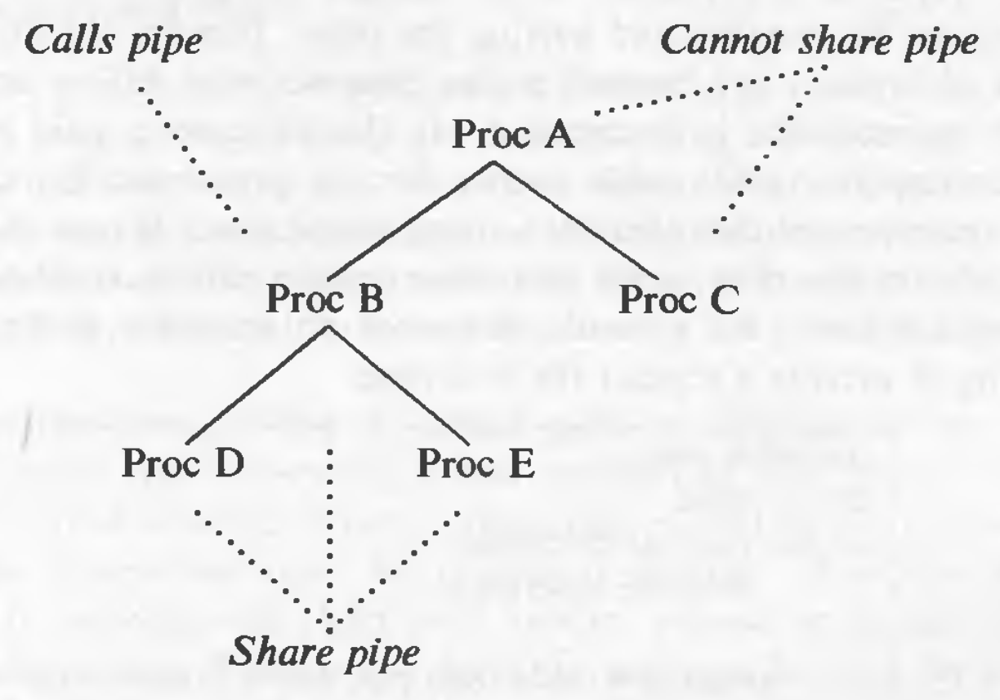
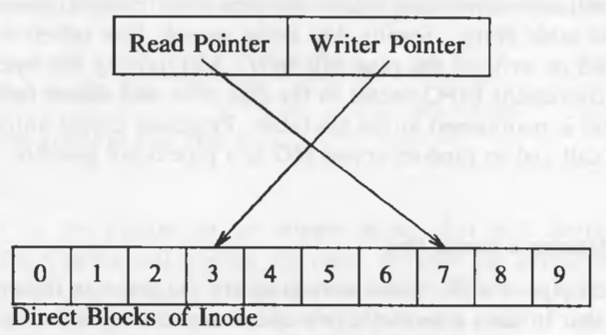
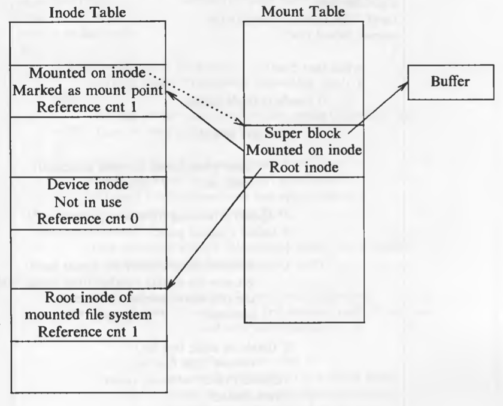
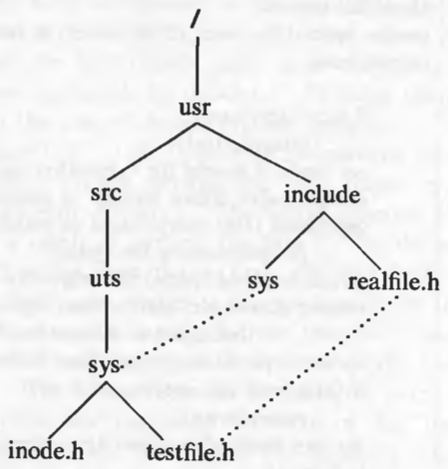
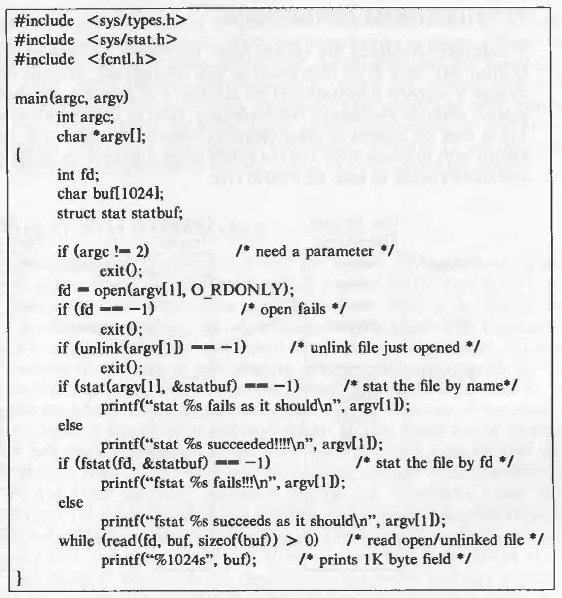

# System Calls for the File System

Systems calls related to the file system and their relation to other algorithms is given in the diagram below:


## Open

Open is the first step to access data in a file.

`fd = open (pathname, flags, mode);`

where `flags` indicate the type of open (reading or writing) and `mode` gives the permissions if the file is being created. It returns an integer called the user `file descriptor`. Other file operations use the file descriptor returned by `open`.

The algorithm is given below:

```
/*  Algorithm: open
 *  Input: pathname
 *  		 flags
 *  		 mode (for creation type of open)
 * Output: file descriptor
 */
 
{
	convert file name to inode (Algorithm: namei);
	if (file does not exist or access is not permitted)
		return (error);
	allocate file table entry for inode, initialize count, offset;
	allocate user file descriptor entry, set pointer to file table entry;
	if (type of open specifies truncate file)
		free all blocks (algorithm: free);
	unlock (inode);
	return (user file descriptor);
}
```

After getting the in-core inode of the file to be opened, the kernel allocates an entry in the file table and sets the offset of the file, the offset tells the kernel from where to read or write to the file. In the case of *read* and *write* modes, the offset is set to 0, but for *write-append* mode, the offset is set to the size of the file. Then the kernel allocates an entry in the *user file descriptor table* which is local to a process and accessible through the u-area. The user file descriptor table entry has a pointer to its file table entry and the file table entry has a pointer to the in-core inode table entry. The *file descriptor* returned to the user is nothing but the index of the entry in the user file descriptor table.

If a process executes following code:

```
fd1 = open ("/etc/passwd", O_RDONLY);
fd2 = open ("local", O_RDWR);
fd3 = open ("/etc/passwd", O_WRONLY);
```

In this case, the state of the in-core inode table, file table, and user file descriptor table will be like this:


Entries in the user file descriptor table point to unique entries in the file table even though "/etc/passwd" is opened twice. This is needed because the modes of open could be different and even if they are not, the offsets need to be maintained separately. Both the file table entries point to the same in-core inode table entry.

If another process (say process B) executes the following code, in addition to process A executing the above code:

```
fd1 = open ("/etc/passwd", O_RDONLY);
fd2 = open ("private", O_RDONLY);
```

The state of the tables will be like this:


The file table entries created by different process for the same file point to the same in-core inode table entry. The offsets could have been stored in the user file descriptor table entries as well, eliminating the need of the file table. But the additional indirection to the file table enables sharing of files (using *dup* and *fork* system calls) as we will see later.

The first 3 entries (0, 1, 2) in the user file descriptor table point to standard input (*stdin*), standard output (*stdout*), and standard error (*stderr*). But it is just a convention and there is nothing special about these entries. *stdin* is used to read input (usually, keyboard), *stdout* and *stderr* are used for printing the output and the errors respectively (usually, monitor for both).

## Read

`number = read (fd, buffer, count);`

where `fd` is the descriptor returned by *open*. `buffer` is the address of the data structure where the data will be read. `count` is the number of bytes to be read. And it returns how many bytes were successfully read. 

The algorithm is given below:

```
/*  Algorithm: read
 *  Input: user file descriptor
 *         address of buffer in user process
 *         number of bytes to be read
 *  Output: count of bytes copied into user space
 */

{
	get file table entry from user file descriptor table;
	check file accessibility;
	set parameters in u-area for user address, byte count, I/O to user;
	get inode from file table;
	lock inode;
	set byte offset in u-area from file table offset;
	while (count not satisfied)
	{
		convert file offset to disk block (algorithm: bmap);
		calculate offset into block, number of bytes to read;
		if (number of bytes to read is 0)
			break;			// trying to read End Of File (EOF)
		read block (algorithm: bread or breada whichever applicable);
		copy data from system buffer to user address;
		update u-area fields for file byte offset, read count, address to write into user space;
		release buffer;		// locked in bread
	}
	unlock inode;
	update file table offset for next read;
	return (total number of bytes read);
}
```

After getting the file table entry from user file descriptor table, the kernel sets some parameters in the u-area and eliminates the need to pass them as function parameters. The parameters in the u-area:

* mode: indicates read or write
* count: count of bytes to read or write
* offset: byte offset in file
* address: target address to copy data in user or kernel memory
* flag: indicates if address is in user or kernel memory

If a process reads two blocks sequentially, the kernel assumes that all subsequent reads will be sequential until proven otherwise. During each iteration through the loop, the kernel saves the next logical block number in the in-core inode and during the next iteration, compares the current logical block number to the value previously saved. If they are equal, the kernel calculates the physical block number for read-ahead and saves its value in the u-area for use in the *breada* algorithm. Of course, if a process does not read to the end of the block, the kernel does not invoke read-ahead for the next block.

As we had seen previously, it is possible to have some block numbers in an inode or in an indirect block to have the value 0. In such cases, the kernel allocates an arbitrary buffer and clears its contents to 0 and copying it to user address space.

The kernel always unlocks inode at the end of a system call. Inode is not locked across the system calls. Otherwise one malicious/erroneous user can block all the other users from accessing a file.

## Write

`number = write (fd, buffer, count);`

The function signature is exactly same to that of read. But the action is writing instead of reading.

The algorithm is given below:

```
/*  Algorithm: write
 *  Input: user file descriptor
 *         address in the user space from where data is to be written
 *         number of bytes to be written
 *  Output: count of bytes written in the file
 */

{
	get file table entry from user file descriptor table;
	check file accessibility;
	set parameters in u-area for user address, bytes count, I/O to user;
	get inode from file table;
	lock inode;
	set bytes offset in u-area from file table offset;
	while (count not satisfied)
	{
		if (file offset is larger than the file size)
		{
			while (indirection is required)
			{
				allocate a new block for indirection (algorithm: alloc);
				write the block number in the parent block;
			}
			allocate a new block for data (algorithm: alloc);
			write the block number in the inode/indirect block;
		}
		else
			convert file offset to disk block (algorithm: bmap);
		calculate the offset into block, number of bytes to write;
		if (only part of the block to be written)
		{
			read the buffer (algorithm: bread);
		}
		write data in the buffer;
		write block (algorithm: bwrite);
		update u-area fields for file byte offset, write count, address to read from user space;
	}
	update the file size if required;
	unlock inode;
	update file table offset for next write;
	return (total number of bytes read)
}
```

This algorithm is almost similar to *read*, but when the bytes offset is larger than the file size, the kernel has to allocate an extra data block, and if indirection is required, several blocks need to be allocated to be used as indirect blocks.

Also, when a block is to be written partially, the kernel has to read the block, copy the contents which are not going to get overwritten, and then write the block.

## Adjusting the Position of File I/O

With *read* and *write*, access to a file is sequential. *lseek* is used to enable random access to files.

`position = lseek (fd, offset, reference);`

where `offset` is the desired bytes offset and `reference` states whether the byte offset is to be taken from the beginning or current position or the end of the file. The return value `position` is the byte offset where the next read/write will start. *lseek* just adjusts the byte offset in the file table.

## Close

A process *close*s an *open* file when it no longer wants to access it.

`close (fd);`

When closing a file, the kernel first deals with the entries in the user file descriptor table, file table and the in-core inode table. It decrements the reference count of the corresponding file table entry (reference count can be more than 1 is case of *fork* and *dup*, described later). If the reference count becomes 0, it decrements the reference count of the in-core inode table entry. If it becomes 0, the in-core inode is free to be reallocated. When a process exits, the kernel examines the active user file descriptors and *close*s each one. Hence, no process can keep a file open after its termination.

## File Creation

The *creat* system call creates a new file in the file system.

`fd = creat (pathname, modes);`

If pathname of an existing file is passed to *creat*, it will truncate the file and set its size to 0 (if permissions allow, otherwise the system call will fail).

The algorithm is given below:

```
/*  Algorithm: creat
 *  Input: file name
 *         permissions
 *  Output: file descriptor
 */

{
	get inode for file name (algorithm: namei);
	if (file already exists)
	{
		if (not permitted access)
		{
			release inode (algorithm: iput);
			return (error);
		}
	}
	else
	{
		assign free inode from file system (algorithm: ialloc);
		create new directory entry in the parent directory: include new file name and newly assigned inode number;
	}
	allocate file table entry for inode, initialize count;
	if (file existed at time of creat)
		free all file blocks (algorithm: free);
	unlock (inode);
	return (user file descriptor);
}
```

After the steps in the algorithm, the *creat* system calls follows the steps in *open* to create entries in the 3 tables.

The algorithm also remembers the inode of the directory being searched, in the u-area and keeps the inode locked as the directory will become the parent directory of the file. 

The kernel write the newly allocated inode to disk before it writes the directory with the new name to disk. If the system crashes between the write operations, an inode which is not referenced by any path will just lie there, but the system will functional normally. However, if a directory entry references a corrupt inode, the system will crash.

If the pathname refers to an old file, kernel gets the inode of that file, truncates its contents (if write permission is given, otherwise error), but it does not modify the permissions and owner of the file, it ignores the permission modes given in the system call parameter. The kernel does not check if the parent directory allows write permission, because it is not going to write in the parent directory.

## Creation of Special Files

The system call *mknod* creates special files including named pipes, device files, and directories.

`mknod (pathname, type and permissions, dev);`

where `dev` specifies major and minor device numbers for block and character special files. 

The algorithm is given below:

```
/*  Algorithm: mknod
 *  Input: pathname
 *         file type
 *         permissions
 *         major, minor device numbers (for block and character special files)
 *  Output: none
 */

{
	if (new node not named pipe and user not super user)
		return (error);
	get inode of parent of new node (algorithm: namei);
	if (new node already exists)
	{
		release parent inode (algorithm: iput);
		return (error);
	}
	assign free inode from file system of new node (algorithm: ialloc);
	create new directory entry in parent directory with new node name and new inode number;
	release parent directory inode (algorithm: iput);
	if (new node is block or character special file)
		write major, minor numbers into inode structure;
	release new node inode (algorithm: iput);
}
```

It also sets the file type field to indicate if its a pipe, directory or a special file. If a directory is being created, proper format for the directory is set (such as setting the "." and ".." entries).

## Change Directory and Change Root

When process 0 is created, it sets its current directory as root. It gets the root inode (*iget*), saves it in its u-area as the current directory and releases the inode. When a new process is created with *fork*, it inherits the current directory from the parent process in its u-area and the inode reference count is incremented.

`chdir (pathname);`

The algorithm is given below:

```
/*  Algorithm: chdir
 *  Input: new directory name
 *  Output: none
 */

{
	get inode for new directory name (algorithm: namei);
	if (inode not that of directory or if access not permitted)
	{
		release inode (algorithm: iput);
		return (error);
	}
	unlock inode;
	release "old" current directory inode (algorithm: iput);
	place new inode in current directory slot of u-area;
}
```

In a way, *chdir* is similar to *open*, as both of them leave the inode allocated. In the case of *chdir*, the inode will be release only when the process calls *chdir* again with different pathname, or when the process *exit*s.

Processes usually use the global root "/" as for pathnames starting with "/". The kernel has a global variable that points to the inode of the global root. Processes can change their current root via *chroot* system call. This is useful for simulations.

`chroot (pathname);`

The algorithm is similar to *chdir*. But if the old root was the global root, it is not released. When the current root is changed, searches for pathnames starting from "/" will start from the new root. And all of the child process will inherit the current root.

## Change Owner and Change Mode

Changing the owner or mode (access permissions) of a file are operations on the inode.

```
chown (pathname, owner, group);
chmod (pathname, mode);
```

For both the algorithms, the kernel gets the inode using *namei*, and then modifies the inode accordingly (access permissions are checked).

## Stat and Fstat

The system calls *stat* and *fstat* allow processes to query the status of files, returning information such as the file type, file owner, access permissions, file size, number of links, inode number, and file access times.

```
stat(pathname, statbuffer);
fstat(fd, statbuffer);
```

where `statbuffer` is the address of the data structure in user process that will get filled in the call. The system calls simply write the fields of inodes into the *statbuffer*.

## Pipes

Pipes allow transfer of data between processes in a first-in-first-out manner. There are two kinds of pipes: *named pipes* and *unnamed pipes*. Both are identical, except the way processes initially accesses them. Named pipes are created with *open* and unnamed pipes are created with the *pipe* system call. Afterwards, *read*, *write*, and *close* are used for further operations on pipes.

Access to unnamed pipes is shared only for child processes. For example, in the following diagram, process B has called *pipe* so that pipe can be used only by process B, D, and E. But process A and C cannot access the pipe. However, named pipes can be shared between any processes.



### The Pipe System Call

`pipe (fdptr);`

where `fdptr` is the pointer to an integer array that will contain the two file descriptors for *reading* and *writing* the pipe. Pipes use the same data structures as used by normal files, the user file descriptor table, and the in-core inode table; as a result, the interface to read/write files remains consistent and the processes do not need to know whether they are reading a normal file or a pipe.

The algorithm is given below:

```
/*  Algorithm: pipe
 *  Input: none
 *  Output: read file descriptor
 *  		  write file descriptor
 */
 
{
	assign new inode from pipe device (algorithm: ialloc);
	allocate a file table entry for reading and another for writing;
	initialize file table entries to point to new inode;
	allocate user file descriptor for reading, another for writing and point to respective file table entries;
	set inode reference count to 2;
	initialize count of inode readers, writers to 1;
}
```

A *pipe device* is just a file system from which the kernel can assign inodes and data blocks for pipes. System admins specify a pipe device during system configuration.

One big difference between normal files and pipes is that the byte offset for normal files is in the file table entry, but for pipe files, it is in the inode. And the *lseek* system call cannot adjust the byte offsets in the inode; random access I/O to a pipe is not possible.

**Opening a Named Pipe**

Named pipe has the same semantics of as those of an unnamed pipe, except that it has a directory entry and is accessed by a pathname.
The algorithm for opening a name pipe is identical to the algorithm for opening a regular file. However, before completing the system call, the kernel increments the read or write counts in the inode, indicating the number of processes that have the named pipe open for reading or writing. A process that open the named pipe for reading will sleep until another process opens the named pipe for writing, and vice versa. It makes no sense for a pipe to be open for reading if there is no hope for it to receive data; the same is true for writing. Depending on whether the process opens the named pipe for reading or writing, the kernel awakens other processes that were asleep, waiting for a writer or reader process (respectively) on the named pipe.

If a process opens a named pipe for reading and a writing process exists, the open call completes. Or if a process opens a named pipe with the *no delay* option, the *open* call returns immediately, even if there are no writing processes. But if neither condition is true, the process sleeps until a writer process opens the pipe. Similar rules hold for a process that opens a pipe for writing.

**Reading and Writing Pipes**

A pipe should be viewed as if processes write on one end of the pipe and read from the other end. The number of processes reading from a pipe do not necessarily equal the number of processes writing the pipe; when the number is not equal, they must coordinate use of the pipe with other mechanisms. 

The storage mechanism for a regular file and a pipe is similar. The kernel uses the data blocks from the pipe device. But there is a difference, the pipe uses only direct blocks of the inode for efficiency. But this places a limit on the size of the pipe at a time. The kernel manipulates the direct blocks of the inode as a circular queue. It maintains read and write pointers internally to preserve the FIFO order, as shown in the figure:



We will study 4 cases:

1. **Writing a pipe that has room for the data being written**: The sum of bytes being written and the number of bytes that are already there in the pipe is less than the capacity of the pipe. The kernel follows the same algorithm as of normal files, except that it increments the size of the pipe after every write. For normal files, the kernel increments the size only if the data is written beyond the maximum byte offset. If the next byte offset is going to require an indirect block, the kernel just brings the byte offset value in the u-area to 0, but it never overwrites the data in the pipe. It sets the offset to 0 because it has already determined that the the data will not overflow the capacity. When the writer process has written all its data into the pipe, the kernel updates the pipe's write pointer (stored in the inode) so that next writes begins from that location. The kernel then awakens all other processes waiting for to read data from the pipe.

2. **Reading from a pipe which has enough data to satisfy the read**: Before reading, kernel checks if the pipe is not empty. The reading begins from the read offset (stored in the inode). With every block of read, the kernel decrements the size of the pipe according to the number of bytes it read, and adjusts the u-area offset value to wrap around, if needed. On completion of the call, kernel awakens all sleeping writer processes and saves the current read offset in the inode. 

3. **Reading from a file that does not contain enough data to satisfy the read**: If a process tries to read more data than is in the pipe, the read will complete successfully after returning all data currently in the pipe. If there is no data in the pipe, the reading process sleeps unless *no delay* option is given.

4. **Writing to a pipe which does not have enough space**: If a process tries to write data that does not fit into the pipe, the process goes to sleep waiting for space to become available. But the case when data to be written is greater than the capacity of the pipe, is different. In that case, the kernel writes writes as much data as possible and puts the process to sleep until more room becomes available. Because of the race to write the data, the data in a pipe is not guaranteed to be contiguous.

The offsets had to be stored in the inode so that processes could share the read and write offsets. For every *open* call, a process gets a new entry in the file table, that is why it is not possible to share the offset in the file table.


**Closing Pipes**

When closing the pipes, the kernel follows the usual routine for *close*. But it does some special processing before releasing the inode. It decrements the number of pipe readers or writers, according to the type. If count of writer processes drops to 0 and there are processes waiting to read data from the pipe, the kernel awakens them, and they return from their read calls without reading any data. If the count of reader processes drops to 0 and there are processes waiting to write data to the pipe, the kernel awakens them and sends them a signal (explained later) to indicate an error condition. If an unnamed pipe has no writer process, there will never be a writer process, but for named pipes, this is not the case. If no reader or writer process access the pipe, the kernel frees all its data blocks and adjusts the inode to indicate that the pipe is empty. When it releases the inode of an ordinary pipe, it frees the disk copy for reassignment.

## Dup

The *dup* system call copies the given file descriptor to the first free slot in the user file descriptor table, and returns the new file descriptor.

`newfd = dup (fd);`

Since it duplicates the entry in the user file descriptor, it increments the reference count in the file table.

## Mounting and Unmounting File Systems

A physical disk may have many logical partitions. And if each partition has a file system on it, it means that it will have its own boot block, super block, inode list, and data blocks. The *mount* system call can attach such a file system on a specified location on the current file system. The *unmount* system call can detach it. The *mount* system call thus, allows data on a disk block to be read as a file system instead of sequence of a disk blocks.

`mount (special pathname, directory pathname, options);`

where `special pathname` is the name of the device file of the disk section whose file system is to be mounted. The `directory pathname` is the path in existing file system where the new file system will be mounted. The `options` indicate whether to mount in a "read-only" manner.

For example, if this system call is made:

`mount ("/dev/dsk1", "/usr", 0);`

the kernel attaches the file system on "/dev/disk1" on the directory "/usr". The root of the file system on "/dev/dsk1" will be accessed by "/usr". The processes can seamlessly access this newly mounted file system. Only the *link* system call checks if the file system is same for the files being linked.

The kernel has a *mount table* which has entries for each mounted file system. The contents of each entry are:

* The device number of the file system.
* Pointer to a buffer containing the super block of the mounted file system.
* Pointer to a buffer containing the root inode of the mounted file system.
* Pointer to a buffer containing the inode of the mount point on the existing file system.

The algorithm of the *mount* system call is given below:

```
/*  Algorithm: mount
 *  Input: file name of the block special file
 *         directory name of mount point
 *         options (read only)
 *  Output: none
 */

{
	if (not super user)
		return (error);
	get inode for block special file (algorithm: namei);
	make legality checks;
	get inode for "mounted on" directory name (algorithm: namei);
	if (not directory, or reference count > 1)
	{
		release inodes (algorithm: iput);
		return (error);
	}
	find empty slot in mount table;
	invoke block device driver open routine;
	get free buffer from buffer cache;
	read super block into free buffer;
	initialize super block fields;
	get root inode of mounted device (algorithm: iget), save in mount table;
	mark inode of "mounted on" directory as mount point;
	release special file inode (algorithm: iput);
	unlock inode of mount point directory;
}
```

The kernel only allows the superuser to *mount* or *unmount* file systems. After mounting, processes can no longer access the inode of the mount point, unless *unmount* is called.

State of data structures after *mount*:



## Crossing Mount Points in File Path Names

In the algorithms *namei* and *iget*, special handling is required for mount points. There are two cases: going from host file system to the mounted file system and going from mounted file system to host file system. The last 2 commands of the following 3 commands cover both the cases respectively:

```
mount /dev/dsk1 /usr 
cd /usr/src/uts
cd ../../..
```

The revised algorithm for *iget* with mount point handling is given below:

```
/*  Algorithm: iget
 *  Input: file system inode number
 *  Output: locked inode
 */
 
{
	while (not done)
	{
		if (inode in inode cache)
		{
			if (inode locked)
			{
				sleep (event: inode becomes unlocked);
				continue;
			}
			// special processing for mount points
			if (inode a mount point)
			{
				find mount table entry for mount point;
				get new file system number from mount table;
				use root inode number in search;
				continue;
			}
			if (inode on free list)
				remove inode from free list;
			increment reference count of the inode;
			return inode;
		}
		// inode not in the cache
		if (free list is empty)
			return error;
		remove inode from free list;
		reset inode number and file system;
		remove inode from old hash queue and place it on the new hash queue;
		read inode from disk (algorithm: bread);
		initialize inode;
		return inode;
	}
}
```

For the first case, when the inode for "/usr" is accessed (*iget*), the above algorithm will return the inode of the root of the mounted file system. For the second case, when ".." is accessed the third time, special handling is required in the algorithm *namei*. Consider revised algorithm for *namei*:

```
/*  Algorithm: namei
 *  Input: pathname
 *  Output: locked inode
 */
 
{
	if (path name starts from root)
		working inode = root inode (algorithm: iget);
	else
		working inode = current directory inode (algorithm: iget);
	
	while (there is more path name)
	{
		read next path name component from input;
		verify that working inode is of a directory and access permissions are OK;
		if (working inode is of changed root and component is "..")
			continue;
	component search:
		read directory (working inode) by repeated use of algorithms: bmap, bread, brelse;
		if (component matches an entry in the directory (working inode)
		{
			get inode number for matched component;
			if (found inode of root and working inode is root and component is "..")
			{
				// crossing mount point
				get mount table entry for working inode;
				release working inode (algorithm: iput);
				working inode = mounted on inode;
				lock mounted on inode;
				increment reference count of working inode;
				go to component search (for "..");
			}
			release working inode (algorithm: iput);
			working inode = inode of matched component (algorithm: iget);
		}
		else
			return (no inode)  // component not in the directory
	}
	return (working inode);
}
```

In the algorithm above, when  finding the inode number of path name component in a directory, the kernel checks if the inode number is the root inode of a file system. If it is, and if the inode of the current working inode is also root, and the path name component is "..", the kernel knows the inode is a mount point. It finds the mount table entry whose device number equals the device number of the last found inode, gets the inode of the mounted-on directory, and continues its search for ".." using the mounted-on inode as the working inode. At the root of the file system, however, ".." is the root.

### Unmounting a File System

`unmount (special filename);`

where `special filename` indicates the file system to be unmounted. The algorithm is given below:

```
/*  Algorithm: unmount
 *  Input: special file name of file system to be unmounted
 *  Output: none
 */

{
	if (not super user)
		return (error);
	get inode of special file (algorithm: namei);
	extract major, minor number of device being unmounted;
	get mount table entry, based on major, minor number, for unmounting file system;
	release inode of special file (algorithm: input);
	remove shared text entries from region table for files belonging to file system; // explained later
	update super block, inodes, flush buffers;
	if (files from file system still in use)
		return (error);
	get root inode of mounted file system from mount table;
	lock inode;
	release inode (algorithm: input);    // iget was in mount
	invoke close routine for special device;
	invalidate buffers in pool from unmounted file system;
	get inode of mount point from mount table;
	lock inode;
	clear flag marking it as mount point;
	release inode (algorithm: iput);    // iget was in mount
	free buffer used for super block;
	free mount table slot;
}
```

Before unmounting the file system, it is checked if any file on the file system is in use. After unmounting the file system, the buffer that hold the data of the unmounted file system do not need to be cached. So they are release from the buffer pool. They are placed in the front of the free list so that buffers with valid data will remain on the buffer pool for a long time.

## Link

The *link* system call links a file to a new name in the directory structure. It creates a new directory entry which points to an existing inode.

`link (source file name, target file name);`

After linking the files, the kernel does not keep track of which file name was the original one. Therefore, no name is treated specially. For example, after linking with the following code:

```
link ("/usr/src/uts/sys", "/usr/include/sys");
link ("/usr/include/realfile.h", "/usr/src/uts/sys/testfile.h");
```

the 3 pathnames refer to the same file: "/usr/src/uts/sys/testfile.h", "/usr/include/sys/testfile.h", "/usr/include/realfile"



Only a superuser is allowed to link directories. This is done to avoid mistakes by arbitrary users. If a user *links* a directory to a child directory, a program which accesses that pathname will enter in a infinite loop.

The algorithm for *link* is given below:

```
/*  Algorithm: link
 *  Input: existing file name
 *  		 new file name
 *  Output: none
 */

{
	get inode for existing file name (algorithm: namei);
	if (too many links on file or linking directory without super user permission)
	{
		release inode (algorithm: iput);
		return (error);
	}
	increment link count on inode;
	update disk copy of inode;
	unlock inode;
	get parent inode for directory to contain new file name (algorithm: namei);
	if (new file name already exists or existing file, new file on different file systems)
	{
		undo update done above;
		return (error);
	}
	create new directory entry in parent directory of new file name;
		include new file name, inode number of existing file name;
	release parent directory inode (algorithm: iput);
	release inode of existing file (algorithm: iput);
}
```

The kernel unlocks the inode of the source file right after incrementing its link count, to avoid a deadlock. Consider what will happen if the inode was not unlocked immediately while creating following two links:

```
link ("a/b/c/d", "e/f/g");		// Process A
link ("e/f", "a/b/c/d/ee");	// Process B
```

Suppose process A and B arrive at a state where A has locked the inode for "a/b/c/d" and B has locked the inode "e/f". Now when process A tries to read "e/f" while reading the target file name, it finds that it is locked and process B when trying to read "a/b/c/d" finds that the inode is locked. This is a classical example of a deadlock. This is avoided because the inode for the source file is unlocked right after incrementing the reference count for the source file.

Even a single process can deadlock itself with this:

`link ("a/b/c", "a/b/c/d");`

Since inodes are finitely allocatable resources, receipt of a signal cannot awaken the process from its sleep (studied later). Hence in such cases, the system could not be able to break the deadlock without rebooting.

## Unlink

The *unlink* system call removes a directory entry for a file.

`unlink (pathname);`

The algorithm for *unlink* is given below:

```
/*  Algorithm: unlink
 *  Input: file name
 *  Output: none
 */

{
	get parent inode of file to be unlinked (algorithm: namei);
	// if unlinking the current directory
	if  (last component of file name is ".")
		increment inode reference count;
	else
		get inode of file to be unlinked (algorithm: iget);
	if (file is directory but user is not super user)
	{
		release inodes (algorithm: iput);
		return (error);
	}
	if (shared text file and link count currently 1)
		remove from region table;
	write parent directory: zero inode number of unlinked file;
	release inode parent directory (algorithm: iput);
	decrement file link count;
	release file inode (algorithm: iput);
	// iput checks if link count is 0: if so, releases file blocks and frees inode
}
```

### File System Consistency

The kernel orders writes to disk to minimize file system corruption in the event of system failure. For example, when *unlink*ing a file, the kernel first writes the modified parent directory blocks synchronously to the disk before accessing the inode and file contents (if required) of the file being unlinked. If the system were to crash before the inode (and file contents, if required) was modified, there would be an inode which would have link count 1 greater than the file names which access it in the file system. If the directory write were not synchronous, there would be a possibility of a directory entry for an inode which has been freed (or reallocated). System damage is much less severe in the first case, and it is recoverable too.

Same is the case when freeing data blocks of a file, the kernel has to modify the inode to reflect the changes in data blocks and then actually has to clear the data blocks. If the kernel chose to clear the data blocks first and then modify the inode, in the event of a system crash after the data blocks have been cleared, the inode would still contain the data blocks that have been freed. In this case, the kernel would not notice the corruption, but the user would see unusual data when such file is opened. Therefore, the kernel first modifies the inode, writes it to the disk, and then clears the data blocks. If the system crashes after writing the inode to disk, there would be data blocks which contain data but are not associated with any file and neither are they free. Such situation is not harmful to the user, and it could be recovered from, by running disk maintenance programs like *fsck* (file system check). The previous case also could be recovered from, by using *fsck*, but the efforts required would be far more.

### Race Conditions

There are many possible race conditions around the *unlink* system call. Suppose process A is accessing the file "a/b/c/d", in processing the pathname, process A sleeps while getting the inode of "a/b/c". Now, suppose process B is *unlink*ing the directory "a/b/c", and it also sleeps while getting the inode for "a/b/c". In such scenario, if process B runs before process A after both have been woken up, process B will clear unlink the inode (if its the last link) and then when process A runs, it will access an invalid inode. Therefore, in *namei*, kernel always checks if the link count of the inode is not 0, and if it is, reports an error.

However, this check is not enough. After unlinking, another process could create a file which could use the same inode, hence incrementing its reference count. And then the reading process will access a different file. But at least, the system integrity is maintained. And such race condition is extremely rare in practice. It is shown in the figure below:


Consider the following program:



The process *unlinks* the file which was just opened. So there is no directory entry for the file and hence the *stat* system call fails. But *fstat* succeeds as it refers the inode by the file descriptor. After the program ends, the process *close*es the file and its inode reference count drops to 0 and the file gets deleted. Sometimes, processes use this kind of mechanism for creating temporary files.

## File System Abstractions

Unix supports multiple file system types. All the file system types are accessible through the usual system calls (*open*, *read*, *write*, *close*, etc.). To make this possible, the kernel has generic inodes, which point to specific inodes of a file system type. The generic inodes contain information like the device number, inode number, file name, file size, owner, reference count. And the specific inode contains information such as block information, file permissions. To maintain the abstraction in the system calls, the kernel has function pointers which point to functions of a specific file system type. The kernel calls these functions based on file system type and operations.


## File System Maintenance

The kernel maintains the integrity and consistency of the file system by proper ordering of operations in its system calls. But events like a power failure can leave a file system in an inconsistent state. The command *fsck* checks for such inconsistencies and repairs the file system if necessary. It accesses the disk blocks using its raw or block interface (explained later), bypassing the file system abstractions.

The possible inconsistencies could be:

* A disk block number is in more than 1 inode.
* A disk block number is in an inode and also on the free list of blocks.
* A disk block number is neither in an inode nor on the free list of blocks.
* An inode has non 0 link count but the inode number does not appear in any directory.
* Format of an inode is incorrect (such as undefined file type).
* Number of free blocks or free inodes recorded in the super block does not match the number in the disk blocks.

Most of these inconsistencies occur because the updated in-memory copy could not be written to disk (due to a power failure). Some inconsistencies (last 2) could occur due to mounting of improperly formatted file systems.
