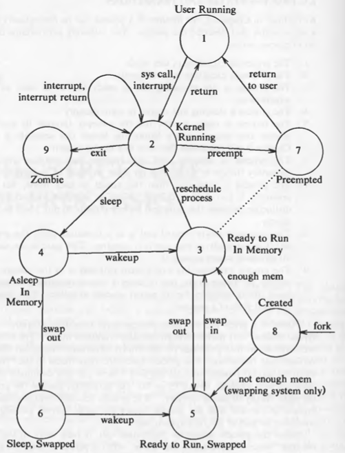
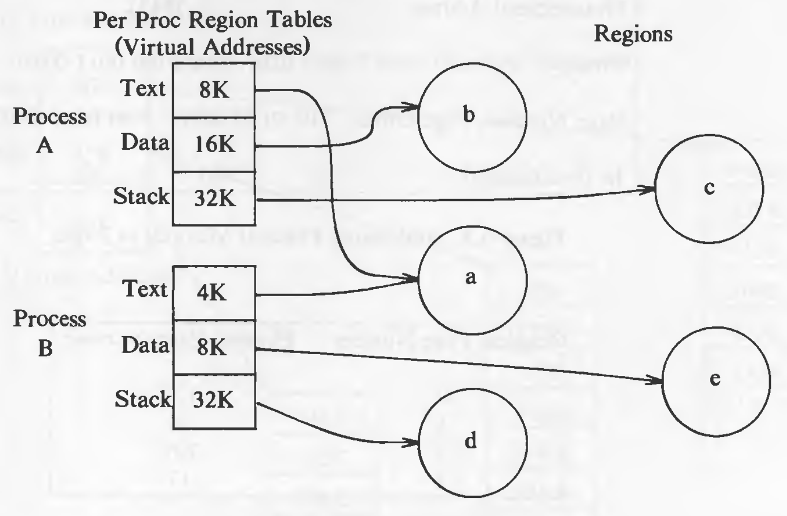
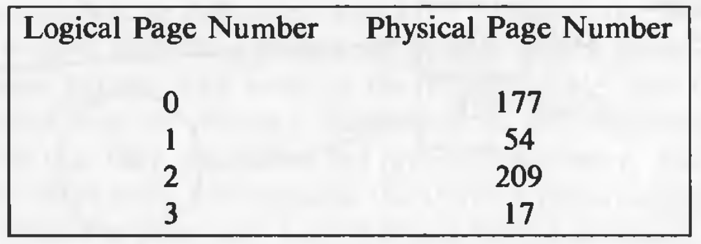
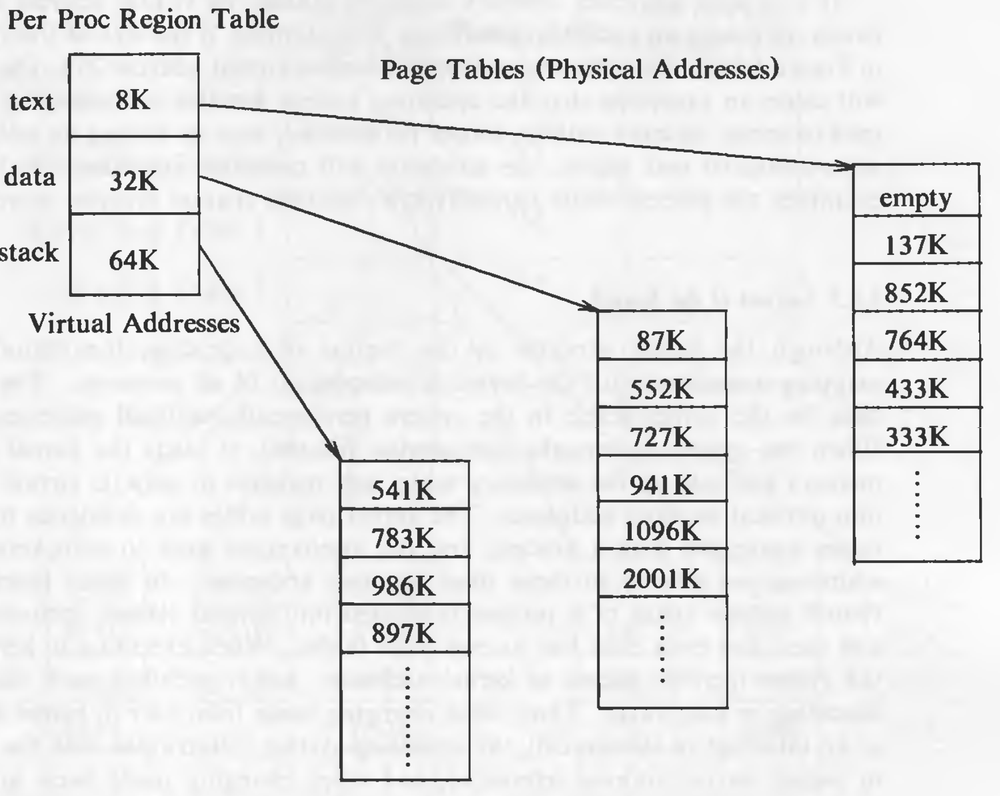
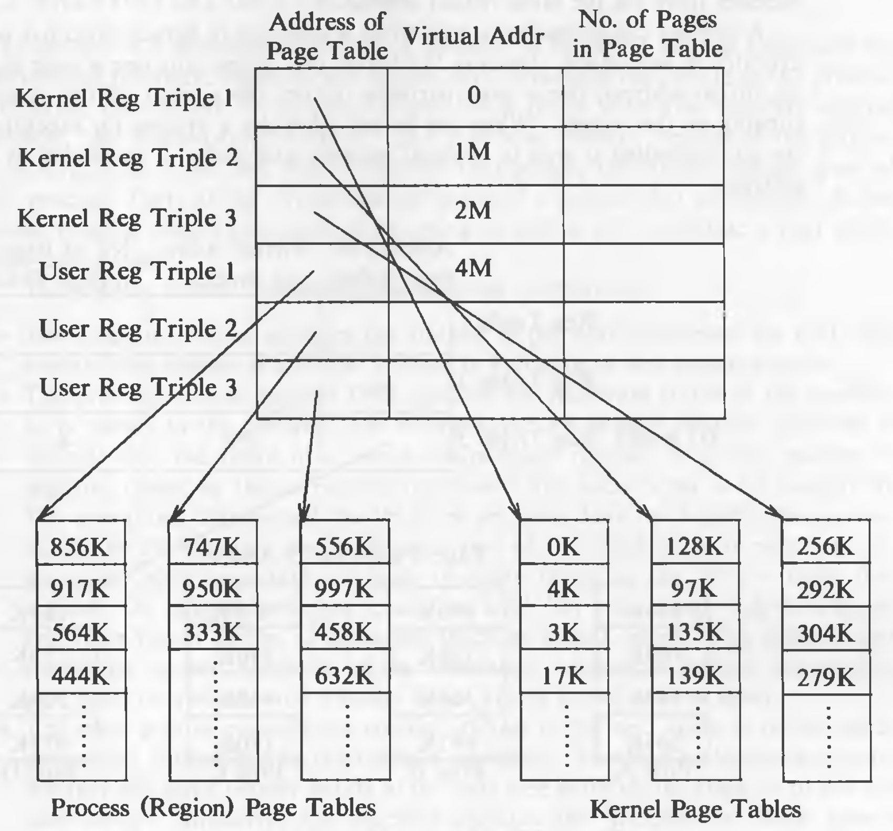
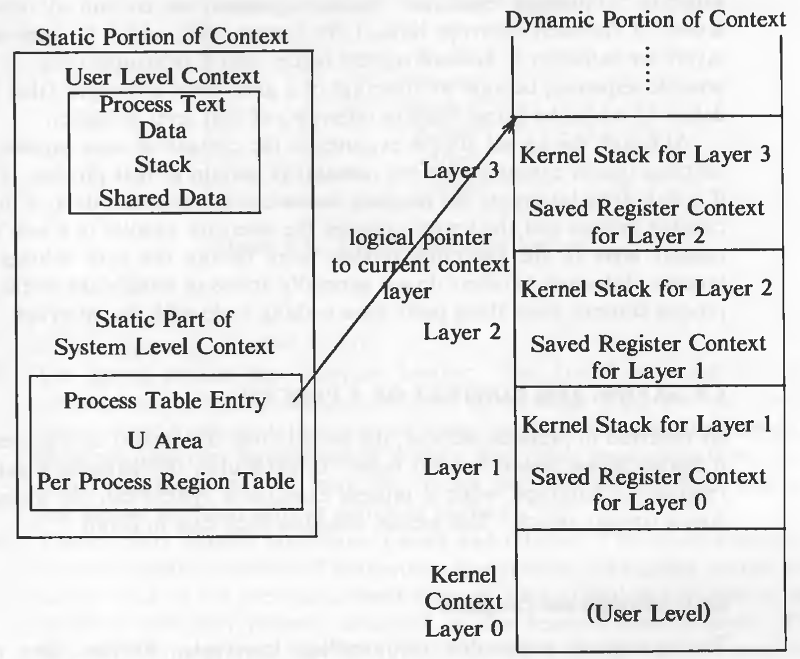
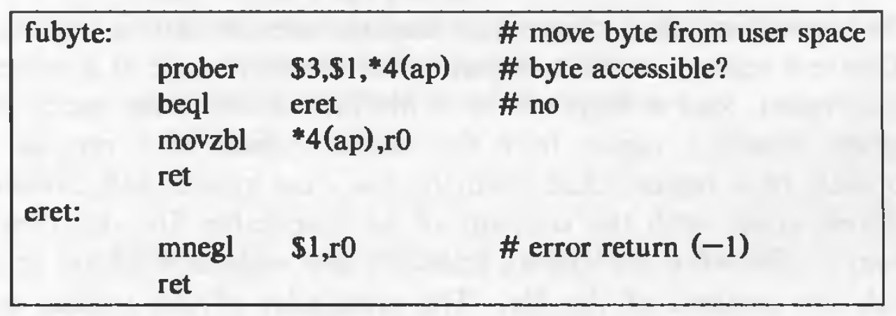
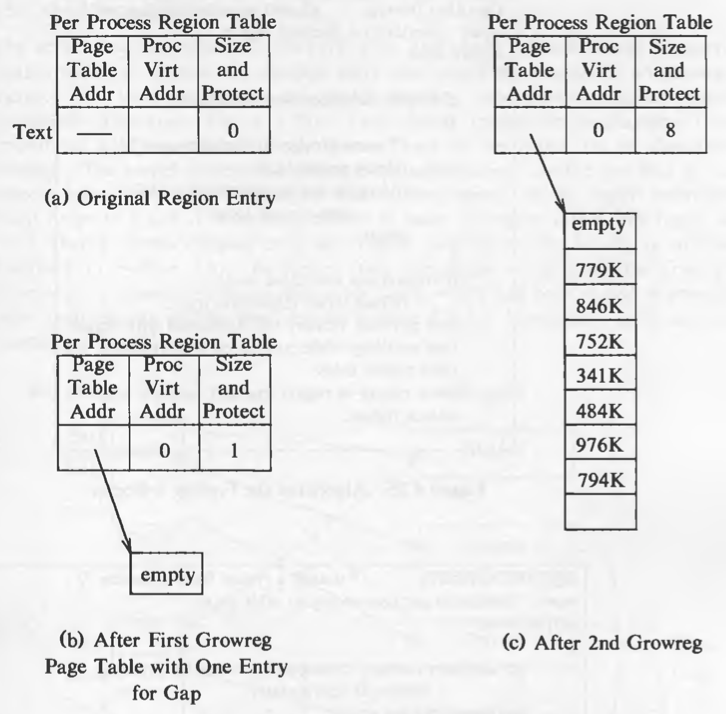
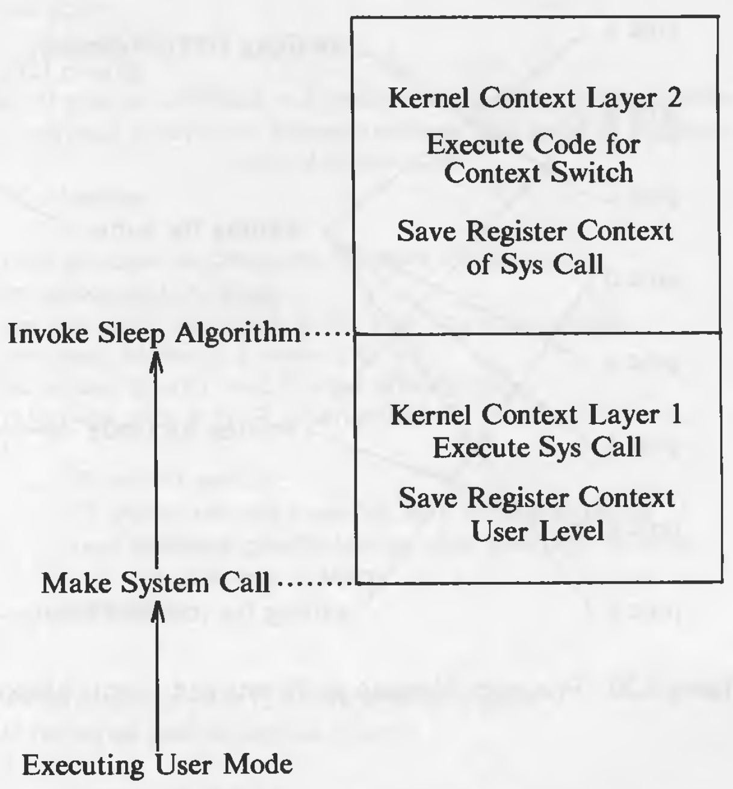
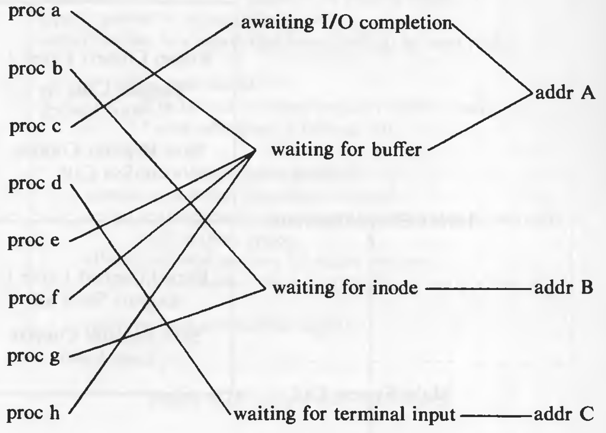

# The Structure of Processes

The kernel has a process table where it stores the state of the process and other information about the process. The information of the entry and the u-area of the process combined is the *context* of the process.

## Process States And Transitions

The complete set of process states:

1. Executing in user mode.
2. Executing in kernel mode.
3. Ready to run.
4. Sleeping in memory.
5. Ready to run, but in swap space (covered later).
6. Sleeping in swap space.
7. Preempted. (the process is returning from kernel to user mode, but the kernel preempts it and does a context switch to schedule another process. Very similar to state 3)
8. Newly created. Not ready run, nor sleeping. This is the start state for all processes expect process 0.
9. The process executed *exit* system call and is in the *zombie* state. The process no longer exists, but it leaves a record containing an exit code and some timing statistics for its parent process to collect. The zombie state is the final state of a process.



The process enters the *created* state when the parent process executes the fork system call model and eventually moves into a state where it is ready to run (3 or 5). The scheduler will eventually pick the process and the process enters the state *kernel running*, where it completes its part of *fork* system call. After the completion of system call, it may move to *user running*. When interrupts occur (such as system call), it again enters the state *kernel running*. After the servicing of the interrupt the kernel may decide to schedule another process to execute, so the first process enters the state *preempted*. The state *preempted* is really same as the state *ready to run in memory*, but they are depicted separately to stress that a process executing in kernel mode can be preempted only when it is about to return to user mode. Consequently, the kernel could swap a process from the state *preempted* if necessary. Eventually, it will return to *user running* again.

When a system call is executed, it leaves the state *user running* and enters the state *kernel running*. If in kernel mode, the process needs to sleep for some reason (such as waiting for I/O), it enters the state *asleep in memory*. When the event on it which it has slept, happens, the interrupt handler awakens the process, and it enters the state *ready to run in memory*.

Suppose the system is executing many processes that do not fit simultaneously into main memory, then the swapper (process 0) swaps out a process to make room for another process that is in the state *ready to run swapped*. When evicted from main memory, the process enters the state *ready to run swapped*. Eventually, swapper chooses the process as most eligible to run and it re-enters the state *ready to run in memory*. And then when it is scheduled, it will enter the state *kernel running*. When a process completes and invokes *exit* system call, thus entering the states *kernel running* and finally, the *zombie* state.

Some state transitions can be controlled by the users, but not all. User can create a process. But the user has no control over when a process transitions to *sleeping in memory* to *sleeping in swap*, or *ready to run in memory* to *ready to run in swap*, etc. A process can make a system call to transition itself to *kernel running* state. But it has no control over when it will return from kernel mode. Finally, a process can *exit* whenever it wants, but that is not the only reason for *exit* to be called.

The process transitions follow a rigid model encoded in the kernel, reacting to events in a predictable way according to formulated rules (studied later). For example, no process can preempt another process executing in the kernel.


Two kernel data structures describe the state of a process: the process table entry and the u-area. The process table contains information that should be accessible to the kernel and the u-area contains the information that should be accessible to the process only when its running. Kernel allocates space for u-area only when creating a process. It does not need u-area for process table entries that do not have processes. For example, the process table entries that contain the information about the kernel context, do not have processes.

The fields in the process table are the following:

* State of the process
* Fields that allow the kernel to locate the process and its u-area in main memory or in secondary storage. This information is used to do a *context switch* to the process when the process moves from state *ready to run in memory* to the state *kernel running* or from the state *preempted* to the state *user running* or when *swapping* the process. It contains a field that gives the size of the process so that the kernel knows how much space to allocate for the process.
* Several user identifiers (user IDs or PIDs) specify the relationship of processes to each other. These ID fields are set up when the process enters the state *created* in the *fork* system call.
* Event descriptor when the process is *sleep*ing.
* Scheduling parameters allow the kernel to determine the order in which processes move to the states *kernel running* and *user running*.
* A signal fields enumerates the signals sent to a process but not yet handled.
* Various timers give process execution time and kernel resource utilization. These are used for calculation of process scheduling priority. One field is a user-set timer used to send an alarm signal to a process.

The u-area contains these fields (some are covered previously as well) :

* A pointer in the process table identifies the entry that corresponds to the u-area.
* The real and effective user IDs determine various privileges allowed the process, such as file access rights.
* Timer fields record the time the process spent executing in user mode and in kernel mode.
* An array indicates how the process wishes to react to signals.
* The control terminal field identifies the "login terminal" associated with the process, if one exists.
* An error field records errors encountered during a system call.
* A return value field contains the result of system calls.
* I/O parameters describe the amount of data to transfer, the address of the source (or target) data array in user space, file offsets for I/O, and so on.
* The current directory and current root describe the file system environment of the process.
* The user file descriptor table records the files the process has open.
* Limit fields restrict the size of a process and the size of a file it can write.
* A permission modes field masks mode settings on files the process creates.

## Layout of System Memory

The physical memory is addressable. Starting from offset 0, going up to the amount of physical memory. A process in UNIX contains three sections: text, data, and stack. Text section contains the instructions. Those instructions could refer to other addresses, for example, addresses of different subroutines, addresses of global variables in the data section, or the addresses of local data structures on the stack. If the addresses generated by the compiler were to be treated as physical addresses, it would be impossible to run more than one process at a time, because the addresses could overlap. Even if the compiler tries to address this problem by using heuristics, it would be difficult and impractical.

To solve this problem, the kernel treats the addresses given by the compiler as *virtual addresses*. And when the program starts executing, the memory management unit translates the virtual addresses to physical addresses. The compiler doesn't need to know which physical addresses the process will get. For example, two instances of a same program could be executing in memory using the same virtual addresses but different physical addresses. The subsystems of the kernel and the hardware that cooperate to translate virtual to physical addresses comprise the *memory management* subsystem.

### Regions

The UNIX system divides its virtual address space in logically separated *regions*. The regions are contiguous area of virtual address space. A region is a logically distinct object which can be shared. The text, data, and stack are usually separate regions. It is common to share the text region among instances of a same process.

The region table entries contain the physical locations at which the region is spread. Each process contains a private *per process regions table*, called a *pregion*. The pregion entry contains a pointer to an entry in the region table, and contains starting virtual address of the region. *pregion* are stored in process table, or u-area, or a separately allocated memory space, according to the implementation. The pregion entries contain the access permissions: read-only, read-write, or read-execute. The pregion and the region structure is analogous to file table and the in-core inode table. But since, pregions are specific to a process, *pregion* table is private to a process, however the file table is global. Regions can be shared amongst processes.

An example of regions:



The concept of *region*s is independent of the memory management policies.

### Pages and Page Tables

In a memory model based a pages, the physical memory is divided into equal sized blocks called *pages*. Page sizes are usually between 512 bytes to 4K bytes, and are defined by the hardware. Every memory location can be address by a "page number" and "byte offset" in the page. For example, a machine with 2^32 bytes of memory has pages of size 1K bytes (2^10), then it will have 2^22 pages.

When kernel assigns physical pages of memory to a region, it need not assign the pages contiguously or in any particular order. Just like disk blocks are not assigned contiguously to avoid fragmentation.

The kernel maintains a mapping of logical to physical page numbers in a table which looks like this:



These tables are called *page tables*. Region table entry has pointers to page tables. Since logical address space is contiguous, it is just the index into an array of physical page numbers. The page tables also contain hardware dependent information such as permissions for pages. Modern machines have special hardware for address translation. Because software implementation of such translation would be too slow. Hence, when a process starts executing, the kernel tells the hardware where its page tables reside.



For being hardware independent, let us assume that the hardware has register triples (in abundance) which the kernel uses for memory management. The first register in the triple contains the address of the page table, the second register contains the first virtual address mapped by the page table, and the third register contains control information such as number of pages in page tables and page access permissions. When executing a process, the kernel loads such register triples with the data in the pregion entries.

If a process accesses an address outside its virtual address space, an exception is generated. Suppose a process has 0 to 16K bytes of address space and the process accesses the virtual address 20K, an exception will generated, and it is caught by the operating system. Similarly, if a process tries to access a page without having enough permission, an exception will be generated. In such cases, process normally *exit*.

### Layout of the Kernel

Even if the kernel executes in the context of a process, its virtual address space is independent of processes. When the system boots up, the kernel is loaded into memory and necessary page tables and registers are loaded with appropriate data. Many hardware systems slice a process' address space into many sections, user and kernel being two of them. When in user mode, access to kernel page tables is prohibited. When the process switches to kernel mode, only then it can access kernel page tables. Some system implementations try to allocate the same physical pages to the kernel, keeping the translation function, an identity function.

Example:



### The U Area

Even if every process has a u-area, the kernel accesses them through its *u* variable. It needs to access only one u-area at a time, of the currently executing process. The kernel knows where the page table entry of the u-area is located, therefore, when a process is scheduled, the physical address of its u-area is loaded into kernel page tables.

Example:


The first two register triples point to text and data and the third triple refers to the u-area of currently executing process (in this case, process D). When a context switch happens, the entry in this fields changes and points to the u-area of the newly scheduled process. Entries 1 and 2 do not change as all the process share the kernel text and data.


## The Context of a Process

The context of a process consists of:

* Contents of its (user) address space, called as *user level context*
* Contents of hardware registers, called as *register context*
* Kernel data structures that relate to the process, called as *system context*

User level context consists of the process text, data, user stack and shared memory that is in the virtual address space of the process. The part which resides on swap space is also part of the user level context.

The register context consists of the following components:

* Program counter specifies the next instruction to be executed. It is an address in kernel or in user address space.
* The processor status register (PS) specifies hardware status relating the process. It has subfields which specify if last instruction overflowed, or resulted in 0, positive or negative value, etc. It also specifies the current processor execution level and current and most recent modes of execution (such as kernel, user).
* The stack pointer points to the current address of the next entry in the kernel or user stack. If it will point to next free entry or last used entry it dependent on the machine architecture. The direction of the growth of stack (toward numerically higher or lower addresses) also depend on machine architecture.
* The general purpose registers contain data generated by the process during its execution.

The system level context has a "static part" and a "dynamic part". A process has one static part throughout its lifetime. But it can have a variable number of dynamic parts.

The static part consists of the following components:

* The process table entry
* The u-area
* Pregion entries, region tables and page tables.

The dynamic part consists of the following components:

* The kernel stack contains the stack frames the kernel functions. Even if all processes share the kernel text and data, kernel stack needs to be different for all processes as every process might be in a different state depending on the system calls it executes. The pointer to the kernel stack is usually stored in the u-area but it differs according to system implementations. The kernel stack is empty when the process executes in user mode
* The dynamic part of the system level context consists of a set of layers, visualized as a last-in-first-out stack. Each *system-level context layer* contains information necessary to recover the previous layer, including register context of the previous layer.

The kernel pushes a context layer when an interrupt occurs, when a process makes a system call, or when a process does a context switch. It pops a context layer when it returns from an interrupt handler, returns from a system call, or when a context switch happens. Thus, a context switch entails a push-pop operation: The kernel pushes the context of the old process and pops the context layer of the new process. The process table entry stores the necessary information to recover the current context layer.

The following figure shows the components that form the context of a process:



The right side of the figure shows the dynamic portion of the context. It consists of several stack frames where each stack frame contains saved register context of the previous layer and the kernel stack as it executes in that layer. System context layer 0 is a dummy layer that represents the user-level context; growth of the stack here is in the user address space and the kernel stack is null. The process table entry contains the information to recover the current layer in of the process (shown by the arrow).

The maximum number of context layer depends on the number of levels of interrupts the system supports. Suppose the system supports 5 levels interrupts (software, terminal, disk, peripheral devices, clock), then 7 context layers are enough. 1 for user-level context, 1 for system call and 5 for different interrupt levels. As the kernel blocks all the lower level interrupts when a higher level interrupt occurs, there could be maximum 1 interrupt of each level. Therefore, in the worst case (interrupts occurring in the sequence of level 1 to 5), 7 context layers will be used. Although the kernel executes in the context of a process, the logical function it performs do not necessarily pertain to the process. For instance, interrupts handlers do not generally modify the static parts of the the process.

## Saving the Context of a Process

### Interrupts and Exceptions

The system is responsible for handling interrupts and exceptions. If the system is executing at a lower processor execution level, when an interrupts occurs, the kernel accepts the interrupt before decoding the next instruction and then raises the processor execution level to block other interrupts of that or lower level. It handles the interrupt by performing following sequence of operations:

1. It saves the current register context of the executing process and creates (pushes) a new context layer.
2. The kernel determines the source (cause) of the interrupt, and if applicable, unit number (such as which drive caused the interrupt). When the system receives an interrupt, it gets a number. It uses that number as an index into the *interrupt vector*, which stores the actions to be taken (interrupt handlers) when interrupts occur. Example of *interrupt vector*:


3. The kernel invokes the interrupt handler. The kernel stack of the new context layer is logically distinct from the kernel stack of the previous context layer. Some implementations use the processes kernel stack to store the stack frame of an interrupt handler, while some implementations use a global interrupt stack for the interrupt handlers which are guaranteed to return without a context switch.
4. The kernel returns from the interrupt handler and executes a set of hardware instructions which restore the previous context. The interrupt handler may affect the behavior of the process as it might modify the kernel data structures. But usually, the process resumes execution as if the interrupt never occurred.

The algorithm for interrupt handling is given below:

```
/*  Algorithm: inthand
 *  Input: none
 *  Output: none
 */

{
	save (push) current context layer;
	determine interrupt source;
	find interrupt vector;
	call interrupt handler;
	restore (pop) previous context layer;
}
```

Example of state of the context layer as stack as system call is executed and interrupts occur:


### System Call Interface

The library functions such as *open*, *read*, etc. in the standard C library are not actually system calls. Those are normal functions and normal functions cannot change the mode of execution of the system. These functions invoke a special instruction which makes the system change its execution mode to kernel mode and start executing the system call code. The instruction is called as *operating system trap*. The system calls are a special case of interrupt handling. The library routines pass the a number unique for each system call, as the parameter to the operating system trap through a specific register or on the stack. Through that number, the kernel determines which system call to execute.

The algorithm for executing system calls is given below:

```
/*  Algorithm: syscall
 *  Input: system call number
 *  Output: result of system call
 */
 
{
	find entry in the system call table corresponding to the system call number;
	determine number of parameters to the system call;
	copy parameters from the user address space to u-area;
	save current context for abortive return;	// studied later
	invoke system call code in kernel;
	if (error during execution of system call)
	{
		set register 0 in user saved register context to error number;
		turn on carry bit in PS register in user saved register context;
	}
	else
		set register 0, 1 in user saved register context to return values from system call;
}
```

Register 0 and 1 are used to exchange information between user mode and kernel mode. For being machine independent, the terms register 0 and 1 are used. The kernel calculates the address of the parameters by adding (or subtracting, according to the direction of growth of the stack) an offset to the user stack pointer, corresponding to the number of parameters to the system call. The setting of carry bit indicates that there was an error in the system call execution. After execution of this algorithm, the library function determines the return value from registers 0 and 1 and returns it to the user.

Consider the following code which calls the *creat* function of the C library. And the assembly code generated by the compiler (on a Motorola 68000) :


Consider the stack configuration for the above program:


The code for main begins at address 58. It copies the parameters 0666 and the variable "name" onto the user stack. The order in which the parameters are copied is machine dependent. Then it calls the C library function *creat* at address 64. The function is at address 7a. The return address from the function call is 6a, and the process pushes this number on the stack. The function places the value 8 (number of the creat system call) in register 0 and then executes the trap instruction which makes the system switch to kernel mode. The kernel checks the number of the system call and determines that the routine for *creat* is to be executed. It determines the number of parameters to the system call and copies them to the u-area from the user stack. When the system call returns, the interrupt handler checks it the u-area field for error is set, and if it is, it sets the carry bit and places the error code in register 0, and returns. The library routine then checks if carry bit is set, if it is, it jumps to address 13c. It moves the error code from register 0 to a global variable *errno* at address 20e and moves -1 in the data register 0, and returns to address 86. If the carry bit was not set, the creat library function will return and further execution will start after the call at address 64. Register 0 contains the return value from the system call.

### Context Switch

As seen previously, the kernel permits a context switch under 4 situations:

1. When a process sleeps
2. When a process exits
3. When a process returns from a system call to user mode but is not the most eligible process to run.
4. When a process returns from an interrupt handler to user mode but is not the most eligible process to run.


The process followed for a context switch is similar to that of a system calls and interrupts. Except that the context layer of a different process is restored instead of the previous layer of the same process. The choice of which process to schedule is a policy decision and it is independent of the mechanism of the context switch.

The code that implements the context switch on UNIX systems is usually the most difficult to understand in the operating system, because function calls give the appearance of not returning on some occasions and materializing from nowhere on the others. This is because the kernel, in many implementations, saves the process context at one point in the code but proceeds to execute the context switch and scheduling algorithms in the context of the "old" process. When it later restores the context of the process, it resumes execution according to the previously saved context. To differentiate between the case where the kernel resumes the context of a new process and the case where it continues to execute in the old context after having saved it, the return values of critical functions may vary, or the program counter where the kernel executes may be set artificially.

The pseudo code for a context switch is given below:

```
if (save_context())		// save context of executing process
{
	// pick another process to run
	.
	.
	.
	resume_context (new_process);
	// never gets here
}
// resuming process executes from here
```

Suppose, process A is doing a context switch, the function *save_context* will save the context of process A and return the value 1. The current program counter (somewhere inside the function *save_context*) is also saved. The value 0, to be returned from *save_context* is also saved. In spite of saving the context, the kernel continues to execute in the context of process A, and picks another process to schedule, say process B. And then calls *resume_context* for process B. Then the context of process B is restored and it starts executing, hence the comment "never gets here". When eventually, the process A is selected for scheduling, the context of process A is restored, it begins executing in the function *save_context* and returns the value 0. Hence not going in the *if* block resuming execution from below the if block, hence the comment "resuming process executes from here". 

**Saving Context for Abortive Returns**

Situations arise when kernel needs to abort the current execution sequence and restore a previously save context. Such situations are discussed later in the sections where *sleep* and *signals* are described. The mechanism for such context restore is discussed here. For saving the context, the algorithm *setjmp* is used and the algorithm *longjmp* is used to restore the previous context. *setjmp* is similar to *save_context* except that *save_context* pushes a new context layer whereas *setjmp* saves the current context in the u-area and continues to execute in the old context layer. When the kernel wishes to restore the context saved in *setjmp*, it does a *longjmp*, restoring the context saved in the u-area and returning 1 from *setjmp*.

**Copying Data Between System and User Address Space**

The process executes in kernel mode *or* in user mode. But the system calls need to copy the data from user to kernel address space and vice-a-versa. Addresses in kernel address space are of course, not accessible from user address space. The kernel copies data from user address space kernel address space and vice-a-versa. The kernel when accessing addresses is user address space, must ascertain that the address is in user space, otherwise it could inadvertently, write on some kernel data structures and corrupt the system. Therefore, copying data between kernel and user address space is an expensive operation, requiring more than one instruction.

This is the VAX code for moving one character from user to kernel address space:



The *prober* instruction checks if one byte at the address *argument pointer register + 4* (indicated by : *4(ap)*) could be read in user mode (mode 3). If not, the kernel branches to address *eret*, stores -1 in register 0, and returns; the move failed. Otherwise, the kernel copies one byte from the user given address to register 0 and returns the value to the caller. The procedure requires 5 instructions (with the call to *fubyte*) to move 1 character; the process is expensive.

## Manipulation of the Process Address Space

The region table entry contains the following information:

* The inode of the file from which the region was initially loaded.
* The type of the region (text, shared memory, private data, or stack).
* The size of the region.
* The location of the region in physical memory.
* The state of the region:
	- locked
	- in demand
	- being loaded into memory
	- valid, loaded into memory
* The reference count, giving the number of processes that reference the region

The operations that manipulate regions are:

* lock a region
* unlock a region
* allocate a region
* attach a region to the memory space of a process
* change the size of a region
* load a region from a file into the memory space of a process
* free a region
* detach a region from the memory space of a process, and duplicate the contents of a region

**Locking and Unlocking a Region**

The kernel can lock and unlock a region independent of the operations to allocate and free a region, just like the the locking-unlocking mechanism of inodes is independent of the allocating the releasing (*iget* and *iput*) inodes.

### Allocating a Region

The kernel allocates a region in *fork*, *exec*, and *shmget* (shared memory get) system calls. Just like inodes, the kernel contains a free list of regions, when a region is to be allocated, the kernel picks up the first region from the free list and places it on the active list. The inode is used by the kernel to enable other process to share the region. The kernel increments the inode reference count to prevent other processes from removing its contents when *unlink*ing it.

The algorithm *allocreg* is given below:

```
/*  Algorithm: allocreg
 *  Input: indoe pointer
 *         region type
 *  Output: locked region
 */

{
	remove region from linked list of free regions;
	assign region type;
	assign region inode pointer;
	if (inode pointer not null)
		increment inode reference count;
	place region on linked list of active regions;
	return (locked region);
}
```

We check if the inode pointer is not null because there are a few exceptions where a region is not associated with an inode.

### Attaching a Region to a Process

The kernel attaches the region to a processes address space with the *attachreg* system call. It is used in *fork*, *exec*, and *shmat*. The region being attached might be newly allocated or might be an already allocated region which is to be shared.

The algorithm is given below:

```
/*  Algorithm: attachreg
 *  Input: pointer to (locked) region being attached
 *         process to which the region is being attached
 *         virtual address in process where region will be attached
 *         region type
 *  Output: pre process region table entry
 */

{
	allocate per process region table entry for process;
	initialize per process region table entry;
		set pointer to region being attached;
		set type field;
		set virtual address field;
	check legality of virtual address, region size;
	increment region reference count;
	increment process size according to attached region;
	initialize new hardware register triple for process;
	return (per process region table entry);
}
```

### Changing the Size of a Region

The stack region of a process grows and shrinks automatically according to the nesting of calls. It uses the *growreg* algorithm. The data region of a process can be extended with the *sbrk* system call. It also internally calls *growreg*. Both of these regions are private to a process. Shared regions cannot be extended, so there are no side-effects of *growreg*. Text regions also cannot grow.

The algorithm *growreg* is given below:

```
/*  Algorithm: growreg
 *  Input: pointer to per process region table entry
 *         change in size of region (positive or negative)
 *  Output: none
 */

{
	if (region size increasing)
	{
		check legality of new region size;
		allocate auxiliary tables (page tables);
		if (not system supporting demand paging)
		{
			allocate physical memory;
			initialize auxiliary tables, as necessary;
		}
	}
	else		// region size decreasing
	{
		free physical memory, as appropriate;
		free auxiliary tables, as appropriate;
	}
	
	do (other) initialization of auxiliary tables, as necessary;
	set size field in process table;
}
```

### Loading a Region

In a system supporting demand paging, the kernel can "map" a file into process address space during the exec system call, arranging to read individual physical pages later on demand (studied later). If the kernel does not support demand paging, it must copy the executable file into memory, loading the process regions at virtual addresses specified in the executable file. It may attach a region at a different virtual address from where it loads the contents of the file, creating a gap in the page table. For example, this feature is used to cause memory faults when user programs access address 0 illegally. Programs with pointer variables sometimes use them erroneously without checking that their value is 0 and, hence, that they are illegal for use as a pointer reference. By protecting the page containing address 0 appropriately, processes that errantly access address 0 incur a fault and abort, allowing programmers to discover such bugs more quickly.

The algorithm *loadreg* is given below:

```
/*  Algorithm: loadreg
 *  Input: pointer to per process region table entry
 *         virtual address to load region
 *         inode pointer of file for loading region
 *         byte offset in file for start of region
 *         byte count for amount of data to load
 *  Output: none
 */
 
{
	increase region size according to eventual size of region (algorithm: growreg);
	mark region state: being loaded into memory;
	unlock region;
	set up u-area parameters for reading file:
		target virtual address where data is read to,
		start offset value for reading file,
		count of bytes to read from file;
	read file into region (internal variant of read algorithm);
	lock region;
	mark region state: completely loaded into memory;
	awaken all processes waiting for region to be loaded;
}
```

For example, if the kernel wants to load text of size 7K into a region that is attached at virtual address 0 of a process but wants to leave a gap of 1K bytes at the beginning of the region. By this time, the kernel will have allocated a region table entry and will have attached the region at address 0 using algorithms *allocreg* and *attachreg*. Now it invokes *loadreg*, which invokes *growreg* twice -- first, to account for the 1K byte gap at the beginning of the region, and second, to allocate storage for the contents of the region -- and *growreg* allocates a page table for the region. The kernel then sets up fields in the u-area to read the file: It reads 7K bytes from a specified byte offset in the file (supplies as a parameter by the kernel) into virtual address 1K of the process. It is shown in the following diagram:



### Freeing a Region

When a kernel no longer needs a region, it frees the region and places it on the free list again. The algorithm *freereg* is given below:

```
/*  Algorithm: freereg
 *  Input: pointer to a (locked) region
 *  Output: none
 */

{
	if (region reference count non zero)
	{
		// some process still using region
		release region lock;
		if (region has an associated inode)
			release inode lock;
		return;
	}
	if (region has associated inode)
		release inode (algorithm: iput);
	free physical memory still associated with region;
	free auxiliary tables associated with region;
	clear region fields;
	place region on region free list;
	unlock region;
}
```

### Detaching a Region from a Process

The kernel detaches regions in the *exec*, *exit*, and *shmdt* system calls. It updates the pregion entry and cuts the connection to physical memory by invalidating the associated memory management register triple. The address translation mechanisms thus invalidated apply specifically to the *process*, not to the region (as in the algorithm *freereg*). The kernel decrements the region reference count. If the region referenced count drops to 0 and there is no reason to keep the region in memory (studied later), the kernel frees the region with algorithm *freereg*. Otherwise, it only releases the region and inode locks.

The algorithm *detachreg* is given below:

```
/*  Algorithm: detachreg
 *  Input: pointer to per process region table entry
 *  Output: none
 */

{
	get auxiliary memory management tables for process, release as appropriate;
	decrement process size;
	decrement region reference count;
	if (region reference count is 0 and region not stick bit)		// studied later
		free region (algorithm: freereg;)
	else		// either reference count non-0 or region sticky bit on
	{
		free inode lock, if applicable (inode associated with region);
		free region lock;
	}	
}
```

### Duplicating a Region

In the *fork* system call, the kernel needs to duplicate the regions of a process. If the region is shared, the kernel just increments the reference count of the region. If it is not shared, the kernel has to physically copy it, so it allocates a new region table entry, page table, and physical memory for the region. The algorithm *dupreg* is given below:

```
/*  Algorithm: dupreg
 *  Input: pointer to region table entry
 *  Output: pointer to a region that looks identical to input region
 */

{
	if (region type shared)
		// caller will increment region reference count with subsequent attachreg call
		return (input region pointer);
	allocate new region (algorithm: allocreg);
	set up auxiliary memory management structures, as currently exist in input region;
	allocate physical memory region contents;
	"copy" region contents from input region to newly allocated region;
	return (pointer to allocated region);
}
```

The state of regions when process A *fork*s process B:


## Sleep

Processes sleep inside of system calls awaiting for a particular resource or even if a page fault occurs. In such cases, they push a context layer and do a context switch. The context layers of a sleep process are shown below:



### Sleep Event and Addresses

As seen previously, processes sleep on a particular event (for example, unlocking of a buffer). When it is said that processes sleep on an event, they actually sleep on an address. This mechanism has couple of disadvantages. If there are many processes sleeping on a buffer to become unlocked, the kernel wakes up all the processes when the buffer gets unlocked, even though many of them will go back to sleep after entering the kernel mode.

Another disadvantage is that, multiple events can map to a single address. As shown in the figure below:



Many process are waiting on addr A but some are waiting for the buffer while a process is awaiting I/O completion. On any of these two events, all the processes will be woken up. Even though any one of these two events occurs, all the process will be woken up since they are sleeping on the same address. It would have been better if there was a one-to-one mapping, but practically, such clashes are rare and system performance is not affected.

### Algorithms for Sleep and Wakeup

Algorithm for *sleep* is given below:

```
/*  Algorithm: sleep
 *  Input: sleep address
 *         priority
 *  Output: 1 if a process awakened as a result of a signal that process catches,
 *          longjmp if the process is awakened as a result of a signal it does not catch,
 *          0 otherwise
 */

{
	raise processor execution level to block all the interrupts;
	set process state to sleep;
	put process on sleep hash queue, based on sleep address;
	save sleep address in process table slot;
	set process priority level to input priority;
	if (process sleep is not interruptible)
	{
		do context switch;
		// process resumes execution here when it wakes up
		reset processor priority level to allow interrupts as when process went to sleep;
		return (0);
	}
	
	// here, process is interruptible by signals
	if (no signal pending against process)
	{
		do context switch;
		// process resumes execution here when it wakes up
		if (no signal pending against process)
		{
			reset processor priority level to allow interrupts as when process went to sleep;
			return (0);
		}
	}
	remove process from sleep hash queue, if still there;
	
	reset processor priority level to what it was when the process went to sleep;
	if (process sleep priority set to catch signals)
		return 1;
	do longjump algorithm;
}
```

The the kernel raises the processor execution level, it stores the old level so that it can be restored when the process wakes up. The kernel saves the sleep address and sleep priority in the process table.

The algorithm for *wakeup* is given below:

```
/*  Algorithm: wakeup
 *  Input: sleep address
 *  Output: none
 */

{
	raise process execution level to block all the interrupts;
	find sleep hash queue for sleep address;
	for (every process asleep on sleep address)
	{
		remove process from hash queue;
		mark process as "ready to run";
		put process on scheduler list of processes ready to run;
		clear field in process table entry for sleep address;
		if (process not loaded in memory)
			wake up swapper process (0);
		else if (awakened process is more eligible to run than currently running process)
			set scheduler flag;
	}
	restore processor execution level to original level;
}
```

If a process that is woken up is not loaded in the memory, the kernel wakes up the swapper process to swap the process in memory. Otherwise, if the awakened process is more eligible to run than currently executing process, the kernel sets a scheduler flag so that it will go through the scheduling algorithm after the process enters the user mode.

*wakeup* does **not** cause the process to be scheduled immediately; it only makes the process eligible to get scheduled.

Processes usually sleep on events that are guaranteed to occur. Such as, I/O of a buffer or an inode/buffer to get unlocked. But processes also might sleep on events that are not guaranteed to happen. In such cases, there must be a mechanism through which processes can wakeup and regain control. The kernel can send a *signal* to such processes (signals are studies later) and wake them up. A signal can be sent *selectively* to a process, and as a result, it wakes up and it can recognize that a signal has been received.

If the sleep priority is above a threshold value, a process will not wake up on receiving a signal, but will sleep until the event occurs. But if the priority is below a threshold value, it will wakeup immediately on receipt of a signal.

In the case where a signal has arrived when a process enters the *sleep* algorithm, the process will sleep if the sleep priority is above a threshold value, but if the priority value is below the threshold, it will never sleep and respond to the signal as if it had arrived while it was sleeping. If it had slept, the signal might not arrive later and the process might never wakeup.

If a process wakes up (or never sleeps as described above) on reception of a signal, the process may do a *longjmp* depending on the event that it had slept on. The kernel does a *longjmp* if, after reception of a signal, there is no way to complete the system call. For instance, if a process is *read*ing from a terminal and that terminal is switches off, there is no way for *read* to complete and it should return with an error. This holds for all system calls that can be interrupted while they are in sleep. In the algorithm *syscall*, the kernel saves the previous context using *setjmp* in anticipation of the need for a later *longjmp*.

There are situations where kernel wants to wakeup on receipts of a signal but do not want to do a *longjmp*. The kernel invokes the *sleep* algorithm with a special priority parameter that suppresses execution of the *longjmp* and causes the *sleep* algorithm to return the value 1. The purpose is to allow the kernel to cleanup the local data structures. For example, a device driver may allocate private data structures and then sleep at an interruptible priority; if it wakes up because of a signal, it should free the allocated data structures, then *longjmp* if necessary.
