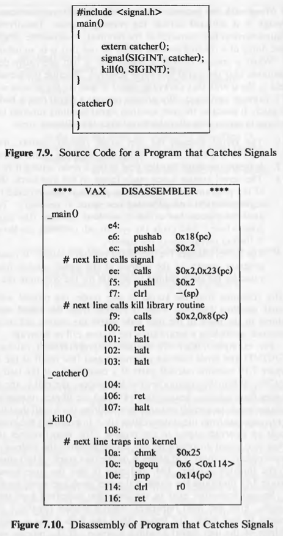
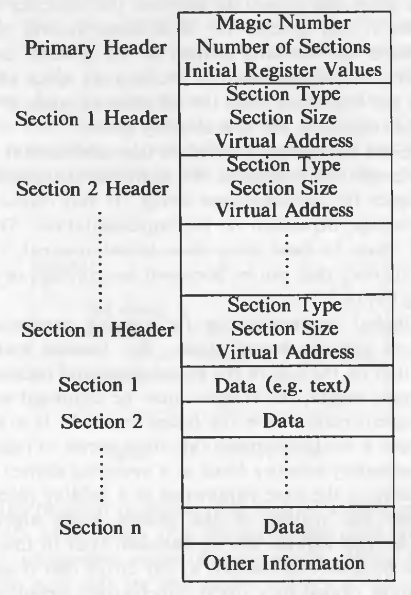

# Process Control

The relationship between the system calls and memory management algorithms is shown in the following diagram:


Almost all calls use *sleep* and *wakeup* so its not shown in the figure. *exec* also interacts with the file system algorithms.

## Process Creation

The only way to create a new process in UNIX is to use the *fork* system call. The process which calls *fork* is called the *parent* process and the newly created process is called the *child* process.

`pid = fork();`

On return of the *fork* system call, the two processes have identical user-level context except for the value of *pid*. *pid* for the parent process is the process ID of the *child* process. And *pid* for child process is 0. The process 0 is the only process which is not created via *fork*.

The steps followed by the kernel for *fork* are:

1. It creates a new entry in the process table.
2. It assigns a unique ID to the newly created process.
3. It makes a logical copy of the regions of the parent process. If a regions can be shared, only its reference count is incremented instead of making a physical copy of the region.
4. The reference counts of file table entries and inodes of the process are increased.
5. It turned the child process ID to the parent and 0 to the child.

The algorithm for *fork* varies slightly for demand paging systems and swapping systems. The algorithms given below are for the traditional swapping system, but wherever changes are required for a paging system, it is mentioned so.

The algorithm *fork* is given below:

```
/*  Algorithm: fork
 *  Input: none
 *  Output: to parent process, child PID number
 *          to child process, 0
 */

{
	check for available kernel resources;
	get free proc table slot, unique PID number;
	check that user not running too many processes;
	mark child state "being created";
	copy data from parent proc table slot to new child slot;
	increment counts on current directory inode and changed root (if applicable);
	increment open file counts in file table;
	make copy of parent context (u-area,	text, data, stack) in memory;
	push dummy system level context layer onto child system level context;
		// dummy context contains data allowing child process to 
		// recognize itself and start running from here when scheduled
	if (executing process is parent process)
	{
		change child state to "ready to run";
		return (child ID);		// from system to user
	}
	else		// executing process is the child process
	{
		initialize u-area timing fields;
		return (0);
	}
}
```

The kernel first checks if it has enough resources to create a new process. In a swapping system, it needs space either in memory or on disk to hold the child process; on a paging system, it has to allocate memory for auxiliary tables such as page tables. The kernel assigns a unique ID to a process. It is one greater than the previously assigned ID. If another process has the proposed ID number, the kernel attempts to assign the next higher ID number. When ID numbers reach the maximum value, assignment starts from 0 again. Since most processes execute for a short time, most ID numbers are not is use when ID assignment wraps around.

The system imposes a (configurable) limit on the number of processes a user can simultaneously execute so that no user can steal many process table slots. Similarly, ordinary users cannot create a process that would occupy the last remaining slot in the process table. On the other hand, a super user can create as many processes as it wants (limited by the size of the process table.)

The kernel assigns parent process ID in the child slot, putting the child in process tree structure, and initialize various scheduling parameters, such as the initial priority value, initial CPU usage, and other timing fields. The initial state of the process is "being created".

The kernel duplicates every region in the parent process using algorithm *dupreg*, and attaches every region to the child process using algorithm *attachreg*. In a swapping system,
it copies the contents of regions that are not shared into a new area of main memory.

The kernel copies the parent context layer 1, containing user saved register context and the kernel stack frame of the *fork* system call. If the implementation is one where the kernel stack is part of the u-area, the kernel automatically creates the child kernel stack when it creates the child u-area. Otherwise, the parent process must copy its kernel stack to a private area of memory associated with the child process. The kernel then creates a dummy context layer 2 for the child process, containing the saved register context for context layer 1. It sets the program counter and other registers in the saved register context so that it can "restore" the child context, even though it had never executed before, and so that the child process can recognize itself as the child when it runs. For instance, if the kernel code tests the value of register 0 to decide if the process is the parent or the child, it writes the appropriate value in the child saved register context in layer 1.

When the child context is ready, the parent completes its part of *fork* by changing the child state to "ready to run (in memory)" and by returning the child process ID to the user. The kernel later schedules the child process for execution via the normal scheduling algorithm, and the child process "completes" its part of the *fork*. The context of the child process was set up by the parent process; to the kernel, the child process appears to have awakened after awaiting a resource. The child process executes part of the code for the *fork* system call, according to the program counter that the kernel restored from the saved register context in context layer 2, and returns a 0 from the system call.

The figure give a logical view of the parent and child processes and their relationship with the kernel data structures immediately after completion of the *fork* system call:


Consider a program where a process has some global variables and has opened some files. After opening the files, the process *fork*s a child process. In this scenario, as the data region was copied, both the processes have their own copies of the global variables, and changing a variable in one process' context will not affect the variable in other process' context. But as the user file descriptor entries of the two processes point to the same file table entry, if one process *read*s/*write*s a file, the offset in the file table will change and the other process will get affected, because when it tries to *read*/*write*, it will do it with respect to the changed offset.

Now consider the following program:

```
#include <string.h>
char string[] = "hello world";
main()
{
	int count, i;
	int to_par[2], to_chil[2];		// for pipes to parent, child
	char buff[256];
	pipe (to_par);
	pipe (to_chil);
	if (fork() == 0)
	{
		// child process executes here
		close (0);				// close old standard input
		dup (to_chil[0]);		// dup pipe read to standard input;
		close (1);				// close old standard output
		dup (to_par[1]);		// dup pipe write to standard out
		close (to_par[1]);		// close unnecessary pipe descriptors
		close (to_chil[0]);
		close (to_par[0]);
		close (to_chil[1]);
		for (;;)
		{
			if ((count = read (0, buf, sizeof(buf)) == 0)
				exit ();
			write (1, buf, count);
		}
	}
	// parent process executes here
	close (1);		// rearrange standard in, out
	dup (to_chil[1]);
	close (0);
	dup (to_par[0]);
	close (to_chil[1]);
	close (to_par[0]);
	close (to_chil[0]);
	close (to_par[1]);
	for (i = 0; i < 15; i++)
	{
		write (1, string, strlen(string));
		read (0, buf, sizeof(buf));
	}
}
```

The execution of each *pipe* system calls allocates two new file descriptors in the user file descriptor table. So the table now has 7 entries (stdin, stdout, stderr, to_par[0], to_par[1], to_chil[0], to_chil[1]). The process then *fork*s a new process, which inherits the user file descriptor table entries from the parent process. The parent process closes its standard output and *dup*s the write end of the child pipe. Then it closes the standard input and *dup*s the read end of the parent pipe. Then it *close*s all the pipes as *dup* has duplicated the needed pipes. After these operations, the user file descriptor table of the parent will have these entries : `[to_par[0], to_chil[1], stderr]`. Everything else has been *close*d. Similarly, the child process *close*s its standard input and *dup*s the read end of the child pipe, and also *close*s the standard output and *dup*s the write end of the parent pipe, and *close*s all unnecessary pipe descriptors. The child process will have these entries in the user file descriptor table: `[to_chil[0], to_par[1], stderr]`.

As a result, when the parent *write*s its standard output, it is writing the pipe *to_child* and sending data to the child process, which *read*s the pipe on its standard input. When the child *write*s its standard output, it is writing the pipe *to_par* and sending data to the parent process, which *read*s the pipe on its standard input. The processes thus exchange messages over the two pipes. The parent exits after 15 iterations through the loop; the child then *read*s "end-of-file" because the pipe has no writer processes and *exit*s. If the child were to *write* the pipe after the parent had *exit*ed, it would receive a signal for writing a pipe with no reader processes.

It is good practice to *close* redundant file descriptors for these reasons:

* It conserves the file descriptors in view of the system-imposed limit.
* If a child process *exec*s, the file descriptors remain assigned in the new context, as will be seen. Closing extraneous files before an *exec* allows programs to execute in a clean, surprise free environment, with only standard input, standard output, and standard error file descriptors open.
* A *read* of a pipe returns end-of-file only  if no processes have the pipe open for writing. If a reader process keeps the pipe write descriptor open, it will never know when the writer processes *close* their end of the pipe. The example above would not work properly unless the child *close*s its write pipe descriptors before entering its loop.

## Signals

*Signal*s inform processes of the occurrence of asynchronous events. Processes may send each other *signal*s with the *kill* system call, or the kernel may send signals internally. There are 19 signals in the System V (Release 2) UNIX system that can be classified as follows:

* Signals having to do with the termination of a process, send when a process *exit*s or when a process invokes the *signal* system call with the *death of child* parameter.
* Signals having to do with process induced exceptions such as when a process accesses an address outside its virtual address space, when it attempts to write memory that is read-only (such as program text), or when it executes a privileged instruction or for various hardware errors.
* Signals having to do with the unrecoverable conditions during a system call, such as running out of system resources during *exec* after the original address space has been released
* Signals caused by an unexpected error condition during a system call, such as making a nonexistent system call (the process passed a system call number that does not correspond to a legal system call), writing a pipe that has no reader processes, or using an illegal "reference" value for the *lseek* system call. It would be more consistent to return an error on such system calls instead of generating a signal, but the use of signals to abort misbehaving processes is more pragmatic.
* Signals originating from a process in user mode, such as when a process wishes to receive an *alarm* signal after a period of time, or when processes send arbitrary signals to each other with the *kill* system call.
* Signals related to terminal interaction such as when a user hands up a terminal (or the "carrier" signal drops on such a line for any reason), or when a user presses the "break" or "delete" keys on a terminal keyboard.
* Signals for tracing execution of a process.

When a kernel or a process sends a signal to another process, a bit in the process table entry of that process is set, with respect to the type of signal received. If the process is asleep at an interruptible priority, the kernel awakens it. A process can remember different types of signals but it cannot remember how many times a signal of a particular type was received.

The kernel checks for receipt of a signal when a process about to return from kernel mode to user mode and when it enters or leaves the sleep state at a suitably low scheduling priority. The kernel handles signals only when a process returns from kernel mode to user mode. This is shown in the following figure:


If a process is running in user mode, and the kernel handles an interrupt that causes a signal to be sent to the process, the kernel will recognize and handle the signal when it returns from the interrupt. Thus, a process never executes in user mode before handling outstanding signals.

The algorithm *issig* for check if a signal is received is given below:

```
/*  Algorithm: issig
 *  Input: none
 *  Output: true, if process received signals that it does not ignore
 *          false otherwise
 */

{
	while (received signal field in process table entry not 0)
	{
		find a signal number sent to the process;
		if (signal is death of child)
		{
			if (ignoring death of child signals)
				free process table entries of zombie children;
			else if (catching death of child signals)
					return (true);
		}
		else if (not ignoring signal)
				return (true);
		turn off signal bit in received signal field in process table;
	}
	return (false);
}
```

## Handling Signals

The kernel handles signals in the context of the process that receives them so a process must run to handle signals. There are three cases for handling signals: the process *exit*s on receipt of the signal, it ignores the signal, or it executes a particular (user) function on receipt of the signal. The default action is to call *exit* in kernel mode, but a process can specify special action to take on receipt of certain signals with the *signal* system call.

`old function = signal (signum, function);`

where `signum` is the signal number the process is specifying the action for, `function` is the address of the (user) function the process wants to invoke on receipt of the signal, and the return value `oldfunction` was the value of `function` in the most recently specified call to *signal* for *signum*. The process can pass the values 1 or 0 instead of a function address: The process will ignore future occurrences of the signal if the parameter value is 1 and *exit* in the kernel on receipt of the signal if its value is 0 (default value). The u-area contains an array of signal-handler fields, one for each signal defined in the system. The kernel stores the address of the user function in the field that corresponds to the signal number.

The handling of signal is done through the algorithm *psig*, given below:

```
/*  Algorithm: psig
 *  Input: none
 *  Output: none
 */

{
	get signal number set in process table entry;
	clear signal number in process table entry;
	if (user had called signal sys call to ignore this signal)
		return;				// done
	if (user specified function to handle the signal)
	{
		get user virtual address of signal catcher stored in u area;
		// the next statement has undesirable side-effects
		clear u area entry that stored address of signal catcher;
		modify user level context:
			artificially create user stack frame to mimic call to signal catcher function;
		modify system level context:
			write address of signal catcher into program counter field of user saved register context;
		return;
	}
	if (signal is type that system should dump core image of process)
	{
		create file named "core" in current directory;
		write contents of user level context to file "core";
	}
	invoke exit algorithm immediately;
}
```

If signal handling function is set to its default value, the kernel will dump a "core" image of the process for certain types of signals before *exit*ing. This is done for signals that imply that something is wrong with a process, such as when a process executes an illegal instruction or when it accesses an address outside its virtual address space. But the kernel does not dump core for signals that do not imply a program error. For instance, receipt of an interrupt signal, sent when a user hits the "delete" or "break" key on a terminal, implies that the user wants to terminate a process prematurely, and receipt of a hangup signal implies that the login terminal is no longer "connected". These signals do no imply that anything is wrong with the process. The *quit* signal, however, induces a core dump even though it is initiated outside the running process.

If a process decides to ignore the signal, or receipt of the signal, the signal field is not reset and the process will continue ignoring the signal.

If a process receives a signal that it had previously decided to catch, it executes the user specified signal handling function immediately when it returns to user mode, after the kernel does the following steps:

1. The kernel accesses the user saved register context, finding the program counter and stack pointer that it had saved for return to the user process.
2. It clears the signal handler field in the u area, setting it to the default state.
3. The kernel creates a new stack frame on the user stack, writing in the values of the program counter and stack pointer it had retrieved from the user saved register context and allocating new space, if necessary. The user stack looks as if the process had called user-level function (the signal catcher) at the point where it had made the system call or where the kernel had interrupted it (before recognition of the signal).
4. The kernel changes the user saved register context: It resets the value for the program counter to the address of the signal catcher function and sets the value for the stack pointer to account for the growth of the user stack.

Consider the following program which catches interrupt signals (SIGINT) and sends itself an interrupt signal. Consider the disassembly (only relevant parts) of the load module on a VAX 11/780.



The call to the *kill* library routine comes from address f9, and the library routine executes the *chmk* (change mode to kernel) instruction at address 10a to call the *kill* system call, the kernel sends an interrupt signal to the process. The return address from the system call is 10c. in executing the system call, the kernel sends an interrupt signal to the process. The kernel notices the interrupt signal when it is about to return to user mode, removes the address 10c from the user saved register context, and places it on the user stack. The kernel takes the address of the function *catcher*, 104, and puts it into the user saved register context. The following figure shows the states of the user stack and saved register context:


There are some anomalies in the way signals are handled. The kernel clears the virtual address of the catcher function before it returns to the user mode. If the process wanted to handle the signal again, it must call the *signal* system call again. But here a race condition results because a second instance of the signal may arrive before the process has a chance to invoke the system call. Since the process is executing in user mode, the kernel could do a context switch, increasing the change that the process will receive the signal before resetting the signal catcher. But if the address of the signal catcher was not reset and many signals had arrived before the kernel gets a chance to handle them, the user stack would grow infinitely, resulting into a system crash. This is more severe than the previously seen case. BSD solved this problem by blocking signals of same type when a signal is being handled. When it unblocks the signals, the pending signals are sent.

A secondary anomaly is when a process is sleeping at interruptible priority inside a system call and a signal is received. The signal causes the process to take *longjmp* out of its sleep, return to user mode, and call the signal handler. When the signal handler returns, the process appears to have returned from the system call with an error. Then the user has to restart the system call. But it would sometimes be more convenient if the kernel automatically restarted the system call, as is done in the BSD system.

A third anomaly exist for the case where the process ignores a signal. If signal arrives while the process is asleep at an interruptible sleep priority level, the process will wake up but will no do a *longjmp*. That is, the kernel realizes that the process ignores the signal only after waking it up and running it. A more consistent policy would be to leave the process asleep. However, the kernel stores the signal function address in the u-area, and the u-area may not be accessible when the signal is sent to the process. A solution to this problem would be to store the signal function address in the process table entry, where the kernel could check whether it should awaken the process on receipt of the signal. Alternatively, the process could immediately go back to sleep in the *sleep* algorithm, if it discovers that it should not have awakened. Nevertheless, user processes never realize that the process woke up, because the kernel encloses entry to the *sleep* algorithm in a "while" loop, putting the process back to sleep if the event did not really occur.

An important thing to note about signals is that, if a process invokes the *signal* system call with "death of child" parameter, the kernel sends the calling process a "death of child" signal if it has child processes in the zombie state. The reason behind this is discussed later.

## Process Groups

The system has to identify processes by "groups" in some cases, for instance, a signal might relate to all the processes which are ancestors of the login shell. The kernel uses the *process group ID* to identify groups of related processes that should receive a common signal for certain events. It saves the group ID in the process table.

The *setpgrp* system call initializes the process group number of a process and sets it equal to the value of its process ID.

`grp = setpgrp();`

where `grp` is the new process group number. A child retains the process group number of its parent during *fork*.

## Sending Signals from Processes

Processes use the *kill* system call to send signals.

`kill (pid, signum);`

where `pid` identifies the set of processes to receive the signal, and `signum` is the signal number being sent. The following list shows the correspondence between values of *pid* and sets of processes.

* If *pid* is a positive integer, the kernel sends the signal to the process with process ID *pid*.
* If *pid* is 0, the kernel sends the signal to all processes in the sender's process group.
* If *pid* is -1, the kernel sends the signal to all processes whose real user ID equals the effective user ID of the sender (real and effective user IDs are studied later). If the sending process has effective user ID of superuser, the kernel sends the signal to all processes except processes 0 and 1.
* If *pid* is a negative integer but not -1, the kernel sends the signal to all processes in the process group equal to the absolute value of *pid*.

In all cases, if the sending process does not have effective user ID of superuser, or its real or effective user ID do not match the real or effective user ID of the receiving process, *kill* fails.

Consider the following program:

```
#include <signal.h>
main()
{
	register int i;
	
	setpgrp();
	for (i = 0; i < 10; i++)
	{
		if (fork() == 0)
		{
			//child proc
			if (i & 1)
				setpgrp();
			printf("pid = %d pgrp = %d\n", getpid(), getpgrp());
			pause();		// sys call to suspend execution
		}
	}
	kill(0, SIGINT);
}
```

The process first sets its group ID with `setpgrp` and then forks 10 processes. The processes forked at odd iterations of the for loop set their group ID again. The parent calls *kill*, which sends SIGINT to all the processes which have the same group ID as the parent. Since the processes created on odd iterations have reset their group IDs, they would not receive the signal and continue to pause.

## Process Termination

Processes on the UNIX system exit by executing the *exit* system call. When a process *exit*s, it enters the zombie state, relinquishes all of its resources, and dismantles its context except for its process table entry.

`exit (status);`

where `status` is the exit code returned to the parent. The process may call *exit* explicitly, but the startup routine in C calls *exit* after the *main* function returns. The kernel may call *exit* on receiving an uncaught signal. In such cases, the value of *status* is the signal number.

The algorithm for exit is given below:

```
/*  Algorithm: exit
 *  Input: return code for parent process
 *  Output: none
 */

{
	ignore all signals;
	if (process group leader with associated control terminal)
	{
		send hangup signal to all members of the process group; 
		reset process group for all members to 0;
	}
	close all open files (internal version of algorithm close);
	release current directory (algorithm: iput);
	release current (changed) root, if exists (algorithm: iput);
	free regions, memory associated with process (algorithm: freereg);
	write accounting record;
	make process state zombie;
	assign parent process ID for all child processes to be init process (1);
		if any children were zombie, send death of child signal to init;
	send death of child signal to parent process;
	context switch;
}
```

In the "write accounting record" step in the above algorithm, it saves its exit code and user and kernel execution time of itself and its descendants in the process table entry. It also *write*s accounting data to a global accounting file, containing various run time statistics such as user ID, memory and CPU usage and amount of I/O for the process. The kernel never schedules a zombie process to execute.

## Awaiting Process Termination

A process can synchronize its execution with the termination of a child process by executing the *wait* system call.

`pid = wait (stat_addr);`

where `pid` is the process ID of the zombie child, and `stat_addr` is the address in user space of an integer that will contain the *exit* status code of the child.

The algorithm for *wait* is given below:

```
/*  Algorithm: wait
 *  Input: address of the variable to store status of exiting process
 *  Output: child ID, child exit code
 */

{
	if (waiting process has no child processes)
		return (error);
	
	for(;;)			// loop until return from inside loop
	{
		if (waiting process has zombie child)
		{
			pick arbitrary zombie child;
			add child CPU usage to parent;
			free child process table entry;
			return (child ID, child exit code);
		}
		if (process has no children)
			return error;
		sleep at interruptible priority (event: child process exits);
	}
}
```

The kernel adds the accumulated time the child process executed in user and in the kernel mode to the appropriate fields in the parent process u-area.

If the signal is "death of child", the process responds differently (to properly grasp these cases, look at *sleep*, *issig* and *wait* simultaneously according to the described flow) :

* In the default case, it will wake up from its sleep in *wait*, and *sleep* invokes algorithm *issig* to check for signals. *issig* recognizes the special case of "death of child" signals and returns "false". Consequently, the kernel does not "long jump" from *sleep*, but returns *wait*. The kernel will restart the *wait* loop, find a zombie child -- at least one is guaranteed to exist, release the child's process table slot, and return from the *wait* system call.
* If the process catches "death of child" signals, the kernel arranges to call the user signal-handler routine, as it does for other signals.
* If the process ignores "death of child" signals, the kernel restarts the *wait* loop, frees the process table slots of zombie children, and searches for more children.

Consider the following program:

```
#include <signal.h>
main (argc, argv)
	int argc;
	char *argv[];
{
	int i, ret_val, ret_code;
	
	if (argc > 1)
		signal (SIGCLD, SIG_IGN);		// ignore death of children
	for (i = 0; i < 15; i++)
		if (fork() == 0)
		{
			// child proc here
			printf("child proc %x\n", getpid());
			exit(i);
		}
	ret_val = wait(&ret_code);
	printf("wait ret_val %x ret_code %x\n", ret_val, ret_code);
}
```

If the above program is executed with 0 arguments, it *wait*s for any child to finish execution. But if the program is executed with one or more arguments, it ignores the "death of child" signal. As a result, when it is sleeping inside *wait*, and it receives a signal, it wakes up in *sleep* inside *wait*, in *issig* called by sleep, it sees the signal is "death of child" and it is being ignored. So it clears the zombie process' process table entry and *sleep*s again. It will return with error only when there are no children processes. Therefore, in the first case, the program waits for *any* child to finish execution where as in the second case, the program waits for *all* children to finish execution.

## Invoking Other Programs

The *exec* system call overlays the address space of a process with the contents of an executable file.

`execve (filename, argv, envp)`

where `filename` is name of the file being invoked, `argv` is a pointer to array of character pointers which are arguments to the program in the executable file, and `envp` is a pointer to array of character pointers which are the *environment* of the executed program. There are several library functions that call *exec*, like *execl*, *execv*, *execle*, and so on. All call *execve* eventually. The character strings in the *envp* array are of the form, "name=value". C programs can access the environment variables by accessing the global variable *environ*, initialized by the C startup routine.

The algorithm for *exec* is:

```
/*  Algorithm: exec
 *  Input: file name
 *         parameter list
 *         environment variables list
 *  Output: none
 */

{
	get file inode (algorithm: namei);
	verify file executable, user has permission to execute;
	read file headers, check that it is a load module;
	copy exec parameters from old address space to system space;
	for (every region attached to process)
		detach all old regions (algorithm: detach);
	for (every region specified in load module)
	{
		allocate new regions (algorithm: allocreg);
		attach the regions (algorithm: attachreg);
		load region into memory if appropriate (algorithm: loadreg);
	}
	copy exec parameters into new user stack region;
	special processing for ssetuid programs, tracing;
	initialize user register save area for return to user mod;
	release inode of file (algorithm: iput);
}
```

The kernel examines the file header to determine the layout of the executable file. The logical format of an executable file as it exists in the file system is shown in the diagram below:



It consists of four parts:

1. The primary header describes how many sections are in the file, the start address for process execution, and the *magic number*, which gives the type of the executable file.
2. Section headers describe each section in the file, giving the section size, the virtual addresses the section should occupy when running in the system, and other information.
3. The sections contain the "data", such as text, that are initially loaded in the process address space.
4. Miscellaneous sections may contain symbol tables and other data, useful for debugging.

The magic number is a short integer, which identifies the file as a load module and enables the kernel to distinguish run-time characteristics about it. Magic number plays an important role in paging systems (studied later).

The kernel has to copy the parameters passed to exec to a holding space as the address space is going to be overlaid. It usually copies the parameter into kernel memory. The use of kernel stack for saving the copied parameters is also common, but there is a limit to the kernel stack and the parameters can be of arbitrary length. The kernel usually copies them to a space which is accessible faster. Hence, use of primary memory is preferable that secondary memory (swap device).

The kernel allocates and attaches regions for text and data, loading the contents of the executable file into main memory (algorithms *allocreg*, *attachreg*, and *loadreg*). The data region of a process is (initially) divided into two parts: data initialized at compile time and data not initialized at compile time ("bss"). The initial allocation and attachment of the data region is for the initialized data. The kernel then increases the size of the data region is for the initialized data. The kernel then increases the size of the data region using algorithm *growreg* for the "bss" data, and initializes the value of the memory to 0. Finally, it allocates a region for the process stack, attaches it to the process, and allocates memory to store *exec* parameters. If the kernel has saved the *exec* parameters in memory pages, it can use those pages for the stack. Otherwise, it copies the *exec* parameters to the user stack.

The kernel clears the addresses of user signal catchers from the u area, because those addresses are meaningless in the new user-level context. Signals that are ignored remain ignored in the new context. Then kernel sets the saved register context for user mode, specifically setting the initial user stack pointer and program counter: The loader had written the initial program counter in the file header. The kernel takes special action for *setuid* programs and for process tracing (studied later).

After *exec*, the process ID doesn't change. Only user level context changes.

The reason why text and data regions are separate, is primarily to protect the text region. The kernel can use hardware protection for the text region and any attempt to overwrite the text region, results into a protection fault that typically results in termination of the process. If the text region is protected, it does not change from the time kernel loaded it into the memory. Therefore, several processes can share the text region, saving memory. Thus, when the kernel allocates a text region for a process in *exec*, it checks if the executable file allows its text to be shared, indicated by its magic number. If so, it follows algorithm *xalloc* to find an existing region for the file text or to assign a new one. The algorithm is as follows:

```
/*  Algorithm: xalloc
 *  Input: inode of executable file
 *  Output: none
 */

{
	if (executable file does not have separate text region)
		return;
	if (text region associated with text of inode)
	{
		// text region already exists.. attach to it
		lock region;
		lock region;
		while (contents of region not ready yet)
		{
			// manipulation of reference count prevents total removal of the region
			increment region reference count;
			unlock region;
			sleep (event: contents of region ready);
			lock region;
			decrement region reference count;
		}
		attach region to process (algorithm: attachreg);
		unlock region;
		return;
	}
	// no such text region exists---create one
	allocate text region (algorithm: allocreg);	// region is locked
	if (inode mode has sticky bit set)
		turn on region sticky flag;
	attach region to virtual address indicated by inode file header (algorithm: attachreg);
	if (file specially formatted for paging system)
		// discussed later
	else	// not formatted for paging system
		read file text into region (algorithm: loadreg);
	change region protection in per process region table to read only;
	unlock region;
}
```

When allocating a region for the first time in *allocreg*, the kernel increments the reference count of the inode associated with the region, after it had incremented the reference count in *namei* (invoking *iget*) at the beginning of *exec*. Because the kernel decrements the reference count once in *iput* at the end of *exec*, the inode reference count of a (shared text) file being executed is at least 1: Therefore, if a process *unlinks* the file, its contents remain intact. The kernel no longer needs the file after loading it into memory, but it needs the pointer to the in-core inode in the region table to identify the file that corresponds to the region. If the reference count were to drop to 0, the kernel could reallocate the in-core inode to another file, compromising the meaning of the inode pointer in the region tale: If a user were to *exec* the new file, the kernel would fin the text region of the old file by mistake. The kernel avoids this problem by incrementing the inode reference count in *allocreg*, preventing reassignment of the in-core indoe. When the process detaches the text region during *exit* or *exec*, the kernel decrements the inode reference count an extra time in *freereg*, unless the inode has the sticky-bit mode set, as will be seen.

To decrease the startup time of a program, the kernel can set the sticky-bit for that particular file. Sticky-bit can be set with the *chmod* system call (or command). If the sticky bit is set, the kernel does not remove a region even if the reference count is dropping to 0. It keeps the reference count at 1, even if no process is referring the file. When a process *exec*s such a program, the regions are already loaded and it runs faster as there is no I/O needed.

The kernel removes the entries for sticky-bit text regions in the following cases:

1. If a process *open*s the file for writing, the *write* operations will change the contents of the file, invalidating the contents of the region.
2. If a process changes the permission modes of the file (*chmod*) such that the sticky-bit is no longer set, the file should not remain in the region table.
3. If a process *unlinks* the file, no process will be able to *exec* it any more because the file has no entry in the file system; hence no new processes will access the file's region table entry. Because there is no need for the text region, the kernel can remove it to free some resources.
4. If a process unmounts the file system, the file is no longer accessible and no processes can *exec* it, so the logic of the previous case applies.
5. If the kernel runs out of space on the swap device, it attempts to free available space by freeing sticky-bit regions that are currently unused. Although other processes may need the text region soon, the kernel has more immediate needs.

Of course, the kernel frees the regions only if no processes currently use it.

The scenario for *exec* is slightly more complicated if a process *exec*s itself. If a user types

`sh script`

the shell *fork*s and the child process *exec*s the shell and executes the commands in the file "script". If a process *execIs itself and allows sharing of its text region, the kernel must avoid deadlocks over the inode and region locks. That is, the kernel cannot lock the "old" text region, hold the lock, and then attempt to lock the "new" text region, because the old and new regions are one region. Instead, the kernel simply leaves the old text region attached to the process, since it will be reused anyway.

## The User ID of a Process

There are two *user ID* associated with a process, the *real user ID* and the *effective user ID* or *setuid* (set user ID). The real user ID identifies the user who is responsible for the running process. The effective user ID is used to assign ownership of newly created files, to check file access permissions, and to check permission to send signals to processes via the *kill* system call. The kernel allows a process to change its effective user ID when it *exec*s a *setuid* program or when it invokes the *setuid* system call explicitly.

A *setuid* program is an executable file that has the *setuid* bit set in its permission mode field. When a process *exec*s a *setuid* program, the kernel sets the effective user ID fields in the process table and u-area to the owner ID of the file. To distinguish the two fields, let us call the field in the process table the *saved* user ID.

`setuid (uid);`

where `uid` is the new user ID, and its result depends on the current value of the effective user ID. If the effective user ID of the calling process is superuser, the kernel resets the real and effective user ID fields in the process table and u-area to *uid*. If its not the superuser, the kernel resets the effective user ID in the u-area to *uid* if *uid* has the value of the real user ID or if it has the value of the saved user ID. Otherwise, the system call returns an error. Generally, a process inherits its real and effective user IDs from its parent during the *fork* system call and maintains their values across *exec* system calls.

Consider the following program:

```
#include <fcntl.h>
main()
{
	int uid, euid, fdmjb, fdmaury;
	
	uid = getuid();		// get real UID
	euid = geteuid();	// get effective UID
	printf("uid %d euid %d\n", uid, euid);
	
	fdmjb = open("mjb", O_RDONLY);
	fdmaury = open("maury", O_RDONLY);
	printf("fdmjb %d fdmaury %d\n", fdmjb, fdmaury);
	
	setuid(uid);
	printf("after setuid(%d): uid %d euid %d\n", uid, getuid(), geteuid());
	
	fdmjb = open("mjb", O_RDONLY);
	fdmaury = open("maury", O_RDONLY);
	printf("tdmjb %d fdmaury %d\n", fdmjb, fdmaury);
	
	setuid(euid);
	printf("after stuid(%d): uid %d euid %d\n", euid, getuid(), geteuid());
}
```

Suppose the executable file produced by compiling the program has owner "maury" (user ID 8319), its *setuid* bit is on, and all users have permission to execute it. Further assume that users "mjb" (user ID 5088) and "maury" own the files of their respective names, and that both files have read-only permission for their owners. User "mjb" sees the following output when executing the program:

```
uid 5088 euid 8319
fdmjb -1 fdmaury 3
after setuid(5088): uid 5088 euid 5088
fdmjb 4 fdmaury -1
after setuid(8319): uid 5088 euid 8319
```

The process cannot *open* file "mjb", because its effective user ID (8319) does not have read permission for the file, but the process can *open* file "maury". After calling *setuid* to reset the effective user ID of the process to the real user ID ("mjb"), the second print statement prints values 5088 and 5088, the user ID of "mjb". Now the process can *open* the file "mjb", because its effective user ID has read permission on the file, but the process cannot open file "maury". Finally, after calling *setuid* to reset the effective user ID to the saved *setuid* value of the program (8319), the third print statement prints values 5088 and 8319 again. The last case shows that a process can *exec* a *stuid* program and toggle its effective user ID between its real user ID and its *exec*ed *setuid*.

User "maury" sees the following output when executing the program:

```
uid 8319 euid 8319
fdmjb -1 fdmaury 3
after setuid(5088): uid 8319 euid 8319
fdmjb -1 dfmaury 4
after setuid(8319): uid 8319 euid 8319
```

The *login* calls *setuid* system call. *login* is *setuid* to root (superuser) and therefore runs with *effective user ID* root. When login is successful, it calls *setuid* system call to set its real and effective user ID to that of the user trying to log in (found in fields in the file "/etc/passwd").

The *mkdir* command is a typical *setuid* program. To allow ordinary users to create directories, the *mkdir* command is a *setuid* program owned by root (superuser permission).

## Changing the Size of a Process

A process can increase or decrease the size of its data region by using the *brk* system call.

`brk (endds);`

where `endds` becomes the value of the highest virtual address of the data region of the process (called its *break* value). Alternatively, a user can call

`oldendds = sbrk(increment);`

where `increment` changes the current break value by the specified number of bytes, and `oldendds` is the break value before the call. `sbrk` is a C library routine that calls *brk*. The kernel checks that the new process size is less than the system maximum and that the new data region does not overlap previously assigned virtual address space. The algorithm is given below:

```
/*  Algorithm: brk
 *  Input: new break value
 *  Output: old break value
 */

{
	lock process data region;
	if (region size increasing)
		if (new region size is illegal)
		{
			unlock data region;
			return (error);
		}
	change region size (algorithm: growreg);
	zero out addresses in new data space;
	unlock process data region;
}
```

When the user stack overflows, the kernel extends it using *brk*.

## The Shell

The shell is a very complex program. But this section will describe the shell, apart from the complex parts. The main loop of the shell looks like this:

```
// read command line until "end of file"
while (read(stdin, buffer, numchars))
{
	// parse command line
	if (/* command line contains & */)
		amper = 1;
	else
		amper = 0;
	// for commands not part of the shell command language
	if (fork() == 0)
	{
		// redirection of IO?
		if (/* redirect output */)
		{
			fd = creat(newfile, fmask);
			close(stdout);
			dup(fd);
			close(fd);
			// stdout is now redirected
		}
		if (/* piping *)
		{
			pipe (fildes);
			if (fork() == 0)
			{
				// first component of command line
				close(stdout);
				dup(fildes[1]);
				close(fildes[1]);
				close(fildes[0]);
				// stdout now goes to pipe
				// child process does command
				execlp(command1, command1, 0);
			}
			// 2nd command component of command line
			close(stdin);
			dup(fildes[0]);
			close(fildes[0]);
			close(fildes[1]);
			// standard input now comes from pipe
		}
		execve(command2, command2, 0);
	}
	// parent continues over here...
	// waits for child to exit if required
	if (amper == 0)
		retid = wait(&status);
}
```

The standard input and output file descriptors for the login shell are usually the terminal on which the user logged in. If the shell recognizes the input string as a built-in command (for example, *cd*, *for*, *while* and others), it executes the command internally without creating new processes; otherwise, it assumes the command is the name of an executable file.

If a *&* character is postfixed to the command, the shell runs the *exec*ed process asynchronously. Otherwise, it will wait for the *exec*ed process to finish execution.

When input or output is redirected using the *>*, *<*, or *>2* characters, the shell redirects the output by closing the *stdin*, *stdout*, whichever applicable, or both and then *creat*ing new file(s) and using *dup* for actual redirection. (In the code above, the redirection of *stdout* is shown, same method is used for *stdin* and *stderr*.)

The code shows how the shell could handle a command line with a single *pipe*, as in

`ls -l | wc`

This will result in the output of `ls -l` to be passed to `wc` as its input. For doing this, the shell pipes the output of ls to the input of wc. Here, the child of shell creates another child (grandchild of the shell).

The shell keeps looping and *read*ing the commands.

## System Boot and the Init Process

But procedures vary according to machine types, but the goal is to copy the operating system into machine memory and start executing it. This is done in a series of steps and hence called as the "bootstrap". On UNIX machines, the bootstrap finally reads the boot block (block 0) of a disk and loads it into memory. The program in the boot block loads the kernel from the file system (for example, from the file "/unix"). Then the boot block program transfers control to the start address of the kernel and the kernel starts running. The algorithm *start* is given below:

```
/*  Algorithm: start
 *  Input: none
 *  Output: none
 */

{
	initialize all kernel data structures;
	pseudo-mount of root;
	hand-craft environment of process 0;
	fork process 1:
	{
		// process 1 here
		allocate region;
		attach region to init address space;
		grow region to accommodate code about to copy in;
		copy code from kernel space to init user space to exec init;
		change mode: return from kernel to user mode;
		/*  init never gets here---as result of above change mode,
		 *  init exec's /etc/init and becomes a "normal" user process
		 *  with respect to invocation of system calls
		 */
	}
	// proc 0 continues here
	for kernel processes;
	/*  process 0 invokes the swapper to manage the allocation of
	 *  process address space to main memory and the swap devices.
	 *  This is an infinite loop; process 0 usually sleeps in the
	 *  loop unless there is work for it to do.
	 */
	execute code for swapper algorithm;
}
```

The algorithm for *init* is given below:

```
/*  Algorithm: init
 *  Input: none
 *  Output: none
 */

{
	fd = open("/etc/inittab", O_RDONLY);
	while (line_read(fd, buffer))
	{
		// read every line of file
		if (invoked state != buffer state)
			continue;		// loop back to while
		// state matched
		if (fork() == 0)
		{
			execl("process specified in buffer");
			exit();
		}
		// init process does not wait
		// loop back to while
	}
	
	while ((id = wait((int *) 0)) != -1)
	{
		// check here if a spawned child died
		// consider respawning it
		// otherwise, just continue
	}
}
```

*init* reads the file "/etc/inittab" for instructions about which processes to spawn. The file "/etc/inittab" contains lines that contain an "id", a state identifier (single user, multi-user, etc), an "action" and a program specification. This is shown below:


*init* reads the file and, if the *state* in which it was invoked matches the state identifier of a line, creates a process that executes the given program specification. Meanwhile, *init* executes the *wait* system call, monitoring the death of its child processes and the death of processes "orphaned" by *exit*ing parents.

Processes in the UNIX system are either user processes, daemon processes, or kernel processes. Most processes are user processes, associated with users at a terminal. Daemon processes are not associated with any users but do system-wide functions, such as administration and control of networks, execution of time-dependent activities, and so on. They are like user processes in that they run at user mode and make system calls to access system services.

Kernel processes execute only in kernel mode. Process 0 spawns kernel processes, such as the page-reclaiming process *vhand*, and then becomes the *swapper* process. Kernel processes are similar to daemon processes in that they provide system-wide services, but they have greater control over their execution priorities since their code is part of the kernel. However, they are not as flexible as daemon processes, because the kernel must be recompiled to change them.
