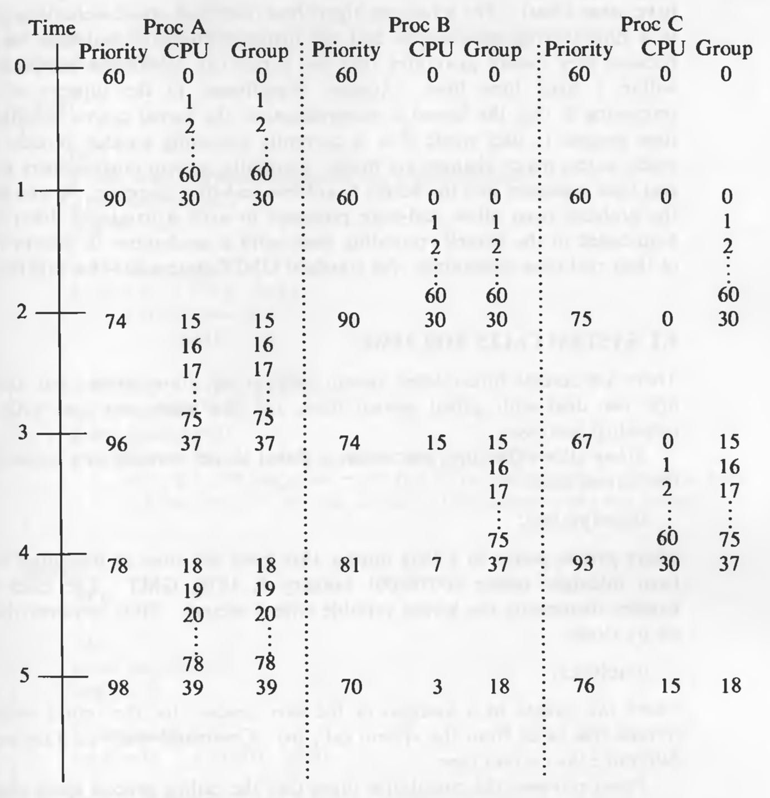
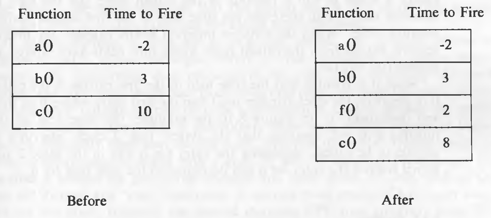
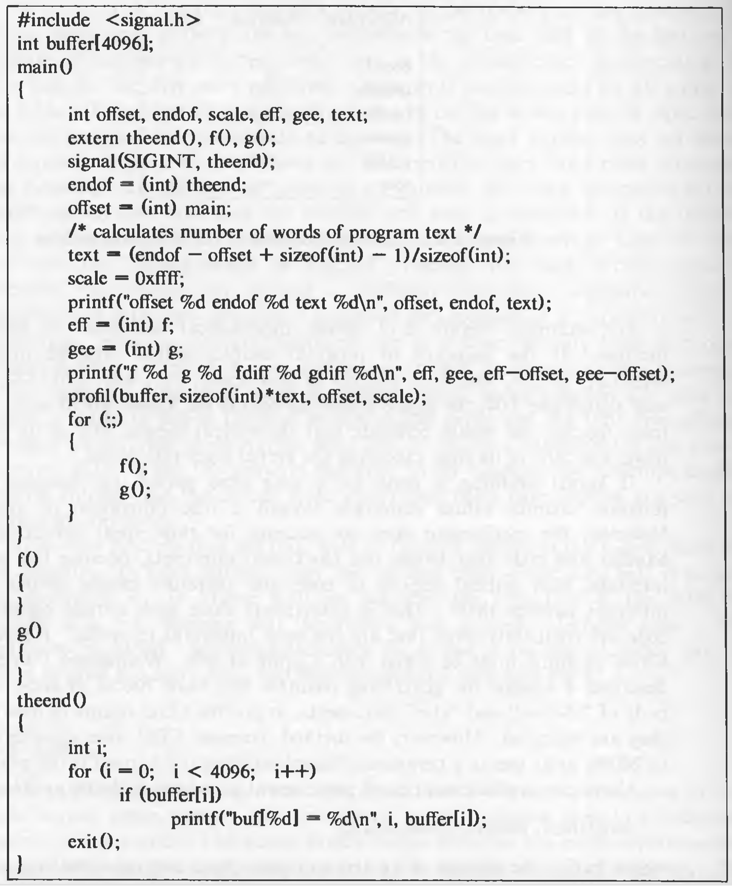
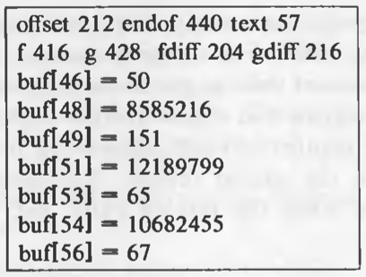

# Process Scheduling and Time

On a time sharing system, the kernel allocates CPU to a process for a period of time called the time slice or time quantum. After the time quantum expires, it preempts the process and schedules another one. The scheduler in UNIX uses relative time of execution as a parameter to determine which process to schedule next. Every process has a priority associated with it. Priority is also a parameter in deciding which process to schedule next. The kernel recalculates the priority of the running process when it comes to user mode from kernel mode, and it periodically re-adjusts the priority of every "ready-to-run" process in user mode.

The hardware clock interrupts the CPU at a fixed, hardware dependent rate. Each occurrence of the clock interrupt is called a *clock tick*.

## Process Scheduling

The scheduler on the UNIX system belongs to the general class of operating system schedulers knows as *round robin with multilevel feedback*. That means, when kernel schedules a process and the time quantum expires, it preempts the process and adds it to one of the several priority queues.

The algorithm *schedule_process* is given below:

```
/*  Algorithm: schedule_process
 *  Input: none
 *  Output: none
 */

{
	while (no process picked to execute)
	{
		for (every process on run queue)
			pick highest priority process that is loaded in memory;
		if (no process eligible to execute)
			idle the machine;
			// interrupt takes machine out of idle state
	}
	remove chosen process from run queue;
	switch context to that of chosen process, resume its execution;
}
```

This algorithm is executed at the conclusion of a context switch. It selects the highest priority process from the states "ready to run, loaded in memory" and "preempted". If several processes have the same priority, it schedules the one which is "ready to run" for a long time.

### Scheduling Parameters

Each process table entry contains a priority field. The priority is a function of recent CPU usage, where the priority is lower if a process has recently used the CPU. The range of priorities can be partitioned in two classes: user priorities and kernel priorities. It is shown in the diagram below:


Each priority has a queue of processes logically associated with it. The processes with user-level priorities were preempted on their return from the kernel to user mode, and processes with kernel-level priorities achieved them in the *sleep* algorithm. User priorities are below a threshold value and kernel priorities are above a threshold value. Processes with low kernel priority wake up on receipt of a signal, but processes with high kernel priority continue to sleep. The user level 0 is the highest user level priority and user level n is the lowest.

The kernel calculates process priorities in these process states:

* It assigns priority to a process about to go to sleep. This priority solely depends on the reason for the sleep. Processes that sleep in lower-level algorithms tend to cause more system bottlenecks the longer they are inactive; hence they receive a higher priority than process that would cause fewer system bottlenecks. For instance, a process sleeping and waiting for the completion of disk I/O has a higher priority than a process waiting for a free buffer. Because the first process already has a buffer and it is possible that after the completion of I/O, it will release the buffer and other resources, resulting into more resource availability for the system.
* The kernel adjusts the priority of a process that returns from kernel mode to user mode. The priority must be lowered to a user level priority. The kernel penalizes the executing process in fairness to other processes, since it had just used valuable kernel resources.
* The clock handler adjusts the priorities of all processes in user mode at 1 second intervals (on System V) and causes the kernel to go through the scheduling algorithm to prevent a process from monopolizing use of the CPU.

When a process is running, every clock tick increments a field in the process table which records the recent CPU usage of the process. Once a second, the clock handler also adjusts the recent CPU usage of each process according to a decay function on system V:

`decay (CPU) = CPU / 2;`

When it recomputes recent CPU usage, the clock handler recalculates the priority of every process in the "preempted but ready-to-run" state according to the formula.

`priority = ("recent CPU usage" / 2) + base level user priority;`

where `base level user priority` is the threshold priority between kernel and user mode. A numerically low value implies a high scheduling priority. As the effect of once a second recalculation, processes with user-level priorities move between the priority queues. The priorities in kernel mode do not change.

If a process is in critical region of the kernel (i.e. the process execution level is risen), the kernel does not recompute the priorities on the one second clock tick, it recomputes the priorities at the next clock tick after the critical region is finished.

**Examples of Process Scheduling**

Consider the following time diagram:


Process A, B, and C are created and initially given the priority 60, which is the highest user-level priority. Assuming that the processes make no system calls, and process A gets scheduled first, after one second the CPU count of A becomes 60. And when it is recalculated, it becomes 30 (decay = 60 / 2). And the priority becomes 75 (priority = 30 / 2 + 60). Then B gets scheduled and the calculation continues every second.

### Controlling Process Priorities

Processes can use the *nice* system call to crude control their scheduling priorities.

`nice(value);`

where `value` is added in the calculation of process priority

`priority = ("recent CPU usage" / constant) + (base priority) + (nice value);`

The *nice* system call increments or decrements the *nice* field in the process table by the value parameter, although only the superuser can supply *nice* values that increase the process priority. The term "nice" is used because decreasing the priority (which is the usual use-case) is being "nice" to other processes. Processes inherit their *nice* value of their parent during the *fork* system call. *nice* system call works for running processes only; a process cannot reset the *nice* value of another process.

### Fair Share Scheduler

The scheduler algorithm described above does not differentiate between classes of users. In *fair share scheduling*, there are groups of processes and the time quantum is allocated equally to all the groups, even if number of processes in each group might be different. For example, if there are 4 fair share groups with 1, 2, 3, and 4 processes respectively, then the one process in group 1 will get twice time quantum than a process in group 2, thrice than a process in group 3 and four times than a process in group 4.

To implement this scheme, another field is added in the u-area for "fair share group priority". It is shared by all the processes in the same fair share group. The clock interrupt handler increments the fair share group CPU usage field for the running process, just as it increments the CPU usage field of the running process and decays the values of all fair share group CPU usage fields once a second. When calculating priorities, a new component of the calculation is the group CPU usage, normalized according to to the amount of CPU time allocated to the fair share group.

For example, consider the processes in the following diagram:



Process A belongs to one group and processes B and C belong to another group. Therefore, the "group" value is shared between B and C. The priorities will be calculated by this formula :

`priority = (CPU usage / 2) + (Group CPU usage / 2) + base priority`

That is why processes execute in this manner: A, B, A, C, A, B, A, C, and so on...

## System Calls for Time

There are several time-related system calls, *stime*, *time*, *times*, and *alarm*. The first two deal with global system time, and the latter two deal with time for individual processes.

*stime* allows the suepruser to set a global kernel variable to a value that gives the current time:

`stime(pvalue);`

where `pvalue` points to a long integer that gives the time as measured in seconds from midnight before (00:00:00) January 1, 1970, GMT. The clock interrupt handler increments the kernel variable once a second.

*time* retrieves the time as set by *stime*.

`time(tloc);`

where `tloc` points to a location in the user process for the return value. *time* returns this value from the system call, too.

*times* retrieves the cumulative times that the calling process spent executing in user mode and kernel mode and the cumulative times that all zombie children had executed in user mode and kernel mode.

```
struct tms *tbuffer;
times(tbuffer);
```

where the structure `tms` contains the retrieved times, and is defined by:

```
struct tms {
	// time_t is the data structure for time
	time_t tims_utime;		// user time of process
	time_t tm_stime;			// kernel time of process
	time_t tms_cutime; 		// user time of children
	time_t tms_cstime;		// kernel time of children
}
```

*times* returns the elapsed time "from an arbitrary point in the past", usually the time of system boot.

The following program forks 10 children and uses *times* to get the time related statistics:

```
#include <sys/types.h>
#include <sys/times.h>
extern long times();

main()
{
	int i;
	// tms is data structure containing the 4 time elements
	struct tms pb1, pb2;
	long pt1, pt2;
	
	pt1 = times(&pb1);
	for (i = 0; i < 10; i++)
		if (fork() == 0)
			child(i);
			
	for (i = 0; i < 10; i++)
		wait((int *) 0);
	pt2 = times(&pb2);
	printf("parent real %u user %u sys %u csys %u", pt2 - pt1, 
				pb2.tms_utime - pb1.tms_utime, pb2.tms_stime - pb1.tms_stime, 				pb2.tms_cutime - pb1.tms_cutime, pb2.tms_cstime - pb1.tms_cstime);
}

child(n)
	int n;
{
	int i;
	struct tms cb1, cb2;
	long t1, t2;
	
	t1 = times(&cb1);
	for (i = 0; i < 10000; i++)
		;
	t2 = times(&cb2);
	printf("child %d: real %u user %u sys %u", n, t2 - t1,
				cb2.tms_utime - cb1.tms_utime, cb2.tms_stime - cb1.tms_stime);
	exit();
}
```

One would naively expect the parent *child user* and *child system* times to equal the respective sums of the child processes' *user* and *system* times, and the parent *real time* to equal the sum of the child processes' *real time*. However, child times do not include times spent in the *fork* and *exit* system calls, and all times can be distorted by time spent handling interrupts or doing context switches.

User processes can schedule alarm signals using the *alarm* system call.


## Clock

The functions of the clock interrupt handler are to:

* restart the clock
* schedule invocation of internal kernel functions based on internal timers
* provide execution profiling capability for the kernel and for user processes
* gather system and process accounting statistics,
* keep track of time
* send alarm signals to processes on request
* periodically wake up the swapper process
* control process scheduling

Some operations are done every clock interrupt, whereas others are done after several clock ticks. The clock handler runs with processor execution level set high. The algorithm *clock* is given below:

```
/*  Algorithm: clock
 *  Input: none
 *  Output: none
 */

{
	restart clock;		// so that it will interrupt again
	if (callout table not empty)
	{
		adjust callout times;
		schedule callout function if time elapsed;
	}
	if (kernel profiling on)
		note program counter at time of interrupt;
	if (user profiling on)
		note program counter at time of interrupt;
	gather system statistics;
	gather statistics per process;
	adjust measure of process CPU utilization;
	if (1 second or more since last here and interrupt not in critical region of code)
	{
		for (all processes in the system)
		{
			adjust alarm time if active;
			adjust measure of CPU utilization;
			if (process to execute in user mode)
				adjust process priority;
		}
		wakeup swapper process if necessary;
	}
}
```

### Internal System Timeouts

Some kernel functions require invocation on a real-time basis (such as device drivers or network protocols). The kernel stores the necessary information in the *callout* table which consists of the functions to be invoked when time expires, a parameter for the function, and the time in clock ticks until the function should be called.

The user has no direct control over the entries in the callout table; various kernel algorithms make entries as needed. The kernel sorts entries in the callout table according to their respective "time to fire". Because of such ordering, the time field for each entry in the callout table is stored as the amount of time to fire after the previous element fires. Decrementing the time field for the first entry effectively decrements the time for all functions. For example, look at the following diagram (the time of "c()" is decreased after "f()" gets added which has the time 2):



The clock interrupt handler does not call the callout functions directly, because it doesn't know how much time they will take, and it does not want to block the clock handler for that reason. Therefore, it sends a "software interrupt" to schedule such functions. Software interrupts are at a lower priority and therefore can get blocked in the execution level is set to a higher level. In such cases, the time field in the callout table could be a negative number. Since it is possible that the time fields of the first entries in the callout table are 0 or negative, the clock handler must find the first entry whose time field is positive and decrement it. In the above example, the time field of the entry for function *a* is -2, meaning that the system took 2 clock interrupts after *a* was eligible to be called. Assuming the entry for *b* was in the table 2 ticks ago, the kernel skipped the entry for *a* and decremented the time field for *b*.

### Profiling

The kernel profile driver monitors the relative performance of kernel modules by sampling system activity at the time of a clock interrupt. The profile driver has a list of kernel addresses to sample, usually addresses of kernel functions. If kernel profiling is enabled, the clock interrupt handler invokes the interrupt handler of the profile driver, which determines the processor mode at the time of interrupt. If the mode was user, the profiler increments a count for user execution, but if the mode was kernel, it increments an internal counter corresponding to the program counter.

For example, the following figure shows hypothetical addresses of several kernel routines:


If the sequence of program counter values sampled over 10 clock interrupts is 110, 330, 145, addresses in user space, 125, 440, 130, 320, addresses in user space, and 104, the figure shows the counts the kernel would save. Examining these figures, one would conclude that the system spends 20% of its time in user mode and 50% of its time executing the kernel algorithm *bread*.

Users can profile execution of processes at user-level with the *profil* system call:

`profil (buff, bufsize, offset, scale);`

where `buff` is the address of an array in user space, `bufsize` is the size of the array, `offset` is the virtual address of a user subroutine (usually, the first virtual address), and *scale* is a factor that maps user virtual addresses into the array. The kernel treats *scale* as a fixed-point binary fraction with the binary point at the extreme "left": The hexadecimal value 0xffff gives a one to one mapping of program counters to words in `buff`, 0x7fff maps pairs of program addresses into a single `buff` word, 0x3fff maps groups of 4 program addresses into a single `buff` word, and so on. When the clock interrupts the process while in user mode, the clock handler examines the user program counter at the time of interrupt, compares it to *offset*, and increments a location in *buff* whose address is a function of *bufsize* and *scale*.

Consider the following program:



Running the program for about 10 seconds on a lightly loaded AT&T 3B20 computer gave this output:



The address of *f* is 204 greater than the 0th profiling address; because the size of the text of *f* is 12 bytes (216 - 208) and the size of an integer is 4 on AT&T 3B20 computer, the addresses of *f* map into *buf* entries 51, 52, 53. Similarly, the addresses of *g* map into *buf* entries 54, 55 and 56. The *buf* entries 46, 48, and 49 are for addresses in the loop in function *main*. In typical usage, the range of addresses to be profiled is determined by examination of the text addresses in the symbol table of the program being profiled. Users are discouraged from using the *profil* call directly because it is complicated; instead, an option on the C compiler directs the compiler to generate code to profile processes.

### Accounting and Statistics

Every process has two fields in its u-area to keep a record of elapsed kernel and user time. Every process has one field in its u-area for the kernel to log its memory usage. The memory usage by a process is a function of its private memory regions and its proportional usage of shared memory regions. For example, if a process shares a text region of size 50K bytes with four other processes and uses data and stack regions of size 25K and 40K bytes, respectively, the kernel charges the process for 75K bytes (50K / 5 + 25K + 40K). For a paging system, it calculates the memory usage by counting the number of valid pages in each region. Thus, if the interrupted process uses two private regions and shares another region with another process, the kernel charges it for the number of valid pages in the private regions plus half the number of valid pages in the shared region.

### Keeping Time

The kernel increments a timer variable at every clock interrupt, keeping time in clock ticks from the time the system was booted. The kernel  saves the process start time in its u-area when a process is created in the *fork* system call, and it subtracts that value from the current time when the process *exit*s, giving the real execution time of a process. Another timer variable, set by the *stime* system call, is updated once a second, keeps track of calendar time.
