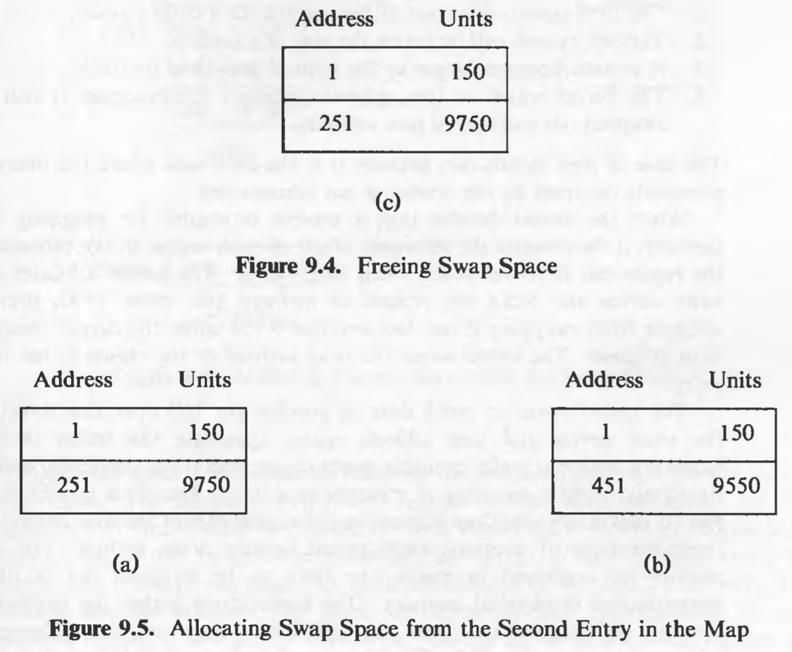
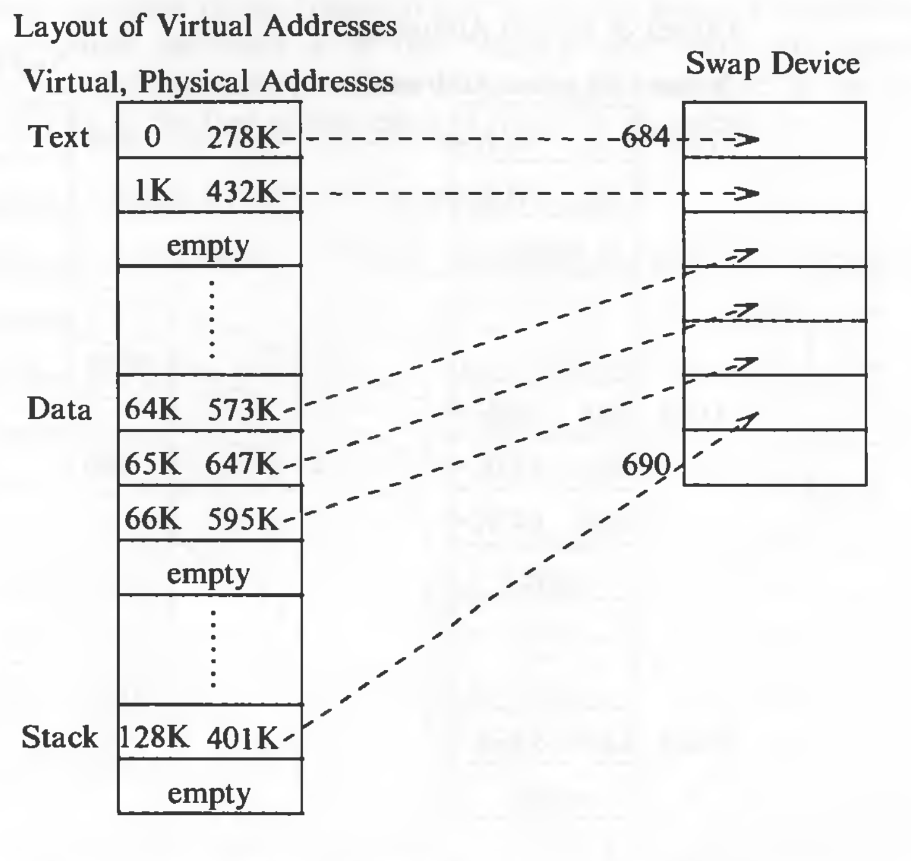
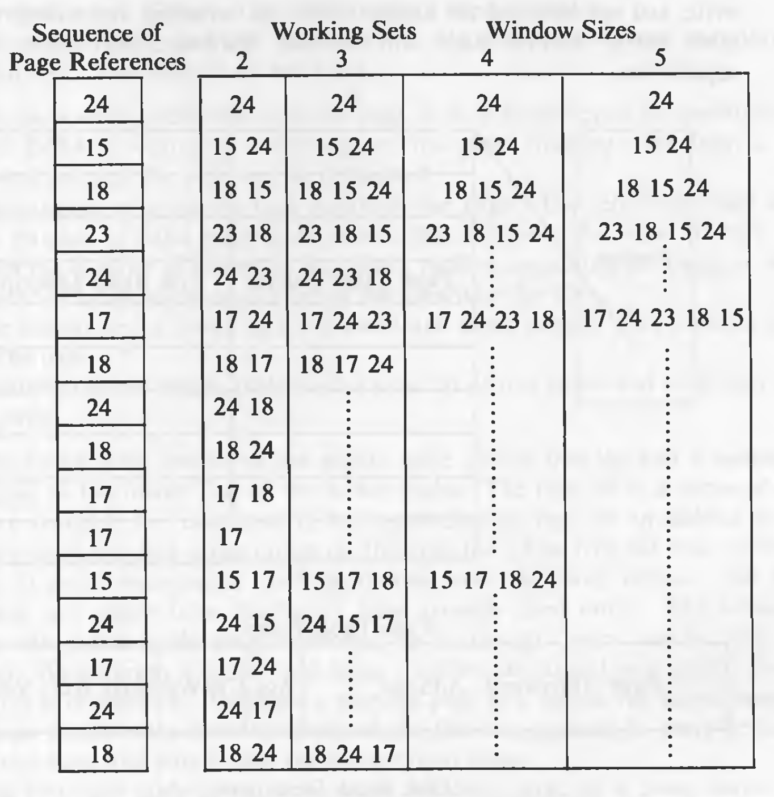
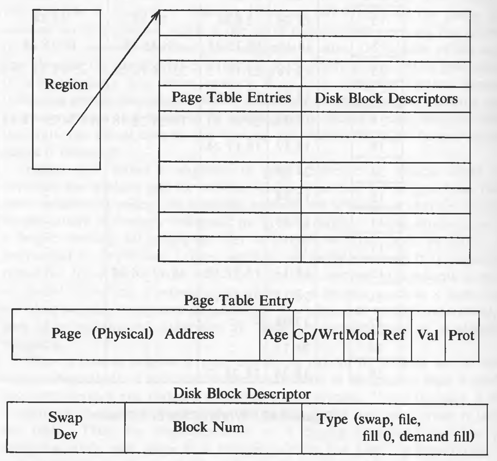
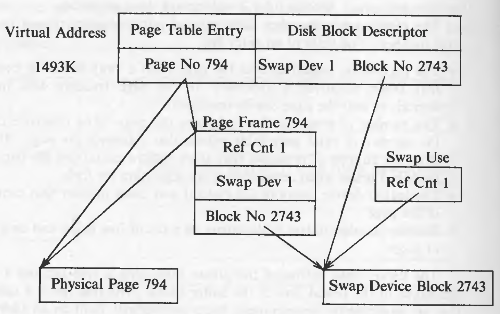
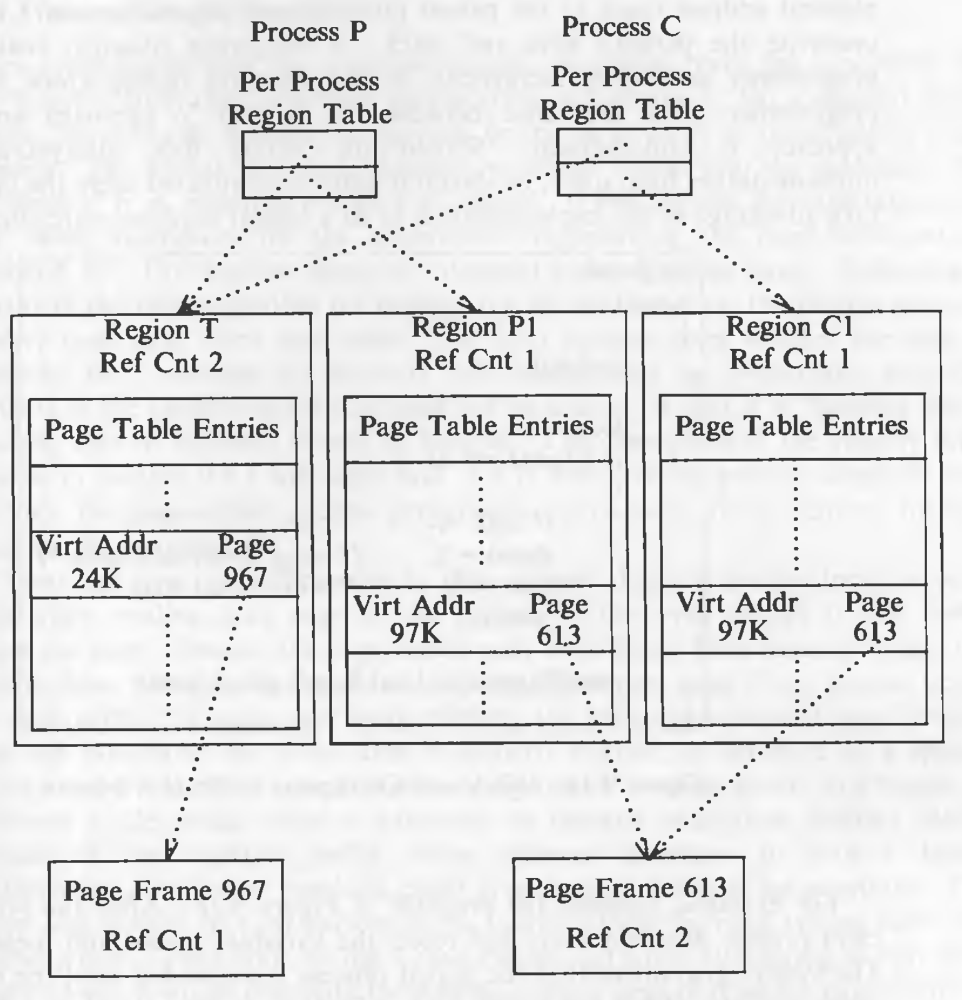
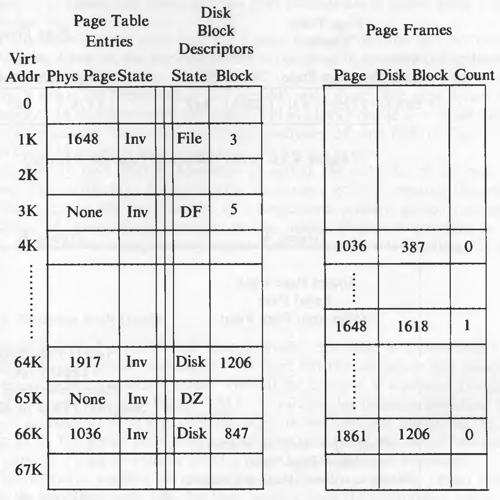
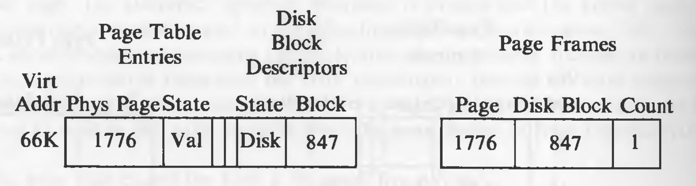

# Memory Management Policies

Historically, UNIX systems transferred entire processes between primary memory and the swap device. Such a memory management policy is called *swapping*. It made sense to implement such a policy on the PDP 11, where the maximum process size was 64K. The BSD system (release 4.0) was the first major implementation of a *demand paging* policy, transferring memory pages instead of processes to and from a secondary device; later releases of UNIX system V also support demand paging. The entire process does not have to reside in main memory to execute, and the kernel loads pages for a process on demand when the process references the pages. This permits greater flexibility in mapping the virtual address space of a process into the physical memory of a machine, usually allowing the size of a process to be greater than the amount of available physical memory and allowing more processes to fit simultaneously in main memory. Swapping policy is easier to implement and has less overhead.

## Swapping

Swapping has 3 parts to it:

* managing space on the swap device
* swapping processes out of main memory
* swapping processes into main memory

### Allocation of Swap Space

The swap device is a block device in a configurable section of a disk. The space on swap device is allocated in the form of contiguous blocks (as opposed to single block allocation for files). The allocation of space on the swap device is transitory (as opposed to long lasting file allocation). A process that resides on the swap device will eventually migrate back to main memory. Since speed is critical and the system can do I/O faster in one multi-block operation than in several single block operations, the kernel allocates contiguous space on the swap device without regard for fragmentation (as opposed to the flexible allocation for files which results into minimum fragmentation).

The allocation scheme for swap space allocation differs from the scheme used for file systems. Therefore, the data structures also differ. The kernel maintains the free space for the swap device in an in-core table, called *map*. A map is an array where each entry consists of an address of an allocatable resource and the number of resource units available there; the kernel interprets the address and units according to the type of map. Initially, a map contains one entry that indicates the address and the total number of resources; it is shown in the figure:


This is to be interpreted as: there are 10000 free blocks starting from address 1.

The algorithm to allocate map space, *malloc* is given below:

```
/*  Algorithm: malloc
 *  Input: map address
 *         requested number of units
 *  Output: address, if successful
 *          0, otherwise
 */

{
	for (every map entry)
	{
		if (current map entry can fit requested units)
		{
			if (requested units == number of units in entry)
				delete entry from map;
			else
				adjust start address of entry;
			return (original address of entry);
		}
	}
	return (0);
}
```

The following figures show the state of the map after allocating 100 units, 50 units, then 100 units again:


When freeing resources, the kernel finds their proper position in the map by address. Three cases are possible here:

1. The freed resources completely fill a hole in the map. In this case, the kernel combines the newly freed resources and the existing (two) entries into one entry in the map.
2. The freed resources partially fill a hole. In this case, the kernel adjusts the address and units fields of an appropriate entry to account for the resources just freed.
3. The freed resources partially fill a hole but are not contiguous to any resources in the map. Then a new entry is created and inserted in the proper position.

Considering the previous example, if the kernel frees 50 units of swap space starting at address 101, the swap map will contain a new entry (case 3). If the kernel then frees 100 units starting at address 1, it adjusts the first entry of the swap map (case 2). Suppose the kernel now requests 200 units of swap space, since the first entry cannot satisfy the requirement, the second entry is modified and space is given from address 251 to 450, both inclusive. These actions are shown below:



Now if the 300 units are freed from address 151 are freed, it will completely, fill the hole between entry number 1 and 2 (case 1), and the entries will be merged together, resulting into only one entry in the map.

Traditional implementations of the UNIX system use one swap device, but later implementations of System V allow multiple swap devices. Swap devices are chosen in a round robin scheme. Administrators can create and remove swap devices dynamically.

### Swapping Processes Out

A process is swapped out if the kernel needs space in memory. It needs space in memory under following situations:

1. The *fork* system call must allocate space for a child process.
2. The *brk* system call increases the size of a process.
3. A process becomes larger by the natural growth of its stack.
4. The kernel wants to free space in memory for processes it had previously swapped out and should now swap in.

When the kernel decides that a process is eligible for swapping from main memory, it decrements the reference count of each region in the process and swaps the region out if its reference count drops to 0. The kernel allocates space on a swap device and locks the process in memory (for cases 1-3), preventing swapper from swapping it out while the current swap operation is in progress. The kernel saves the swap address of the region in the region table entry.

The buffer cache is bypassed when the kernel swaps data between the swap device and user address space. If memory is organized in pages, the data to be swapped out is likely to be discontiguous in physical memory. The kernel must gather the page addresses of data to be swapped out, and the disk driver may use the collection of page addresses to set up the I/O. The swapper waits for each I/O operation to complete before swapping out other data.

It is not necessary that the kernel write the entire virtual address space of a process to a swap device. Instead, it copies the physical memory assigned to a process to the allocated space on the swap device, ignoring unassigned virtual addresses. When the kernel swaps the process back into memory, it knows the virtual address map of the process, so it can reassign the process to the correct virtual addresses. The kernel eliminates an extra copy from a data buffer to physical memory by reading the data into the physical memory locations that were previously set up to conform to the virtual address locations.

The following figure is an example of mapping the in-core image of a process onto a swap device:



Note: for simplicity, the virtual address space is depicted as a linear array of page table entries, disregarding the fact that each region usually has a separate page table.

When swapping out, the kernel does not allocate space for empty entries in the page tables. The following figure depicts the scenario when the process in swapped back in. The physical addresses it gets are different. However, no change is noticed on the user-level.


The kernel does not swap out the u-are of a process if it contains the address translation tables for the process (implementation dependent). The implementations dictate whether a process can swap itself out or whether it must request another process to swap it out.

**Fork Swap**

If enough memory is not available in *fork*, the kernel swaps the process out without freeing the memory occupied by the in-core (parent) copy. When the swap is complete, the child process exists on the swap device; the parent places the child in the "ready-to-run" state and returns to user mode. When the kernel swaps the child in and schedules it, then the child will complete its part of the *fork* system call and return to user mode.

**Expansion Swap**

A process needs to be swapped as a result of its user stack growth or invocation of the *brk* system call, if enough memory is not available. In such situation, the kernel reserves enough space on the swap device, including the newly requested space. Then, it adjusts the address translation mapping of the process to account for the new virtual memory but does not assign physical memory (since none was available). Finally, it swaps the process out in a normal swapping operation, zeroing out the newly allocated space on the swap device. When the kernel later swaps the process into memory, it will allocate physical memory according to the new address translation map. It is shown in the figure below:


**Swapping Processes In**

The swapper process (process 0), is the only process that swaps processes into memory from swap devices. After system initialization, the swapper goes into an infinite loop, where its only task is to do process swapping. The swapper sleeps if there is no work for it. Swapper executes only in kernel mode.

When swapper wakes up to swap processes in, it selects the processes which has spent the longest time in the state "ready to run but swapped out". The algorithm *swapper* is given below:

```
/*  Algorithm: swapper
 *  Input: none
 *  Output: none
 */

{
	loop:
		for (all swapped out processes that are ready to run)
			pick process swapped out longest;
		if (no such process)
		{
			sleep (event: must swap in);
			goto loop;
		}
		if (enough room in main memory for process)
		{
			swap process in;
			goto loop;
		}
	// loop2: here in revised algorithm given later
		for (all processes loaded in main memory, not zombie and not locked in memory)
		{
			if (there is a sleeping process)
				choose process such that priority + residence time is numerically highest;
			else		// no sleeping process
				choose process such that residence time + nice is numerically highest;
		if (chosen process not sleeping or residency requirements not satisfied)
			sleep (event must swap process in);
		else
			swap out process;
		goto loop;	// goto loop2 in revised algorithm given later
}
```

The swapper tries to swap out sleeping processes rather than ready-to-run processes, because ready-to-run processes might get scheduled earlier than sleeping processes. A ready-to-run process must be core resident for at least 2 seconds before being swapped out, and a process to be swapped in must have been swapped out for at least 2 seconds.

If the swapper cannot find a processes to swap out or if neither the process to be swapped in nor the process to be swapped out have accumulated more than 2 seconds residence time in their environment, then swapper sleeps on the event that it wants to swap a process into memory but cannot find room for it. The clock will awaken the swapper once a second in that state. The kernel also awakens swapper if another process goes to sleep, since it may be more eligible for swapping out than the processes previously considered by the swapper. In any case, the swapper wakes up and begins execution from the beginning, attempting to swap in eligible processes.

Here is an example of process scheduling in a system where A, B, C, D are same sized processes and only 2 processes can stay in main memory. This is the scheduling timeline:


The swapper chooses processes to swap in based on the amount of time the processes had been swapped out. Another criterion could have been to swap in the highest-priority process that is ready to run, since such processes deserve a better chance to execute. It has been demonstrated that such a policy results in "slightly" better throughput under heavy system load.

The algorithm for choosing a process to swap out has some serious flaws:

1. The swapper swaps out a process based on its priority, memory-residence time, and *nice* value. Although it swaps out a process only to make room for a process being swapped in, it may swap out a process that does not provide enough memory for the incoming process. For instance, if the swapper attempts to swap in a process that occupies 1 megabyte of memory and the system contains no free memory, it is futile to swap out a process that occupies only 2K bytes of memory. An alternative strategy would be to swap out groups of processes only if they provide enough memory for the incoming process.
2. If the swapper sleeps because it could not find enough memory to swap in a process, it searches again for a process to swap in although it had previously chosen one. The reason is that other swapped processes may have awakened in the meantime and they may be more eligible for swapping in than the previously chosen process. But that is small solace to the original process still trying to be swapped in. In some implementations, the swapper  tries to swap out many smaller processes to make room for the big process to be swapped in before searching for another process to swap in; this is the revision in the swapper algorithm shown by the comments in the algorithm given above.
3. If the swapper chooses a "ready-to-run" process to swap out, it is possible that the process had not executed since it was previously swapped in. The following figure shows such a case, where the kernel swaps in process D at the 2-second mark, schedules process C, and then swaps out process D at the 3-second mark in favor of process E (because of the interaction of the *nice* value) even though process D had never run. Such thrashing is clearly undesirable:


4. If the swapper attempts to swap out a process but cannot find space on the swap device, a system deadlock could arise if the following four conditions are met:
	
	- All the processes in main memory are asleep
	- All the ready-to-run processes are swapped out
	- There is no room on the swap device for new processes
	- There is no room in main memory for incoming processes

## Demand Paging

Machines whose memory architectures is based on pages and whose CPU has restartable instructions can support a kernel that implements a demand paging algorithm, swapping pages of memory between main memory and a swap device. Demand paging systems free processes from size limitations otherwise imposed by the amount of physical memory available on a machine. The kernel still has a limit on the virtual size of a process, dependent on the amount of virtual memory the machine can address. Demand paging is transparent to the user except for the virtual size permissible to a process.

The portion of the text section which contains the frequently called subroutines and program loops is a small subset of the total space of the process. This is known as the principle of "locality". The *working set* of a process is the set of pages that the process has referenced in its last *n* memory references; the number *n* is called the *window* of the working set. If the working set stays in the memory, swapping could be reduced. When a process addresses a page that is not in its working set, it incurs a page fault; in handling the fault, the kernel updates the working set, reading in pages from a secondary device if necessary.

The following figure shows the changes in working set of different window sizes as the process accesses pages:



As shown in the diagram, working sets with larger window sizes are more efficient, implying that the process will not fault often as often. 

It is expensive to remember the order of page references. Instead, systems approximate a working set model by setting a *reference* bit whenever a process accesses a page and by sampling memory references periodically: If a page was recently referenced, it is part of a working set; otherwise, it "ages" in memory until it is eligible for swapping.

When a process accesses a page that is not part of its working set, it incurs a *validity page fault*. The kernel suspends execution of the process until it reads the page into memory and makes it accessible to the process. When the page is loaded in memory, the process restarts the instruction it was executing when it incurred the fault. Thus, the implementation of a paging subsystem has two parts: swapping rarely used pages to a swapping device and handling page faults.

### Data Structures for Demand Paging

The kernel contains 4 major data structures to support low-level memory management functions and demand paging:

* page table entries
* *disk block descriptors*
* *page frame data table* (called *pfdata* for short)
* swap-use table

pfdata table is allocated once for the lifetime of the system, but allocations for other structure are dynamic.

As seen previously, the region contains page tables to access physical memory. Each entry of a page table contains the physical address of the page, protection bits indicating whether processes can read, write or execute from the page, and the following bit fields to support demand paging:

* Valid
* Reference
* Modify
* Copy on write
* Age

The kernel sets the *valid* bit to indicate that the contents of a page are legal, but the page reference is not necessarily illegal if the *valid* bit is not set. The *reference* bit indicates whether a process recently referenced a page, and the *modify* bit indicates whether a process recently modified the contents of a page. The *copy on write* bit, used in the *fork* system call, indicates that the kernel must create a new copy of the page when a process modifies its contents. The kernel manipulates the *age* bits to indicate how long a page has been a member of the working set of a process. Assume the kernel manipulates the valid, copy on write, and age bits, and the hardware sets the reference and modify bits of the page table entry (later, a hardware that does not have these capabilities is considered).

The structure of the region is given below:



Each page table entry is associated with a disk block descriptor, which describes the disk copy of the virtual page. Processes that share a region therefore access common page table entries and disk block descriptors. The contents of a virtual pages are either in a particular block on a swap device, in an executable, or not on a swap device. If the page is on a swap device, the disk block descriptor contains the logical device number and block number containing the page contents. If the page is contained in an executable file, the disk block descriptor contains the logical block number in the file that contains the page; the kernel can quickly map this number into its disk address. The disk block descriptor also indicates two special conditions set during *exec*: that a page is "demand fill" or "demand zero", studied later.

The pfdata table describes each page of *physical* memory and is indexed by page number. It contains these fields:

* State of the page, indicating that the page is on a swap device or executable file, that DMA is currently underway for the page (reading data from a swap device), or that the page can be reassigned.
* The number of processes that reference the page. The reference count equals the number of valid page table entries that reference the page. It may differ from the number of processes that share regions containing the page, as will be described below when reconsidering the algorithm *fork*.
* The logical device (swap or file system) and block number that contains a copy of the page.
* Pointers to other pfdata table entries on a list of free pages and on a hash queue of pages.

The kernel links entries of the pfdata table onto a free list and a hashed list, just like the buffer cache. This free list is also used in LRU order. The hash queues are hashes according to the (swap) device number and block number. 

The swap-use table contains an entry for every page on a swap device. The entry consists of a reference count of how many page table entries point to a page on a swap device.

The following figure shows the relationship between page table entries, disk block descriptors, pfdata table entries, and the swap-use count table.



It will be explained later why the block number is duplicated in disk block descriptor and pfdata entry table.

### Fork in Paging System

In swapping systems, the kernel copies the address space of the parent. But in paging system, for shared regions, kernel just increments the reference count in the region table entry to share the region. And for private regions such as data and stack, the kernel allocates a new region table entry and page table. Then it examines the pages on the parent process and if they are valid, increments the reference count in *pfdata* table entry, sharing the page (as opposed to sharing the region).

The kernel sets the "copy-on-write" bit in *fork*, for the shared pages in the private regions. If any process writes on such shared page, it incurs the "protection fault". In the fault handler, the kernel makes a copy of page and then the process can write on its private copy. So the copying is differed until an actually write operation is done.

The diagram below shows the kernel data structures after the *fork* system call:



Text region is shared, the page frame reference count remains 1. And pages in private regions are shared, the page frame reference count is 2.

In BSD systems, the *fork* system call makes a physical copy of parent's address space. There is a different system call, *vfork*, in which the regions are shared. But in this case, the child operates in parent's address space and therefore can affect the parent. There is a philosophical difference between the System V approach and the BSD update: whether to hide the working of the system call from the user or whether to allow the user to take advantage of knowing how the system calls work.

### Exec in a Paging System

On a demand paged system, the executable file may be too large to fit in the available main memory. Therefore, the kernel does not preassign memory to executable file but "faults" it in, assigning memory as needed. It first assigns the page tables and disk block descriptors for the executable file, marking the page table entries "demand fill" (for non-bss data) or "demand zero" (for bss data). Following a variant of *read* algorithm for reading the file into memory, the process incurs a validity fault as it reads each page. The fault handler notes whether the page is "demand fill", meaning its contents will immediately be overwritten with the contents of the executable file so it need not be cleared, or that it is "demand zero", meaning that its contents should be cleared. If the process cannot fit into memory, the page-stealer process periodically swaps pages from memory, making room for the incoming file.

There are some inefficiencies in this scheme:

* A process incurs a page fault when reading each page of the executable file, even though it may never access the page.
* The page stealer may swap pages from memory before the *exec* is done, resulting in two extra swap operations per page if the process needs the page early.
* To make *exec* more efficient, the kernel can demand page directly from the executable file if the data is properly aligned, as indicated by a special magic number. However, use of standard algorithms (such as *bmap*) to access a file would make it expensive to demand page from indirect blocks because of the multiple buffer cache accesses necessary to read a block.
* Consistency problems could arise because *bmap* is not reentrant. The kernel sets various I/O parameters in the u-area during the *read* system call. If a process incurs a page fault during a *read* system call when attempting to copy data to user space, it would overwrite these fields in the u-area to read the page from the file system. Therefore, the kernel cannot use the regular algorithms to fault in pages from the file system. The algorithms are, of course, reentrant in regular cases, because each process has separate u-area and a process cannot simultaneously execute multiple system calls.

To page directly from an executable file, the kernel finds all the disk block numbers of the executable file when it does the *exec* and attaches the list to the file indoe. When setting up the page table for such an executable file, the kernel marks the disk block descriptor with the logical block number (starting from block 0 in the file) containing the page; the validity fault handler later uses this information to load the page from the file. The following figure shows a typical arrangement, where the disk block descriptor indicates that the page is at logical block offset 84 in the file. The kernel follows the pointer from the region to the inode and looks up the appropriate disk block number.


### The Page-Stealer Process

The page stealer is a kernel process that swaps out memory pages that are no longer part of the working set of a process. It is created on system initialization and is invoked throughout the system lifetime when system is low on free pages. It examines every active, unlocked region and increments the age field of all valid pages. The kernel locks a region when a process faults on a page in the region, so that the page stealer cannot steal the page being faulted in.

There are two paging states for a page in memory: the page is aging and is not yet eligible for swapping, or the page is eligible fro swapping and is available for reassignment to other virtual pages. The first state indicates that a process recently accessed the page. Some machines set a *reference* bit when they reference a page, but software methods can be substituted if the hardware does not have this feature. The page stealer turns off the *reference* bit for such pages but remembers how many examinations have passed since the page was last referenced. Te first state thus consists of several substates, corresponding to the number of passes the page stealer makes before the page is eligible for swapping. When the number exceeds a threshold value, the kernel puts the page into the second state, ready to be swapped. The figures show how a page ages:


Because of sharing, a page can be part of the working set of one or more processes. But this does not matter to the page stealer. It is just that there is more chance of the page getting referred. The kernel wake up the page stealer when memory is below a low-water mark and the page stealer swaps out pages until the available memory goes above a high-water mark. Because of swapping out up till a high-water mark, the memory usage does not go below to the low-water mark quickly. Administrators can configure the low and high water mark values.

When the page stealer decides to swap out a page, it considers whether a copy of the page is on a swap device. There are three possibilities:

1. If no copy of the page is on a swap device, the kernel "schedules" the page for swapping: The page stealer places the page on a list of pages to be swapped out and continues; the swap is logically complete. When the list of pages to be swapped reaches a limit (dependent on the capabilities of the disk controller), the kernel writes the pages to the swap device.
2. If a copy of the page is already on a swap device and no process had modified its in-core contents (the page table entry *modify* bit is clear), the kernel clears the page table entry *valid* bit, decrements the reference count in the pfdata table entry, and puts the entry on the free list for future allocation.
3. If a copy of a page is on a swap device but the contents are modified in memory, the kernel schedules the page for swapping, as above, and frees the space it currently occupies on the swap device.

The page stealer fills a list of pages to be swapped and swaps them to a swap device when the list is full. If no swap device contains enough contiguous space, the kernel swaps out one page at a time (this is more costly). There is more fragmentation of a swap device in the paging scheme than in a swapping scheme, because the kernel swaps out block of pages but swaps in only one page at time.

When the kernel writes a page to swap device, it turns off the *valid* bit in its page table entry and decrements the use of count of its pfdata table entry. If the count drops to 0, it places the pfdata table entry at the end of the free list, caching it until reassignment. If the count is not 0, several processes are sharing the page as a result of a previous *fork* call, but the kernel still swaps the page out. Finally, the kernel allocates swap space, saves the swap address in the disk block descriptor, and increments the swap-use table count for the page. If a process incurs a page fault while the page is on the free list, however, the kernel can rescue the page from memory instead of having to retrieve it form the swap space. However, the page is still swapped if it is on the swap list.

For example, suppose the page stealer swaps out 30, 40, 50, and 20 pages from processes A, B, C, and D, respectively, and that it writes 64 pages to the swap device in one disk write operation. The figure shows the sequence of page-swapping operations that would occur if the order is A, B, C, and D.


### Page Faults

There are two types of page faults: validity faults and protection faults. The fault handlers may have to read a page from disk to memory and sleep during the I/O operation, therefore, they are an exception to the general rule that interrupt handlers cannot sleep.

**Validity Fault Handler**

If a process attempts to access a page whose *valid* bit is not set, it incurs a validity fault and then the kernel invokes the validity fault handler. The algorithm *vfault* is given below:

```
/*  Algorithm: vfault
 *  Input: address where process faulted
 *  Output: none
 */

{
	find region, page table entry, disk block descriptor corresponding to faulted address, lock region;
	if (address outside virtual address space)
	{
		send signal (SIGSEGV: segmentation violation) to process;
		goto out;
	}
	if (address now valid)			// process may have slept above
		goto out;
	if (page in cache)
	{
		remove page from cache;
		adjust page table entry;
		while (page contents not valid)		// another proc faulted first
			sleep (event: contents become valid);
	}
	else
	{
		assign new page to region;
		put new page in cache, update pfdata entry;
		if (page not previously loaded and page "demand zero")
			clear assigned page to 0;
		else
		{
			read virtual page from swap dev or exec file;
			sleep (event: I/O done);
		}
		awaken processes (event: page contents valid);
	}
	set page valid bit;
	clear page modify bit, page age;
	recalculate process priority;
 out: unlock region;
}
```

For the pages not in the address space and for the pages which are in the address space but do not currently have a physical page assigned to them of a process, *validity* bit is not set. The virtual address at which the fault occurred, it provided to the algorithm. If the disk block descriptor has no reference of the page, the kernel sends a "segmentation violation" signal to the process.

The page that caused the fault could have the following states:

1. On a swap device and not in memory.
2. On the free page list in memory.
3. In an executable file.
4. Marked "demand zero".
5. Marked "demand fill".

Let us see each case in detail. Consider the following states of data structure:





In case 1, the page is on the swap device, that means it once resided in the main memory. From the disk block descriptor, the kernel finds the swap device and block number where the page is stored and verifies that the page is not in the page cache. The kernel updates the page table entry so that it points to the page about to be read in, places the pfdata table entry on a hash list and reads the page from the swap device.

For example, consider the page table entry for virtual address 66K in the diagram above. If a process incurs a validity fault when accessing the page, the fault handler examines the disk block descriptor and sees that the page is contained in block 847 of the swap device (assume there is only one swap device): Hence, the virtual address is legal. The fault handler then searches the page cache but fails to find an entry fro disk block 847. Therefore, there is no copy of the virtual page in memory, it must be read from the swap device. The kernel assigns page 1776 (see the figure above), reads the contents of the virtual page from the swap device into the new page, and updates the page table entry to refer to page 1776. Finally, it updates the disk block descriptor to indicate that the page is still swapped and the pfdata table entry for page 1776 to indicate that block 847 of the swap device contains a duplicate copy of the virtual page.

In case 2, the page is on the free list. It then ignores the block number in the disk block descriptor and reassigned the page table entry to point to the page just found, increments its page reference count, and removes the page from the free list. For example, the entry at virtual address 64K, describes that the page is not in memory, but at 1206 block on the swap device. But when kernel looks if the page is in the cache, it finds that the page 1861 contains the contents of block 1206 of the swap device. That means that the page is found in the cache. It resets the page table entry for virtual address 64K to point to page 1861, sets the *valid* bit, and returns. The disk block number thus associates a page table entry with a pfdata table entry, explaining why both tables save it.

If a process is trying to read a page while other process just faulted over it and is reading the page in, the process trying to read the page sleeps because the region is locked by the process which is reading page in. The following figure shows such condition:


If the page is not on in memory neither in swap space, it has to be read from the executable file (case 3). The fault handler examines the disk block descriptor, finds the logical block number in the file that contains the page, and finds the inode associated with the region table entry. It uses the logical block number as an offset into the array of disk block numbers attached to the inode during *exec*. Knowing the disk block number, it reads the page into memory. In the example figure, the virtual address 1K points that the contents of that page are in logical block 3 in the executable file.

If a process incurs a page fault for a page marked "demand fill" or "demand zero" (cases 4 and 5), the kernel allocates a free page in memory and updates the appropriate page table entry. For "demand zero", it also clears the page to zero. Finally, it clears the "demand fill" or "demand zero" flags: The page is now valid in memory and its contents are not duplicated on a swap device or in a file system. Virtual addresses 3K and 65K in the example figure are like that.

The validity fault handler also sets the *valid* bit and clears the *modify* bit. It recalculates the process priority, because the process may have slept in the fault handler at a kernel-level priority, giving it an unfair scheduling advantage when returning to user mode. Finally, if returning to user mode, it checks for receipt of any signals that occurred while handling the page fault.

**Protection Fault Handler**

If a process accesses a valid page but its permission bits do not permit access to it, the process incurs a *protection* fault. A process also incurs a protection fault when it attempts to write a page whose *copy on write* bit was set during the *fork* system call. The kernel  must determine whether permission was denied because the page requires a *copy on write* or whether something truly illegal happened. The algorithm, *pfault*, is given below:

```
/*  Algorithm: pfault
 *  Input: address where process faulted
 *  Output: none
 */

{
	find region, page table entry, disk block descriptor, page frame for address, lock region;
	if (page not valid in memory)
		goto out;
	if (copy on write bit not set)
		goto out;			// real program error - signal
	if (page frame reference count > 1)
	{
		allocate a new physical page;
		copy contents of old page to new page;
		decrement old page frame reference count;
		update page table entry to point to new physical page;
	}
	else		// "steal" page, since nobody is using it
	{
		if (copy of page exists on swap device)
			free space on swap device, break page association;
		if (page is on page hash queue)
			remove from hash queue;
	}
	set modify bit, clear copy on write bit in page table entry;
	recalculate process priority;
	check for signals;
 out: unlock region;
}
```

If a page table entry is invalid and its *copy on write* bit is set to cause a protection fault, let us assume that the system handles the validity faults first when a process accesses the page. Nevertheless, the protection fault handler must check that a page is still valid, because it could sleep when locking a region, and the page stealer could meanwhile swap the page from memory. If the page is invalid, the fault handler returns immediately, and the process will incur a validity fault. The kernel handles the validity fault, but the process will incur the protection fault again. More then likely, it will handle the final protection fault without any more interference, because it will take a long time until the page will age sufficiently to be swapped out.

**Demand Paging on Less-Sophisticated Hardware**

Demand paging is most efficient if the hardware sets the *reference* and *modify* bits and causes a protection fault when a process writes a page whose *copy on write* bit is set. But it is possible to implement this is software if the hardware recognizes *validity* and *protection* bits. If the *valid* bit is duplicated by a *software-valid* bit that indicates whether the page is really valid or not, then the kernel could turn off the hardware *valid* bit and simulate the setting of the other bits in software. For example, the VAX-11 hardware does not have a reference bit. The kernel  can turn off the hardware *valid* bit for the page and follow this scenario: If a process references the page, it incurs a page fault because the hardware *valid* bit is off, and the page fault interrupt handler examines the page. Because the *software-valid* bit is set, the kernel knows that the page is really valid and in memory; it sets the software *reference* bit and turns the hardware *valid* bit on, but it will have acquired the knowledge that the page had been referenced. Subsequent references to the page will not incur a fault because the hardware *valid* bit is on. When the page stealer examines the pages, it turns off the hardware *valid* bit again, causing processes to fault when referencing the page, repeating the cycle.

## A Hybrid System with Swapping and Demand Paging

Demand paging systems treat memory more flexibly than swapping systems. But there could be situations where the page stealer and validity fault handler thrash (spend more time on swapping pages rather than process execution) because of shortage of memory. If the sum of the working sets of all processes is greater than the physical memory on a machine, the fault handler will usually sleep, because it cannot allocate pages for a process. The page stealer will not be able to steal pages fast enough, because all pages are in a working set. System throughput will be affected badly.

The system V kernel runs swapping and demand paging both to avoid thrashing. When the kernel is not able to allocate pages for a process, it wakes up the swapper and puts the calling process in a state equivalent to "ready to run but swapped". The swapper swaps out entire processes until available memory exceeds the high-water mark. For each process swapped out, it makes one "ready-to-run but swapped" process ready to run. It does not swap those processes in via the normal swapping algorithm but lets them fault in pages as needed. This method slows down the system fault rate and reduces thrashing.
